# 什么是KMP算法


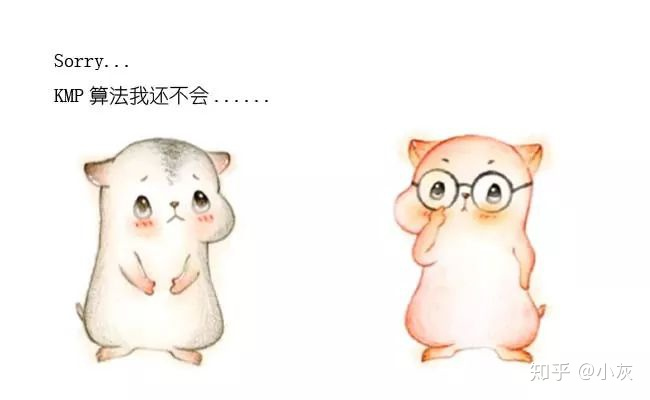


————————————


**前情回顾**

在字符串匹配算法的前两讲，我们分别介绍了暴力算法**BF算法**，利用哈希值进行比较的**RK算法**，以及尽量减少比较次数的**BM算法**，没看过的小伙伴可以点击下方链接：

[1. BF算法和RK算法](https://link.zhihu.com/?target=http%3A//mp.weixin.qq.com/s%3F__biz%3DMzIxMjE5MTE1Nw%3D%3D%26mid%3D2653201142%26idx%3D1%26sn%3D8cac1bbcfdb94474f0cc3855705cc253%26chksm%3D8c99d02cbbee593ae0fb7fa1c8c610e7c1f57009e0c0ecbe19d07f60951912c915bce65c8619%26scene%3D21%23wechat_redirect)

[2.BM算法](https://link.zhihu.com/?target=http%3A//mp.weixin.qq.com/s%3F__biz%3DMzIxMjE5MTE1Nw%3D%3D%26mid%3D2653201540%26idx%3D1%26sn%3D645a3f5f3fbf30be4f6d1c23eebdf0e7%26chksm%3D8c99d65ebbee5f482dd68efecf7b2a23e98b238ba04c1d3a6aed6c12cab76d4650c3bef5ea00%26scene%3D21%23wechat_redirect)

如果没时间细看也没关系，就让我带着大家简单梳理一下。

首先，给定 “主串” 和 “模式串” 如下：

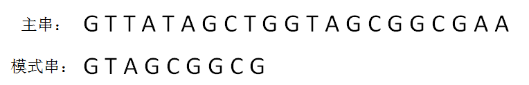

**BF算法**是如何工作的？

正如同它的全称BruteForce一样，BF算法使用简单粗暴的方式，对主串和模式串进行逐个字符的比较：

**第一轮**，模式串和主串的第一个等长子串比较，发现第0位字符一致，第1位字符一致，第2位字符不一致：

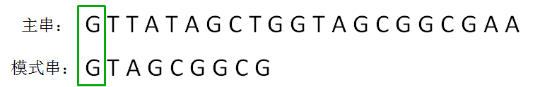

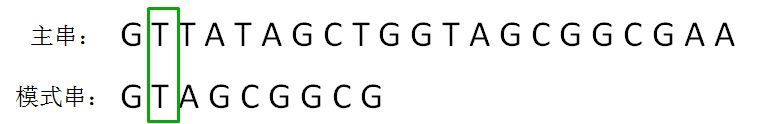

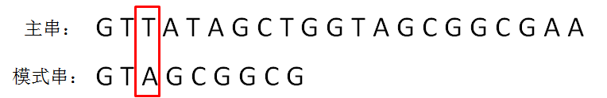

**第二轮**，模式串向后挪动一位，和主串的第二个等长子串比较，发现第0位字符不一致：

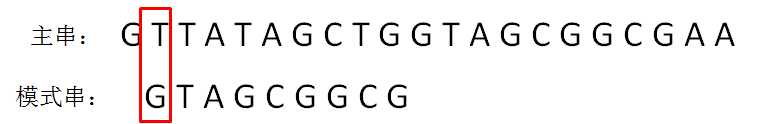

**第三轮**，模式串继续向后挪动一位，和主串的第三个等长子串比较，发现第0位字符不一致：

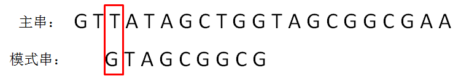

以此类推，一直到第N轮：

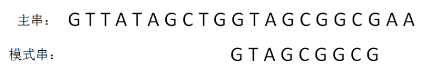

当模式串挪动到某个合适位置，逐个字符比较，发现每一位字符都是匹配时，比较结束：

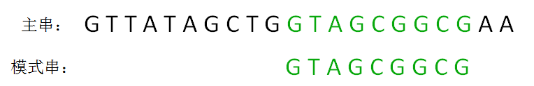

BF算法的缺点很明显，效率实在太低了，每一轮只能老老实实地把模式串右移一位，实际上做了很多无谓的比较。

而**BM算法**解决了这一问题。它借助“坏字符规则”和“好后缀规则”，在每一轮比较时，让模式串**尽可能多移动几位**，减少无谓的比较。


**KMP算法的整体思路**

KMP算法的整体思路是什么样子呢？让我们来看一组例子：

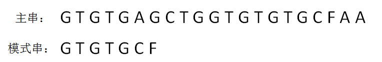

KMP算法和BF算法的“开局”是一样的，同样是把主串和模式串的首位对齐，从左到右对逐个字符进行比较。

**第一轮**，模式串和主串的第一个等长子串比较，发现前5个字符都是匹配的，第6个字符不匹配，是一个“坏字符”：


这时候，如何有效利用已匹配的前缀 “GTGTG” 呢？

我们可以发现，在前缀“GTGTG”当中，后三个字符“GTG”和前三位字符“GTG”是相同的：

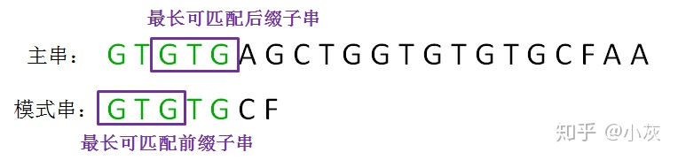

在下一轮的比较时，只有把这两个相同的片段对齐，才有可能出现匹配。这两个字符串片段，分别叫做**最长可匹配后缀子串**和**最长可匹配前缀子串**。

**第二轮**，我们直接把模式串向后移动两位，让两个“GTG”对齐，继续从刚才主串的坏字符A开始进行比较：


显然，主串的字符A仍然是坏字符，这时候的匹配前缀缩短成了GTG：

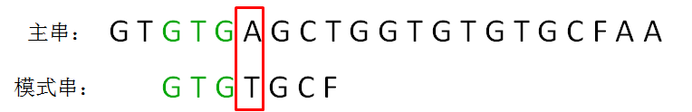

按照第一轮的思路，我们来重新确定最长可匹配后缀子串和最长可匹配前缀子串：

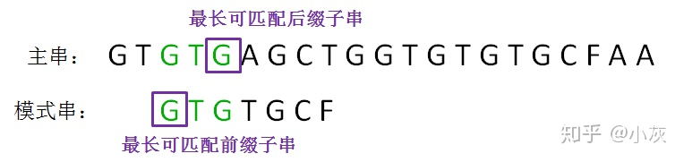

**第三轮**，我们再次把模式串向后移动两位，让两个“G”对齐，继续从刚才主串的坏字符A开始进行比较：


以上就是KMP算法的整体思路：在已匹配的前缀当中寻找到**最长可匹配后缀子串**和**最长可匹配前缀子串**，在下一轮直接把两者对齐，从而实现模式串的快速移动。


**next 数组**

next数组到底是个什么鬼呢？这是一个一维整型数组，数组的下标代表了“已匹配前缀的下一个位置”，元素的值则是“最长可匹配前缀子串的下一个位置”。

或许这样的描述有些晦涩，我们来看一下图：

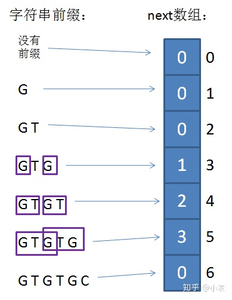

当模式串的第一个字符就和主串不匹配时，并不存在已匹配前缀子串，更不存在最长可匹配前缀子串。这种情况对应的next数组下标是0，next[0]的元素值也是0。

如果已匹配前缀是G、GT、GTGTGC，并不存在最长可匹配前缀子串，所以对应的next数组元素值（next[1]，next[2]，next[6]）同样是0。

GTG的最长可匹配前缀是G，对应数组中的next[3]，元素值是1。

以此类推，

GTGT 对应 next[4]，元素值是2。

GTGTG 对应 next[5]，元素值是3。

有了next数组，我们就可以通过已匹配前缀的下一个位置（坏字符位置），快速寻找到最长可匹配前缀的下一个位置，然后把这两个位置对齐。

比如下面的场景，我们通过坏字符下标5，可以找到next[5]=3，即最长可匹配前缀的下一个位置：

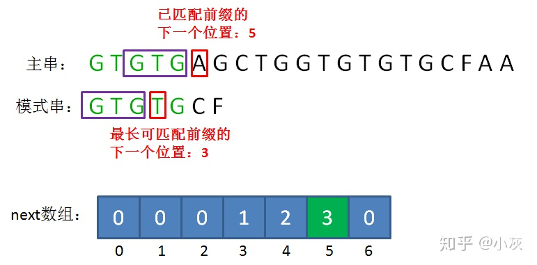

说完了next数组是什么，接下来我们再来思考一下，如何事先生成这个next数组呢？

由于已匹配前缀数组在主串和模式串当中是相同的，所以我们仅仅依据模式串，就足以生成next数组。

最简单的方法是从最长的前缀子串开始，把每一种可能情况都做一次比较。

假设模式串的长度是m，生成next数组所需的最大总比较次数是1+2+3+4+......+m-2 次。

显然，这种方法的效率非常低，如何进行优化呢？

我们可以采用类似“动态规划”的方法。首先next[0]和next[1]的值肯定是0，因为这时候不存在前缀子串；从next[2]开始，next数组的每一个元素都可以由上一个元素推导而来。

已知next[i]的值，如何推导出next[i+1]呢？让我们来演示一下上述next数组的填充过程：

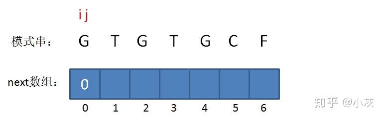

如图所示，我们设置两个变量i和j，其中i表示“已匹配前缀的下一个位置”，也就是待填充的数组下标，j表示“最长可匹配前缀子串的下一个位置”，也就是待填充的数组元素值。

当已匹配前缀不存在的时候，最长可匹配前缀子串当然也不存在，所以i=0，j=0，此时**next[0] = 0**。

接下来，我们让已匹配前缀子串的长度加1：

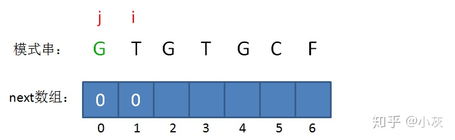

此时的已匹配前缀是G，由于只有一个字符，同样不存在最长可匹配前缀子串，所以i=1，j=0，**next[1] = 0**。

接下来，我们让已匹配前缀子串的长度继续加1：

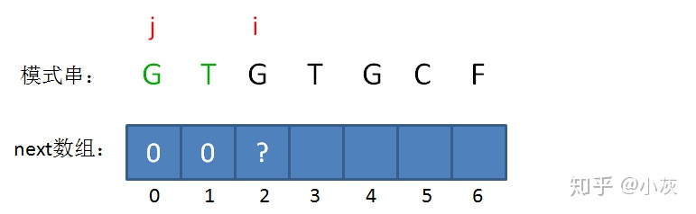

此时的已匹配前缀是GT，我们需要开始做判断了：由于模式串当中 **pattern[j] != pattern[i-1]**，即G！=T，最长可匹配前缀子串仍然不存在。

所以当i=2时，j仍然是0，**next[2] = 0**。

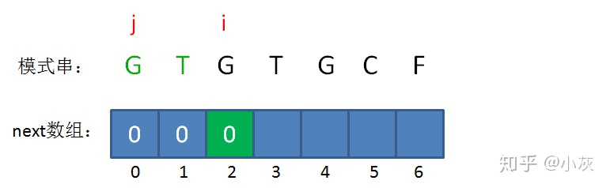

接下来，我们让已匹配前缀子串的长度继续加1：

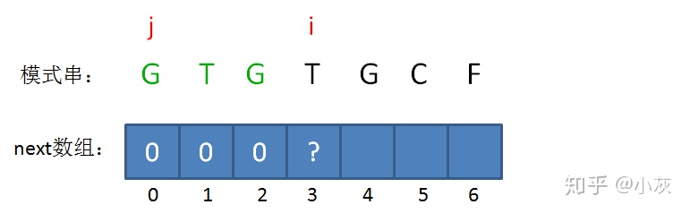

此时的已匹配前缀是GTG，由于模式串当中 **pattern[j] = pattern[i-1]**，即G=G，最长可匹配前缀子串出现了，是G。

所以当i=3时，j=1，**next[3] = next[2]+1 = 1**。

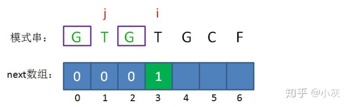

此时的已匹配前缀是GTGT，由于模式串当中 **pattern[j] = pattern[i-1]**，即T=T，最长可匹配前缀子串又增加了一位，是GT。

所以当i=4时，j=2，**next[4] = next[3]+1 = 2**。

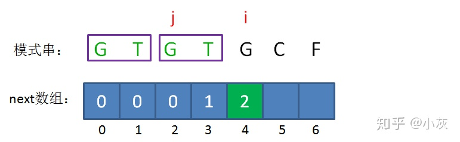

接下来，我们让已匹配前缀子串的长度继续加1：

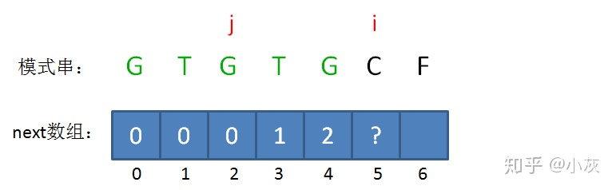

此时的已匹配前缀是GTGTG，由于模式串当中 **pattern[j] = pattern[i-1]**，即G=G，最长可匹配前缀子串又增加了一位，是GTG。

所以当i=5时，j=3，**next[5] = next[4]+1 = 3**。

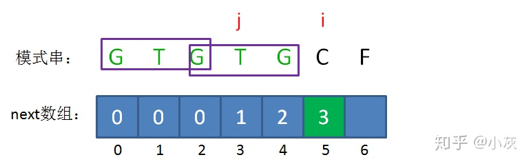

接下来，我们让已匹配前缀子串的长度继续加1：

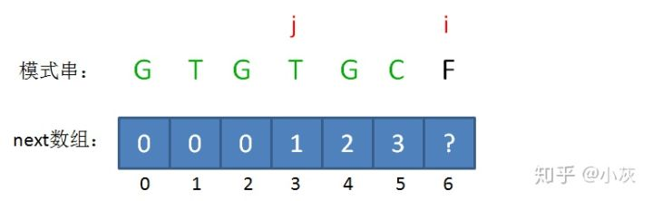

此时的已匹配前缀是GTGTGC，这时候需要注意了，模式串当中 **pattern[j] ！= pattern[i-1]**，即T != C，这时候该怎么办呢？

这时候，我们已经无法从next[5]的值来推导出next[6]，而字符C的前面又有两段重复的子串“GTG”。那么，我们能不能把问题转化一下？

或许听起来有些绕：我们可以把计算“GTGTGC”最长可匹配前缀子串的问题，转化成计算“GTGC”最长可匹配前缀子串的问题。

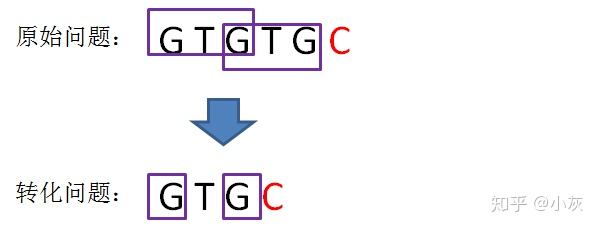

这样的问题转化，也就相当于把变量j回溯到了next[j]，也就是j=1的局面（i值不变）：

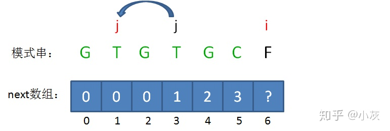

回溯后，情况仍然是 **pattern[j] ！= pattern[i-1]**，即T！=C。那么我们可以把问题继续进行转化：

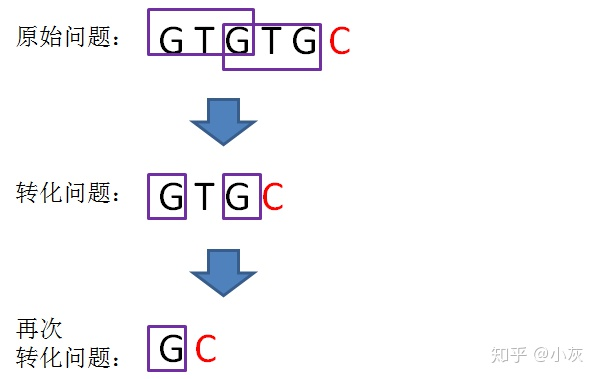

问题再次的转化，相当于再一次把变量j回溯到了next[j]，也就是j=0的局面：

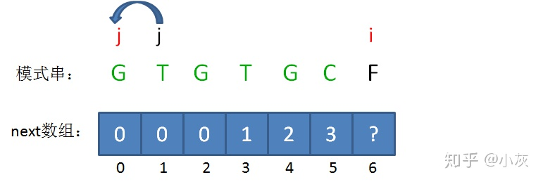

回溯后，情况仍然是 **pattern[j] ！= pattern[i-1]**，即G！=C。j已经不能再次回溯了，所以我们得出结论：i=6时，j=0，**next[6] = 0**。

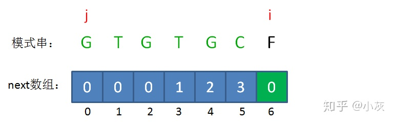

以上就是next数组元素的推导过程。


**1. 对模式串预处理，生成next数组**


**2. 进入主循环，遍历主串**


**2.1. 比较主串和模式串的字符**


**2.2. 如果发现坏字符，查询next数组，得到匹配前缀所对应的最长可匹配前缀子串，移动模式串到对应位置**


**2.3.如果当前字符匹配，继续循环**

**KMP算法的具体实现**


```java
// KMP算法主体逻辑。str是主串，pattern是模式串
public static int kmp(String str,String pattern){
    // 预处理，生成next数组
    int[]next= getNexts(pattern);
    int j =0;
    // 主循环，遍历主串字符
    for(int i =0; i < str.length(); i++){
        while(j >0 && str.charAt(i)!= pattern.charAt(j)){
            // 遇到坏字符时，查询next数组并改变模式串的起点
            j =next[j];
        }
        if(str.charAt(i)== pattern.charAt(j)){
            j++;
        }
        if(j == pattern.length()){
            // 匹配成功，返回下标
            return i - pattern.length()+1;
        }
    }
    return -1;
}
// 生成Next数组
private static int[] getNexts(String pattern){
    int[] next=new int[pattern.length()];
    int j =0;
    for(int i=2; i<pattern.length(); i++){
        while(j !=0&& pattern.charAt(j)!= pattern.charAt(i-1)){
            // 从next[i+1]的求解回溯到 next[j]
            j =next[j];
        }
        if(pattern.charAt(j)== pattern.charAt(i-1)){
            j++;
        }
        next[i]= j;
    }
    return next;
}
public static void main(String[] args){
    String str ="ATGTGAGCTGGTGTGTGCFAA";
    String pattern ="GTGTGCF";
    int index = kmp(str, pattern);
    System.out.println("首次出现位置："+ index);
}
```


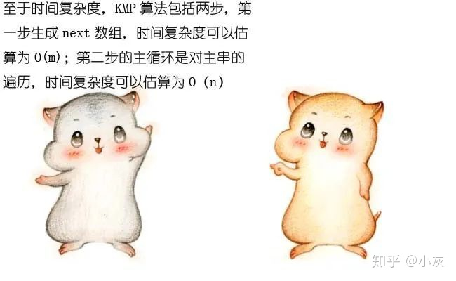

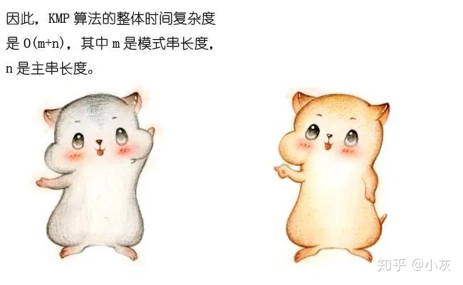

