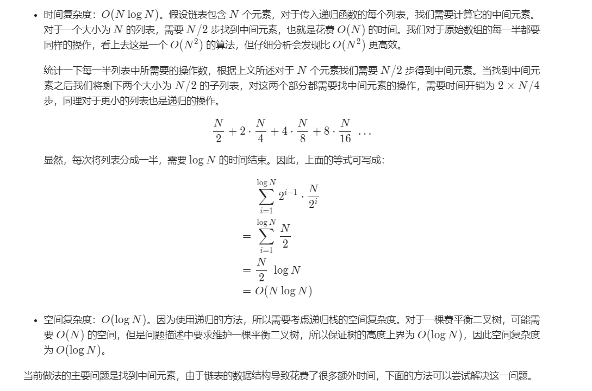

# 有序链表转二叉搜索树

#### 方法 1：递归

**想法**

题目中最重要的要求是需要利用链表中的节点，构建一颗`高度平衡`的二叉搜索树，好消息是链表中的元素是升序的。

众所周知，一棵二叉搜索树是一棵有根二叉树并且对于所有节点满足特殊的性质：对于树中任意一个点，它的权值必然大于等于所有左子树节点的权值，小于等于所有右子树节点的权值。因为二叉树具有递归的子结构，二叉搜索树也同理：所有子树也是二叉搜索树。

当前方法和下一个方法的主要思路是：

```text
给定列表中的中间元素将会作为二叉搜索树的根，该点左侧的所有元素递归的去构造左子树，同理右侧的元素构造右子树。这必然能够保证最后构造出的二叉搜索树是平衡的。
```

**算法**

​	1.由于我们得到的是一个有序链表而不是数组，我们不能直接使用下标来访问元素。我们需要知道链表中的中间元素。
​	2.我们可以利用两个指针来访问链表中的中间元素。假设我们有两个指针 slow_ptr 和 fast_ptr。slow_ptr 每次向后移动一个节点而 fast_ptr 每次移动两个节点。当 fast_ptr 到链表的末尾时 slow_ptr 就访问到链表的中间元素。对于一个偶数长度的数组，中间两个元素都可用来作二叉搜索树的根。
​	3.当找到链表中的中间元素后，我们将链表从中间元素的左侧断开，做法是使用一个 prev_ptr 的指针记录 slow_ptr 之前的元素，也就是满足 prev_ptr.next = slow_ptr。断开左侧部分就是让 prev_ptr.next = None。
​	4.我们只需要将链表的头指针传递给转换函数，进行高度平衡二叉搜索树的转换。所以递归调用的时候，左半部分我们传递原始的头指针；右半部分传递 slow_ptr.next 作为头指针。

**代码**

```java
/**
 * Definition for singly-linked list. public class ListNode { int val; ListNode next;        ListNode(intx) { val = x; } }
/**
 * Definition for a binary tree node. public class TreeNode { int val; TreeNode left;        TreeNode right; TreeNode(int x) { val = x; } }
 */
class Solution {

  private ListNode findMiddleElement(ListNode head) {

    // The pointer used to disconnect the left half from the mid node.
    ListNode prevPtr = null;
    ListNode slowPtr = head;
    ListNode fastPtr = head;

    // Iterate until fastPr doesn't reach the end of the linked list.
    while (fastPtr != null && fastPtr.next != null) {
      prevPtr = slowPtr;
      slowPtr = slowPtr.next;
      fastPtr = fastPtr.next.next;
    }

    // Handling the case when slowPtr was equal to head.
    if (prevPtr != null) {
      prevPtr.next = null;
    }

    return slowPtr;
  }

  public TreeNode sortedListToBST(ListNode head) {

    // If the head doesn't exist, then the linked list is empty
    if (head == null) {
        return null;
    }

    // Find the middle element for the list.
    ListNode mid = this.findMiddleElement(head);

    // The mid becomes the root of the BST.
    TreeNode node = new TreeNode(mid.val);

    // Base case when there is just one element in the linked list
    if (head == mid) {
        return node;
    }

    // Recursively form balanced BSTs using the left and right halves of the original list.
    node.left = this.sortedListToBST(head);
    node.right = this.sortedListToBST(mid.next);
    return node;
  }
}
```

```python
# Definition for singly-linked list.
# class ListNode:
#     def __init__(self, x):
#         self.val = x
#         self.next = None

# Definition for a binary tree node.
# class TreeNode:
#     def __init__(self, x):
#         self.val = x
#         self.left = None
#         self.right = None

class Solution:

    def findMiddle(self, head):

        # The pointer used to disconnect the left half from the mid node.
        prevPtr = None
        slowPtr = head
        fastPtr = head

        # Iterate until fastPr doesn't reach the end of the linked list.
        while fastPtr and fastPtr.next:
            prevPtr = slowPtr
            slowPtr = slowPtr.next
            fastPtr = fastPtr.next.next

        # Handling the case when slowPtr was equal to head.
        if prevPtr:
            prevPtr.next = None

        return slowPtr


    def sortedListToBST(self, head):
        """
        :type head: ListNode
        :rtype: TreeNode
        """

        # If the head doesn't exist, then the linked list is empty
        if not head:
            return None

        # Find the middle element for the list.
        mid = self.findMiddle(head)

        # The mid becomes the root of the BST.
        node = TreeNode(mid.val)

        # Base case when there is just one element in the linked list
        if head == mid:
            return node

        # Recursively form balanced BSTs using the left and right halves of the original list.
        node.left = self.sortedListToBST(head)
        node.right = self.sortedListToBST(mid.next)
        return node
```

**复杂度分析**



#### 方法 2：递归 + 转成数组

这个方法是空间换时间的经典案例。

```text
你可以通过使用更多空间来降低时间复杂度。
```

在这个方法中，我们将给定的链表转成数组并利用数组来构建二叉搜索树。数组找中间元素只需要 O(1)的时间，所以会降低整个算法的时间复杂度开销。

**算法**

​	1.将给定链表转成数组，将数组的头和尾记成 left 和 right 。
​	2.找到中间元素 (left + right) / 2，记为 mid。这需要 O(1)时间开销，也是与上面算法主要改进的地方。
​	3.将中间元素作为二叉搜索树的根。
​	4.递归构造二叉搜索树的左右两棵子树，两个子数组分别是 (left, mid - 1) 和 (mid + 1, right)。

**代码**

```java
/**
 * Definition for singly-linked list. public class ListNode { int val; ListNode next;        ListNode(int x) { val = x; } }
 */
/**
 * Definition for a binary tree node. public class TreeNode { int val; TreeNode left;        TreeNode right; TreeNode(int x) { val = x; } }
 */
class Solution {

  private List<Integer> values;

  public Solution() {
    this.values = new ArrayList<Integer>();
  }

  private void mapListToValues(ListNode head) {
    while (head != null) {
      this.values.add(head.val);
      head = head.next;
    }
  }

  private TreeNode convertListToBST(int left, int right) {
    // Invalid case
    if (left > right) {
      return null;
    }

    // Middle element forms the root.
    int mid = (left + right) / 2;
    TreeNode node = new TreeNode(this.values.get(mid));

    // Base case for when there is only one element left in the array
    if (left == right) {
      return node;
    }

    // Recursively form BST on the two halves
    node.left = convertListToBST(left, mid - 1);
    node.right = convertListToBST(mid + 1, right);
    return node;
  }

  public TreeNode sortedListToBST(ListNode head) {

    // Form an array out of the given linked list and then
    // use the array to form the BST.
    this.mapListToValues(head);

    // Convert the array to
    return convertListToBST(0, this.values.size() - 1);
  }
}
```

```python
# Definition for singly-linked list.
# class ListNode:
#     def __init__(self, x):
#         self.val = x
#         self.next = None

# Definition for a binary tree node.
# class TreeNode:
#     def __init__(self, x):
#         self.val = x
#         self.left = None
#         self.right = None

class Solution:

    # Convert the given linked list to an array
    def mapListToValues(self, head):
        vals = []
        while head:
            vals.append(head.val)
            head = head.next
        return vals    

    def sortedListToBST(self, head):
        """
        :type head: ListNode
        :rtype: TreeNode
        """

        # Form an array out of the given linked list and then
        # use the array to form the BST.
        values = self.mapListToValues(head)

        # l and r represent the start and end of the given array
        def convertListToBST(l, r):

            # Invalid case
            if l > r:
                return None

            # Middle element forms the root.
            mid = (l + r) // 2
            node = TreeNode(values[mid])

            # Base case for when there is only one element left in the array
            if l == r:
                return node

            # Recursively form BST on the two halves
            node.left = convertListToBST(l, mid - 1)
            node.right = convertListToBST(mid + 1, r)
            return node
        return convertListToBST(0, len(values) - 1)
```

**复杂度分析**

* 时间复杂度：时间复杂度降到了 O(N)，因为需要将链表转成数组。而取中间元素的开销变成了 O(1) 所以整体的时间复杂度降低了。
* 空间复杂度：因为我们利用额外空间换取了时间复杂度的降低，空间复杂度变成了 O(N)，相较于之前算法的O(logN) 有所提升，因为创建数组的开销。


#### 方法 3：中序遍历模拟

**想法**

我们知道，二叉树有三种不同的遍历方法：

- 前序遍历
- 中序遍历 和
- 后序遍历。

中序遍历一棵二叉搜索树会有一个非常有趣的结论。

中序遍历一棵二叉搜索树的结果是得到一个升序序列。

这个方法模拟了二叉搜索树的构造过程，因为我们已经获得`有序`的链表，所以自然的产生了这样的想法。

在描述算法之前，先看一下中序遍历是如何获得有序值的。

基于解决这个问题的中序遍历的思想：

```text
我们知道中序遍历最左边的元素一定是给定链表的头部，类似地下一个元素一定是链表的下一个元素，以此类推。这是肯定的因为给定的初始链表保证了升序排列。
```

在了解了中序遍历二叉搜索树和有序数组的关系之后，让我们来看看算法。

**算法**

首先用伪代码来理解一下算法。

```go
 function formBst(start, end)
      mid = (start + end) / 2
      formBst(start, mid - 1)

      TreeNode(head.val)
      head = head.next
       
      formBst(mid + 1, end)
```

​	1.遍历整个链表获得它的长度，我们用两个指针标记结果数组的开始和结束，记为 start 和 end，他们的初始值分别为 0 和 length - 1。
​	2.记住，我们当前需要模拟中序遍历，找到中间元素 (start + end) / 2。注意这里并不需要在链表中找到确定的元素是哪个，只需要用一个变量告诉我们中间元素的下标。我们只需要递归调用这两侧。
​	3.递归左半边，其中开始和结束的值分别为 start, mid - 1。
​	4.在这个算法中，每当我们构建完二叉搜索树的左半部分时，链表中的头指针将指向根节点或中间节点（它成为根节点）。 因此，我们只需使用头指针指向的当前值作为根节点，并将指针后移一位，即 head = head.next。
​	5.我们在递归右半部分 mid + 1, end。

```java
/**
 * Definition for singly-linked list. public class ListNode { int val; ListNode next;        ListNode(intx) { val = x; } }
 */
/**
 * Definition for a binary tree node. public class TreeNode { int val; TreeNode left;        TreeNode right; TreeNode(int x) { val = x; } }
 */
class Solution {

  private ListNode head;

  private int findSize(ListNode head) {
    ListNode ptr = head;
    int c = 0;
    while (ptr != null) {
      ptr = ptr.next;  
      c += 1;
    }
    return c;
  }

  private TreeNode convertListToBST(int l, int r) {
    // Invalid case
    if (l > r) {
      return null;
    }

    int mid = (l + r) / 2;

    // First step of simulated inorder traversal. Recursively form
    // the left half
    TreeNode left = this.convertListToBST(l, mid - 1);

    // Once left half is traversed, process the current node
    TreeNode node = new TreeNode(this.head.val);
    node.left = left;

    // Maintain the invariance mentioned in the algorithm
    this.head = this.head.next;

    // Recurse on the right hand side and form BST out of them
    node.right = this.convertListToBST(mid + 1, r);
    return node;
  }

  public TreeNode sortedListToBST(ListNode head) {
    // Get the size of the linked list first
    int size = this.findSize(head);

    this.head = head;

    // Form the BST now that we know the size
    return convertListToBST(0, size - 1);
  }
}
```

```python
# Definition for singly-linked list.
# class ListNode:
#     def __init__(self, x):
#         self.val = x
#         self.next = None

# Definition for a binary tree node.
# class TreeNode:
#     def __init__(self, x):
#         self.val = x
#         self.left = None
#         self.right = None

class Solution:

    def findSize(self, head):
        ptr = head
        c = 0
        while ptr:
            ptr = ptr.next
            c += 1
        return c


    def sortedListToBST(self, head):
        """
        :type head: ListNode
        :rtype: TreeNode
        """

        # Get the size of the linked list first
        size = self.findSize(head)

        # Recursively form a BST out of linked list from l --> r
        def convert(l, r):
            nonlocal head

            # Invalid case
            if l > r:
                return None

            mid = (l + r) // 2

            # First step of simulated inorder traversal. Recursively form
            # the left half
            left = convert(l, mid - 1)

            # Once left half is traversed, process the current node
            node = TreeNode(head.val)   
            node.left = left

            # Maintain the invariance mentioned in the algorithm
            head = head.next

            # Recurse on the right hand side and form BST out of them
            node.right = convert(mid + 1, r)
            return node
        return convert(0, size - 1)
```

**复杂度分析**

* 时间复杂度：时间复杂度仍然为 O(N)因为我们需要遍历链表中所有的顶点一次并构造相应的二叉搜索树节点。

* 空间复杂度：O*(log*N) ，额外空间只有一个递归栈，由于是一棵高度平衡的二叉搜索树，所以高度上界为 LogN