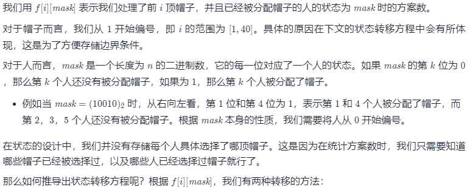
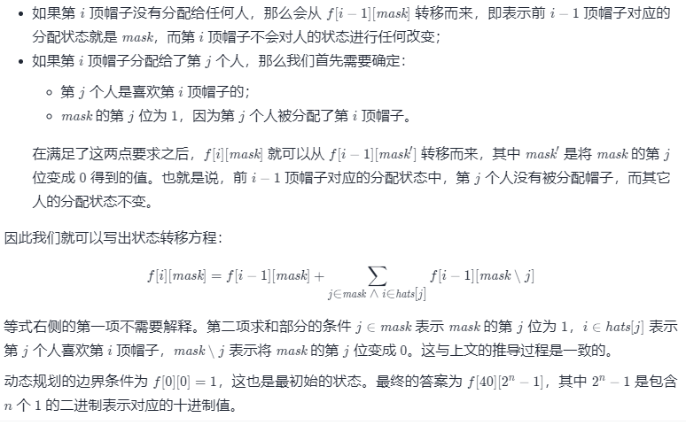

#### 1434. 每个人戴不同帽子的方案数

总共有 `n` 个人和 `40` 种不同的帽子，帽子编号从 `1` 到 `40` 。

给你一个整数列表的列表 `hats` ，其中 `hats[i]` 是第 `i` 个人所有喜欢帽子的列表。

请你给每个人安排一顶他喜欢的帽子，确保每个人戴的帽子跟别人都不一样，并返回方案数。

由于答案可能很大，请返回它对 `10^9 + 7` 取余后的结果。

 **示例 1：**

```shell
输入：hats = [[3,4],[4,5],[5]]
输出：1
解释：给定条件下只有一种方法选择帽子。
第一个人选择帽子 3，第二个人选择帽子 4，最后一个人选择帽子 5。
```

**示例 2：**

```shell
输入：hats = [[3,5,1],[3,5]]
输出：4
解释：总共有 4 种安排帽子的方法：
(3,5)，(5,3)，(1,3) 和 (1,5)
```

**示例 3：**

```shell
输入：hats = [[1,2,3,4],[1,2,3,4],[1,2,3,4],[1,2,3,4]]
输出：24
解释：每个人都可以从编号为 1 到 4 的帽子中选。
(1,2,3,4) 4 个帽子的排列方案数为 24 。
```

**示例 4：**

```shell
输入：hats = [[1,2,3],[2,3,5,6],[1,3,7,9],[1,8,9],[2,5,7]]
输出：111
```

**提示：**

* `n == hats.length`
* `1 <= n <= 10`
* `1 <= hats[i].length <= 40`
* `1 <= hats[i][j] <= 40`
* `hats[i] 包含一个数字互不相同的整数列表。`

### 题解

#### 方法一：状态压缩动态规划






```java
class Solution {
    public int numberWays(List<List<Integer>> hats) {
        int MOD = 1000000000 + 7;
        int n = hats.size();
        // 找到帽子编号的最大值，这样我们只需要求出 f[maxhatid][2^n - 1] 作为答案
        int maxhatID = 0;
        for (int i = 0; i < n; i++) {
            for (int hatID : hats.get(i)) {
                maxhatID = Math.max(maxhatID, hatID);
            }
        }

        // 对于每一顶帽子 hatID，hatToPerson[hatID] 中存储了喜欢这顶帽子的所有人，方便进行动态规划
        List<List<Integer>> hatToPerson = new ArrayList<>();
        for (int i = 0; i <= maxhatID; i++) {
            hatToPerson.add(new ArrayList<>());
        }

        for (int i = 0; i < n; i++) {
            for (int hatID : hats.get(i)) {
                hatToPerson.get(hatID).add(i);
            }
        }

        // 表示分配帽子的每个人的状态
        int max = (1 << n) - 1;
        // 表示我们处理了前 i 顶帽子，并且已经被分配帽子的人的状态为 mask 时的方案数
        int[][] dp = new int[maxhatID + 1][max + 1];
        // 表示处理了前 0 顶帽子,并且已经被分配帽子的人的状态为 0 是的方案数为1
        dp[0][0] = 1;
        for (int i = 1; i <= maxhatID; i++) {
            for (int j = 0; j <= max; j++) {
                dp[i][j] = dp[i - 1][j];
                // 喜欢第 i 顶帽子的人中有第k个人,且第 k 个人分配到了帽子
                for (int k : hatToPerson.get(i)) {
                    if (((j >> k) & 1) == 1) {
                        // 注意这里 不能使用  dp[i][j] = dp[i-1][j] + dp[i - 1][j ^ (1 << k)];
                        // 因为这里多了一层循环,需要在dp[i][j]的基础上累加
                        dp[i][j] = dp[i][j] + dp[i - 1][j ^ (1 << k)];
                        dp[i][j] = dp[i][j] % MOD;
                    }
                }
            }
        }

        return dp[maxhatID][max];
    }
}
```

