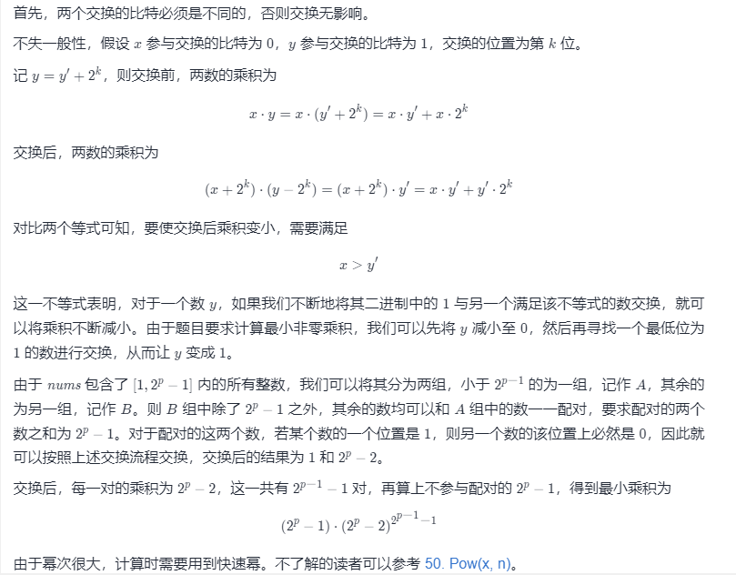

#### 1969. 数组元素的最小非零乘积

给你一个正整数 p 。你有一个下标从 1 开始的数组 nums ，这个数组包含范围 [1, 2p - 1] 内所有整数的二进制形式（两端都 包含）。你可以进行以下操作 任意 次：

- 从 `nums` 中选择两个元素 `x` 和 `y` 。
- 选择 `x` 中的一位与 `y` 对应位置的位交换。对应位置指的是两个整数 **相同位置** 的二进制位。

比方说，如果 `x = 1101` 且 `y = 0011` ，交换右边数起第 `2` 位后，我们得到 `x = 1111` 和 `y = 0001` 。

请你算出进行以上操作 **任意次** 以后，`nums` 能得到的 **最小非零** 乘积。将乘积对 `109 + 7` **取余** 后返回。

**注意：**答案应为取余 **之前** 的最小值。

**示例 1：**

```shell
输入：p = 1
输出：1
解释：nums = [1] 。
只有一个元素，所以乘积为该元素。
```

**示例 2：**

```shell
输入：p = 2
输出：6
解释：nums = [01, 10, 11] 。
所有交换要么使乘积变为 0 ，要么乘积与初始乘积相同。
所以，数组乘积 1 * 2 * 3 = 6 已经是最小值。
```

**示例 3：**

```shell
输入：p = 3
输出：1512
解释：nums = [001, 010, 011, 100, 101, 110, 111]
- 第一次操作中，我们交换第二个和第五个元素最左边的数位。
    - 结果数组为 [001, 110, 011, 100, 001, 110, 111] 。
- 第二次操作中，我们交换第三个和第四个元素中间的数位。
    - 结果数组为 [001, 110, 001, 110, 001, 110, 111] 。
数组乘积 1 * 6 * 1 * 6 * 1 * 6 * 7 = 1512 是最小乘积。
```

**提示：**

- `1 <= p <= 60`

### 题解

**贪心+数学+快速幂**



```java
class Solution {
    public int minNonZeroProduct(int p) {
        long MOD = 1000000000 + 7;
        long c = (1L << p) - 1;
        long b = c - 1;
        long count = ((1L << (p - 1)) - 1);

        long ans = (c % MOD * (quickMul(b, count)) % MOD);

        return (int) ans;
    }

    public long quickMul(long x, long N) {
        long MOD = 1000000000 + 7;
        long ans = 1;
        // 贡献的初始值为 x
        long x_contribute = x % MOD;
        // 在对 N 进行二进制拆分的同时计算答案
        while (N > 0) {
            // 如果 N 二进制表示的最低位为 1，那么需要计入贡献
            if ((N & 1) == 1) {
                ans = (ans * x_contribute) % MOD;
            }
            // 将贡献不断地平方
            x_contribute = (x_contribute * x_contribute) % MOD;
            // 舍弃 N 二进制表示的最低位，这样我们每次只要判断最低位即可
            N = N >> 1;
        }
        return ans;
    }
}
```

