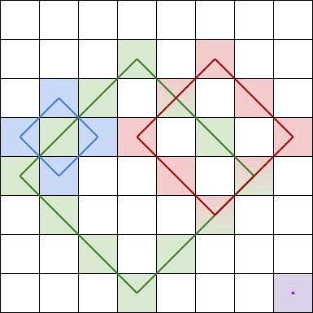

#### 1878. 矩阵中最大的三个菱形和

给你一个 `m x n` 的整数矩阵 `grid` 。

菱形和 指的是 grid 中一个正菱形 边界 上的元素之和。本题中的菱形必须为正方形旋转45度，且四个角都在一个格子当中。下图是四个可行的菱形，每个菱形和应该包含的格子都用了相应颜色标注在图中。



注意，菱形可以是一个面积为 0 的区域，如上图中右下角的紫色菱形所示。

请你按照 **降序** 返回 `grid` 中三个最大的 **互不相同的菱形和** 。如果不同的和少于三个，则将它们全部返回。

**示例 1：**


```shell
输入：grid = [[3,4,5,1,3],[3,3,4,2,3],[20,30,200,40,10],[1,5,5,4,1],[4,3,2,2,5]]
输出：[228,216,211]
解释：最大的三个菱形和如上图所示。
- 蓝色：20 + 3 + 200 + 5 = 228
- 红色：200 + 2 + 10 + 4 = 216
- 绿色：5 + 200 + 4 + 2 = 211
```

**示例 2：**


```shell
输入：grid = [[1,2,3],[4,5,6],[7,8,9]]
输出：[20,9,8]
解释：最大的三个菱形和如上图所示。
- 蓝色：4 + 2 + 6 + 8 = 20
- 红色：9 （右下角红色的面积为 0 的菱形）
- 绿色：8 （下方中央面积为 0 的菱形）
```

**示例 3：**

```shell
输入：grid = [[7,7,7]]
输出：[7]
解释：所有三个可能的菱形和都相同，所以返回 [7] 。
```

**提示：**

- `m == grid.length`
- `n == grid[i].length`
- `1 <= m, n <= 100`
- `1 <= grid[i][j] <= 105`

### 题解

## 计算前缀和

一个是正的： `sum1[i][j] = sum1[i - 1][j - 1] + grid[i - 1][j - 1]`

另一个是反的: `sum2[i][j] = sum2[i - 1][j + 1] + grid[i - 1][j - 1]`

可以看看我画的这个图


仔细思考一下，其实就是把方向变了一下，本质上还是一维前缀和

## 维护菱形和

由于需要维护3个最大菱形和，我们可以考虑使用优先队列等会维护顺序的数据结构，但是这里有一个问题，就是菱形和相同的话，只能算一个，体现在样例grid = [[7,7,7]]上，所以，可以使用set（set底层是红黑树，会自动排序，且具有去重功能）

并且还需要考虑像这种单个方块的菱形边权最大的情况


因此我们枚举每一个中心点的同时再把这个元素放到set里头即可，最后返回的是一个数组，我们只需要取集合的元素并且反转就好啦

```java
class Solution {
    public int[] getBiggestThree(int[][] grid) {
        int m = grid.length;
        int n = grid[0].length;
        int[][] sum1 = new int[m + 1][n + 1+1];
        int[][] sum2 = new int[m + 1][n + 1+1];

        for (int i = 1; i <= m; i++) {
            for (int j = 1; j <= n; j++) {
                sum1[i][j] = sum1[i - 1][j - 1] + grid[i - 1][j - 1];
                sum2[i][j] = sum2[i - 1][j + 1] + grid[i - 1][j - 1];
            }
        }

        TreeSet<Integer> set = new TreeSet<>();

        for (int i = 1; i <= m; i++) {
            for (int j = 1; j <= n; j++) {
                set.add(grid[i-1][j-1]);
                for (int k = 1; i + k <= m && i - k >= 1 && j + k <= n && j - k >= 1; k++) {
                    int a = sum1[i + k][j] - sum1[i][j - k];
                    int b = sum2[i][j - k] - sum2[i - k][j];
                    int c = sum1[i][j + k] - sum1[i - k][j];
                    int d = sum2[i + k][j] - sum2[i][j + k];
                    int sum = a + b + c + d + grid[i - k-1][j-1] - grid[i + k-1][j-1];
                    set.add(sum);
                }
            }
        }

        int len = set.size();
        if (len <= 3) {
            int[] ans = new int[len];
            int index = len - 1;
            for (int result : set) {
                ans[index--] = result;
            }
            return ans;
        }

        int[] ans = new int[3];
        Object[] results = set.toArray();
        ans[2] = (int) results[results.length - 3];
        ans[1] = (int) results[results.length - 2];
        ans[0] = (int) results[results.length - 1];
        return ans;
    }
}
```

