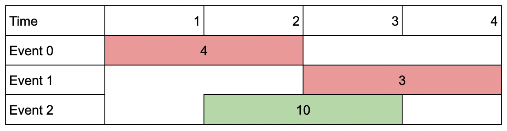

#### 1751. 最多可以参加的会议数目 II

给你一个 events 数组，其中 events[i] = [startDayi, endDayi, valuei] ，表示第 i 个会议在 startDayi 天开始，第 endDayi 天结束，如果你参加这个会议，你能得到价值 valuei 。同时给你一个整数 k 表示你能参加的最多会议数目。

你同一时间只能参加一个会议。如果你选择参加某个会议，那么你必须 完整 地参加完这个会议。会议结束日期是包含在会议内的，也就是说你不能同时参加一个开始日期与另一个结束日期相同的两个会议。

请你返回能得到的会议价值 **最大和** 。

**示例 1：**


```shell
输入：events = [[1,2,4],[3,4,3],[2,3,1]], k = 2
输出：7
解释：选择绿色的活动会议 0 和 1，得到总价值和为 4 + 3 = 7 。
```

**示例 2：**



```shell
输入：events = [[1,2,4],[3,4,3],[2,3,10]], k = 2
输出：10
解释：参加会议 2 ，得到价值和为 10 。
你没法再参加别的会议了，因为跟会议 2 有重叠。你 不 需要参加满 k 个会议。
```

**示例 3：**


```shell
输入：events = [[1,1,1],[2,2,2],[3,3,3],[4,4,4]], k = 3
输出：9
解释：尽管会议互不重叠，你只能参加 3 个会议，所以选择价值最大的 3 个会议。
```

**提示：**

* 1 <= k <= events.length
* 1 <= k * events.length <= 106
* 1 <= startDayi <= endDayi <= 109
* 1 <= valuei <= 106

### 题解

## 基本思路

定义 `dp[i][j] 代表考虑前 i 个事件，选择不超过 j 个会议的最大价值`

对于每件时间，都有选择与不选两种选择，不选有 `dp[i][j]=dp[i-1][j]`

选择的话，则要找到第 i 件事件之前，与第 i 件事件最靠近且不冲突的事件，记为 `last`，则有 `dp[i][j]=dp[last][j-1]+value`

两者取一个 max，则是 `dp[i][j]` 的值。

分析到这里，因为我们要找 last，我们需要先对 events 的结束时间排序，然后找从右往左找，找到第一个满足 结束时间 小于 当前事件的开始时间 的事件，就是 last

而找 `last` 的过程，可以直接循环找，也可以通过二分来找，都能过。

## 动态规划

不通过「二分」来找 `last` 的 DP 解法。

```java
class Solution {
    public int maxValue(int[][] events, int k) {
        int n = events.length;
        Arrays.sort(events, (a, b) -> a[1] - b[1]);

        // dp[i][j] 代表考虑前 i 个事件，选择不超过 j 个会议的最大价值
        int[][] dp = new int[n + 1][k + 1];
        for (int i = 1; i <= n; i++) {
            int[] event = events[i - 1];
            int start = event[0];
            int end = event[1];
            int value = event[2];

            // 找到第i件事件之前,最近与第i件事件不冲突的事件(找到不冲突的前last个事件)
            // 对于当前事件而言,冲突与否与j无关
            int last = 0;
            for (int p = i - 1; p >= 1; p--) {
                int[] prev = events[p - 1];
                if (prev[1] < start) {
                    last = p;
                    break;
                }
            }

            for (int j = 1; j <= k; j++) {
                dp[i][j] = Math.max(dp[i - 1][j], dp[last][j - 1] + value);
            }
        }
        return dp[n][k];
    }
}
```

**动态规划+二分法**

```java
class Solution {
    public int maxValue(int[][] events, int k) {
        int n = events.length;
        Arrays.sort(events, (a, b) -> a[1] - b[1]);

        // dp[i][j] 代表考虑前 i 个事件，选择不超过 j 个会议的最大价值
        int[][] dp = new int[n + 1][k + 1];
        for (int i = 1; i <= n; i++) {
            int[] event = events[i - 1];
            int start = event[0];
            int end = event[1];
            int value = event[2];

            // 找到第i件事件之前,最近与第i件事件不冲突的事件(找到不冲突的前last个事件)
            // 对于当前事件而言,冲突与否与j无关

            int left = 1;
            int right = i - 1;
            while (left <= right) {
                int mid = left + (right - left) / 2;
                // dp代表考虑前 i 个事件，选择不超过 j 个会议的最大价值
                // mid 的取值范围为 [1,i-1]
                int[] pre = events[mid - 1];
                if (pre[1] < start) {
                    left = mid + 1;
                } else {
                    right = mid - 1;
                }
            }

            int last = left-1;

            for (int j = 1; j <= k; j++) {
                dp[i][j] = Math.max(dp[i - 1][j], dp[last][j - 1] + value);
            }
        }
        return dp[n][k];
    }
}
```

