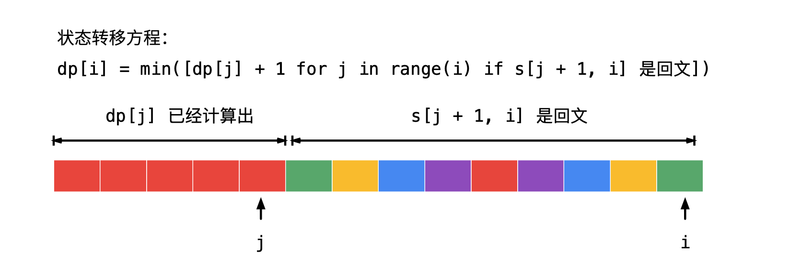

#### 132. 分割回文串 II

给你一个字符串 `s`，请你将 `s` 分割成一些子串，使每个子串都是回文。

返回符合要求的 **最少分割次数** 。

**示例 1：**

```shell
输入：s = "aab"
输出：1
解释：只需一次分割就可将 s 分割成 ["aa","b"] 这样两个回文子串。
```

**示例 2：**

```shell
输入：s = "a"
输出：0
```

**示例 3：**

```shell
输入：s = "ab"
输出：1
```

**提示：**

- `1 <= s.length <= 2000`
- `s` 仅由小写英文字母组成

### 题解

### 方法一：动态规划

#### 步骤 1：思考状态

状态就尝试定义成题目问的那样，看看状态转移方程是否容易得到。

`dp[i]`：表示前缀子串 `s[0:i]` 分割成若干个回文子串所需要最小分割次数。

#### 步骤 2：思考状态转移方程

思考的方向是：大问题的最优解怎么由小问题的最优解得到。

即 `dp[i]` 如何与 `dp[i - 1]`、`dp[i - 2]`、...、`dp[0]` 建立联系。

比较容易想到的是：如果 `s[0:i]` 本身就是一个回文串，那么不用分割，即 `dp[i] = 0` ，这是首先可以判断的，否则就需要去遍历；

接下来枚举可能分割的位置：即如果 `s[0:i]` 本身不是一个回文串，就尝试分割，枚举分割的边界 `j`。

如果 `s[j + 1, i]` 不是回文串，尝试下一个分割边界。

如果 `s[j + 1, i]` 是回文串，则 `dp[i]` 就是在 `dp[j]` 的基础上多一个分割。

于是枚举 `j` 所有可能的位置，取所有 `dp[j]` 中最小的再加 1 ，就是 `dp[i]`。

得到状态转移方程如下：

```shell
dp[i] = min([dp[j] + 1 for j in range(i) if s[j + 1, i] 是回文])
```



#### 步骤 3：思考初始状态

初始状态：单个字符一定是回文串，因此 `dp[0] = 0`。

#### 步骤 4：思考输出

状态转移方程可以得到，并且状态就是题目问的，因此返回最后一个状态即可，即 `dp[len - 1]`。

#### 步骤 5：思考是否可以优化空间

每一个状态值都与之前的状态值有关，因此不能优化空间。

```java
class Solution {
    public int minCut(String s) {
        int n = s.length();
        if (n < 2) {
            return 0;
        }

        char[] charArray = s.toCharArray();

        int[] dp = new int[n];
        for (int i = 0; i < n; i++) {
            dp[i] = i;
        }

        for (int j = 1; j < n; j++) {
            if (checkPalindrome(charArray, 0, j)) {
                dp[j] = 0;
                continue;
            }

            for (int i = 0; i < j; i++) {
                if (checkPalindrome(charArray, i + 1, j)) {
                    dp[j] = Math.min(dp[j], dp[i] + 1);
                }
            }
        }

        return dp[n - 1];
    }

    public boolean checkPalindrome(char[] charArray, int i, int j) {
        while (i < j) {
            if (charArray[i] != charArray[j]) {
                return false;
            }
            i++;
            j--;
        }
        return true;
    }
}
```

### 方法二：动态规划（优化）

上面判断回文串的时候方法 checkPalindrome() 是线性的，时间复杂度为 O(N)。我们可以借助「力扣」第 5 题：最长回文子串 的做法，依然是使用动态规划的做法，得到一个预处理的动态规划数组，这样就可以通过 O(1) 的时间复杂度，得到一个子串是否是回文的结果了。

```java
class Solution {
    public int minCut(String s) {
        int n = s.length();
        if (n < 2) {
            return 0;
        }

        char[] charArray = s.toCharArray();

        int[] dp = new int[n];

        for (int i = 0; i < n; i++) {
            dp[i] = i;
        }

        boolean[][] checkPalindrome = new boolean[n][n];

        for (int i = 0; i < n; i++) {
            checkPalindrome[i][i] = true;
        }

        for (int right = 1; right < n; right++) {
            for (int left = 0; left < right; left++) {
                if (charArray[left] == charArray[right] && (right - left + 1 <= 3 || checkPalindrome[left + 1][right - 1])) {
                    checkPalindrome[left][right] = true;
                }
            }
        }

        for (int j = 1; j < n; j++) {
            if (checkPalindrome[0][j]) {
                dp[j] = 0;
                continue;
            }
            for (int i = 0; i < j; i++) {
                if (checkPalindrome[i + 1][j]) {
                    dp[j] = Math.min(dp[j], dp[i] + 1);
                }
            }
        }
        return dp[n - 1];
    }
}
```

