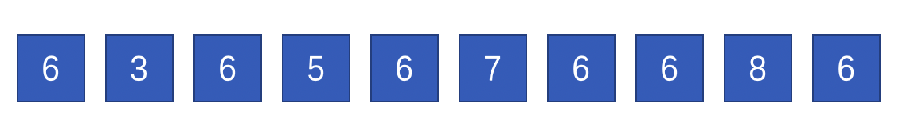
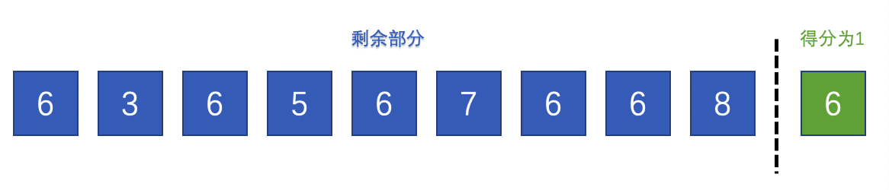
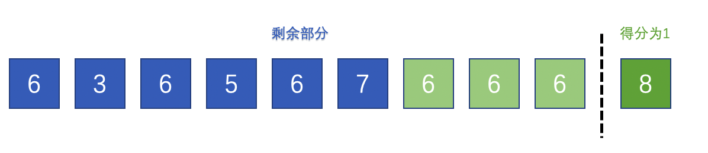

#### 546. 移除盒子

给出一些不同颜色的盒子，盒子的颜色由数字表示，即不同的数字表示不同的颜色。

你将经过若干轮操作去去掉盒子，直到所有的盒子都去掉为止。每一轮你可以移除具有相同颜色的连续 k 个盒子（k >= 1），这样一轮之后你将得到 k * k 个积分。

当你将所有盒子都去掉之后，求你能获得的最大积分和。

**示例 1：**

> 输入：boxes = [1,3,2,2,2,3,4,3,1]
> 输出：23
> 解释：
> [1, 3, 2, 2, 2, 3, 4, 3, 1] 
> ----> [1, 3, 3, 4, 3, 1] (3*3=9 分) 
> ----> [1, 3, 3, 3, 1] (1*1=1 分) 
> ----> [1, 1] (3*3=9 分) 
> ----> [] (2*2=4 分)

**示例 2：**

> ```
> 输入：boxes = [1,1,1]
> 输出：9
> ```

**示例 3：**

> ```
> 输入：boxes = [1]
> 输出：1
> ```

**提示：**

- `1 <= boxes.length <= 100`
- `1 <= boxes[i] <= 100`

### 题解

**思路图解**

以官方题解的数据为例，初始数据为 [6,3,6,5,6,7,6,6,8,6]



此时方案一是消除右边第一个6，然后计算左边剩余部分得分。



方案二是先计算倒数第二位的8的得分，然后把8剔除掉，接着计算剩余部分的得分。此时右边连续的6变成了3个。



比较两种方案的得分，得分高的就是最终的答案。

**代码**

```java
class Solution {
    public int removeBoxes(int[] boxes) {
        int length = boxes.length;
        int[][][] dp = new int[length][length][length];
        return calculatePoints(boxes, dp, 0, length - 1, 0);
    }

    public int calculatePoints(int[] boxes, int[][][] dp, int left, int right, int k) {
        if (left > right) {
            return 0;
        }

        if (dp[left][right][k] != 0) {
            return dp[left][right][k];
        }

        // 策略1
        // 计算把右边k+1个消除时的得分
        dp[left][right][k] = calculatePoints(boxes, dp, left, right - 1, 0) + (k + 1) * (k + 1);

        // 策略2
        // 从右边界开始向左寻找跟外部k个元素相等的元素，如果相等则剔除掉这些不相等的，让后面一段连起来。
        // 此时得分就是中间消除中间一段不连续部分的得分和剩下来部分的得分
        // 比较这个得分和原来计算过其他方案的得分，去最大值覆盖到状态数组dp中
        for (int i = right - 1; i >= left; i--) {
            if (boxes[i] == boxes[right]) {
                dp[left][right][k] = Math.max(dp[left][right][k],
                        calculatePoints(boxes, dp, left, i, k + 1) + calculatePoints(boxes, dp, i + 1, right - 1, 0));
            }
        }

        return dp[left][right][k];
    }
}
```

