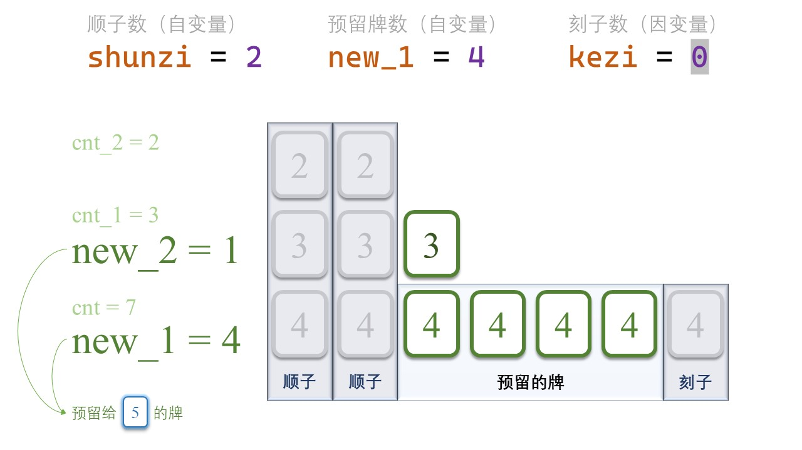

#### LCP 36. 最多牌组数

麻将的游戏规则中，共有两种方式凑成「一组牌」：

- 顺子：三张牌面数字连续的麻将，例如 [4,5,6]
- 刻子：三张牌面数字相同的麻将，例如 [10,10,10]

给定若干数字作为麻将牌的数值（记作一维数组 `tiles`），请返回所给 `tiles` 最多可组成的牌组数。

注意：凑成牌组时，每张牌仅能使用一次。

**示例 1：**

> 输入：`tiles = [2,2,2,3,4]`
>
> 输出：`1`
>
> 解释：最多可以组合出 [2,2,2] 或者 [2,3,4] 其中一组牌。

**示例 2：**

> 输入：`tiles = [2,2,2,3,4,1,3]`
>
> 输出：`2`
>
> 解释：最多可以组合出 [1,2,3] 与 [2,3,4] 两组牌。

**提示：**

- `1 <= tiles.length <= 10^5`
- `1 <= tiles[i] <= 10^9`

### 题解

## 第一步：整理牌序

首先，将 `tiles` 变为 `map<int, int>`。其中，**键**是**点数**, 而**值**是对应的**牌数**，Java中的Treep会自动将key按照从小到大的顺序排序


```java
        TreeMap<Integer, Integer> countMap = new TreeMap<>();
        for (int tile : tiles) {
            countMap.put(tile, countMap.getOrDefault(tile, 0) + 1);
        }
```

接下来，我们的指针会跟随**点数** `[tile]` 移动，动规数组也会随着 `[tile]` 更新。

## 第二步：状态矩阵

动规的目标毫无疑问：已知之前所有牌面最高得分（记为`dp`），当指针随着**点数**增加时，我们要根据新增加的牌来更新最高得分（记为`dp`）。

例如，在下面这副牌中，假设现在我们遍历到 `[tile] = 4`，我们需要根据`4`的牌数来更新得分。即

```shell
dp += 新增得分
```


新增加的得分有两部分：

1. `4`和**之前两张牌**组成的**顺子**得分，
2. `4`自己组成的**刻子**得分。

仔细分析我们发现，有两种不同的情况。

* **情况1**

之前组成了两副顺子，留下来 1 张 [2] 和 0 张 [3]，无法和 [4] 一起组成新的顺子。因此，新增加的 [4] 只带来了 1 分新得分：[4] 的刻子得分。


**情况2**

之前组成了一副顺子和一副刻子，留下来 2 张 [2] 和 1 张 [3]，能够 [4] 一起组成新的顺子。另外，剩下的 [4] 也能组成一副刻子 。因此，新增加的 [4] 最多能带来 2 分：一分顺子， 一分刻子。


仔细分析这两种情况：我们发现：

**影响新增得分的只有`[2]`和`[3]`的剩余牌数，也就是`[tile-2]`和`[tile-1]`的剩余牌数**。	

因此，我们的dp应该是一个二维数组，dp[cnt_2] [cnt_1] 表示：在预留 cnt_2 张 [tile-2] 和 cnt_1 张 [tile-1] 的前提下，[tile] 之前的牌能组成的牌组数。

## 第三步：压缩状态空间

如果我们把预留数量的所有可能性都列出来，`dp`的大小将有O(n^2)。因此，我们考虑**限制预留的牌数**。预留的牌仅用于跟下两张牌组成顺子，故应考虑**限制顺子的数量**。如下图所示，当相同顺子的数量大于等于3时，我们可以把**每3副顺子换成3副对应的刻子。**


那么，相同顺子的数量`<=2`副。

如下图所示，为`[5]`预留的牌，在未来遍历到`[6]`时，可组成顺子`([4], [5], [6])`；在未来遍历到`[7]`时，可组成顺子`([5], [6], [7])`。


每种顺子不超过2副。因此，我们预留的牌，也不超过4张。

`dp`的空间就压缩到了`dp[0~4][0~4]`，即O(5^2)*O*(52)（因为还要考虑一张都不留的情况）。

## 第三步：状态转移方程

根据前面的分析，我们知道，每一步的分数由三部分组成：

1. 之前赚的分数；
2. `[tile-2]`、`[tile-1]`和`[tile]`组成的顺子得分；
3. `[tile]`自己组成的刻子得分。

注意到，我们当前的 `[tile]` 也不要一次性用完，也要考虑留下几张跟后面的牌组成顺子。

那么，我们应该怎么规划**顺子得分**、**刻子得分**和**预留的牌数**呢？我们通过遍历的方式把所有的可能性罗列出来。

#### 罗列顺子的所有可能性

首先，我们把顺子数量从0开始罗列。

正如前文所述，我们预留了`cnt_2`张`[tile-2]` 和 `cnt_1`张`[tile-1]`，而现在我们有 `cnt`张新增加的`[tile]`牌。

组成的顺子数量，不能超过 `cnt_2`、`cnt_1`、`cnt` 的任何一个。

```java
for (int shunzi = 0; shunzi <= min(cnt_2, min(cnt_1, cnt)); ++shunzi) {
    ...
```

对于下一个点数而言，[new_tile-2] 就是当前的 [tile-1]，我们用new_2 代表预留的 [new_tile-2] 的牌数，这个牌数就是[tile-1]的牌数减去顺子数量。

例如，在下面这张图中，下一个点数[new_tile]是5，new_1是预留的[4]的数量，new_2就是剩下的[3]的数量。原来我们有 3 张[3]，顺子用掉 2 张，就还剩 1 张。



#### 罗列预留牌数的所有可能性

同样的，我们把当前预留的牌数从0开始罗列。

对于下一张牌而言，当前的牌面自然是 [new_tile-1] 了，所以我们用 new_1 代表预留的 [new_tile-1] 的牌数，预留的牌数自然不能超过[tile]的牌数减去顺子用掉的数量。

```java
 for (int new_1 = 0; new_1 <= cnt - shunzi; ++new_1) {
        ...
```

那么，自然地，去掉了顺子数量和预留牌数之后，剩下的 `[tile]` 的数量全部组成刻子，它的得分是：`(cnt - shunzi - new_1) / 3`。

综上所述，新的得分是三者相加，即

```java
int new_score = dp[cnt_2][cnt_1] + shunzi + (cnt - shunzi - new_1) / 3;
```

## 第四步：找到最高分

```java
int ans = 0;
for (int cnt_2 = 0; cnt_2 < 5; ++cnt_2)
    for (int cnt_1 = 0; cnt_1 < 5; ++cnt_1)
        ans = max(ans, dp[cnt_2][cnt_1]);
return ans;
```

**代码**

```java
class Solution {
    public int maxGroupNumber(int[] tiles) {
        TreeMap<Integer, Integer> countMap = new TreeMap<>();
        for (int tile : tiles) {
            countMap.put(tile, countMap.getOrDefault(tile, 0) + 1);
        }

        // dp[x][y] 表示在预留x张 [tile-2] 和y张 [tile-1] 的前提下，[tile] 之前的牌能组成的牌组数
        int[][] dp = new int[5][5];
        for (int i = 0; i < 5; i++) {
            Arrays.fill(dp[i], -1);
        }

        dp[0][0] = 0;
        // 前一张牌的点数
        int preTile = 0;
        for (Map.Entry<Integer, Integer> entry : countMap.entrySet()) {
            int tile = entry.getKey();
            int count = entry.getValue();
            if (preTile != tile - 1) {
                int temp = dp[0][0];
                for (int i = 0; i < 5; i++) {
                    Arrays.fill(dp[i], -1);
                }
                dp[0][0] = temp;
            }

            int[][] newdp = new int[5][5];
            for (int i = 0; i < 5; i++) {
                Arrays.fill(newdp[i], -1);
            }

            for (int count2 = 0; count2 < 5; count2++) {
                for (int count1 = 0; count1 < 5; count1++) {
                    if (dp[count2][count1] < 0) {
                        continue;
                    }

                    for (int shunzi = 0; shunzi <= Math.min(count2, Math.min(count1, count)); shunzi++) {
                        int new2 = count1 - shunzi;
                        for (int new1 = 0; new1 <= Math.min(4, count - shunzi); new1++) {
                            int newScore = dp[count2][count1] + shunzi + (count - shunzi - new1) / 3;
                            newdp[new2][new1] = Math.max(newdp[new2][new1], newScore);
                        }
                    }
                }
            }
            dp = newdp;
            preTile = tile;
        }

        int ans = 0;
        for (int count2 = 0; count2 < 5; count2++) {
            for (int count1 = 0; count1 < 5; count1++) {
                ans = Math.max(ans, dp[count2][count1]);
            }
        }
        return ans;
    }
}
```

