# 漫画：什么是冒泡排序算法？

> 面试官： 写一个冒泡排序吧

冒泡排序是一个比较经典和简单的排序算法，今天我们从从算法本身，时间复杂度以及稳定性方面来看看冒泡排序，这些方面也是研究其他排序算法的一般思路

### 一、冒泡思想

在算法国内，相传有一位大师，他不喜做官，在民间传道受业，弟子三千，人称“克”

有一天，克带着得意弟子谦子去溪边游玩，看到许多大大小小的石头在溪边，克拿起了四个大小不同的石子，摆成一行，如下：

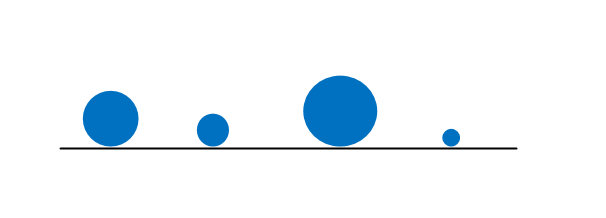

问：“谦子，你如何将这些石子按照从小到大的顺序从左到右依次排列成一行？”

“先找出最大的放在右边，然后再找出次大的，放在最大的左边，按照这个规律就可以依次排好了”，谦子回答道

“那你如何找到最大的呢？”，克问道

“用肉眼看”，谦子弱弱的说了一句

“怎么可以用肉眼看，如果成千上万你也用肉眼看吗？咱们算法国以算法著称，就是让一切问题的解决都可以最终化为一个算法，可以用程序写出来”，克严厉地批评道

“那该如何找最大的呢？”，谦子问道

“你看那水中的鱼，他们时不时地吐出泡泡，那泡泡越往上走就会越大


我们可以借鉴这种思路

从第一个石子开始，让它和右边相邻的石子进行比较，如果左边的石子大于右边的石子，那么就交换两个石子的位置，（也可以左小于右交换，这里采用大于交换），这样每比较一次，大的就跑到右边，直到跑到最右边”，克说道

克看谦子不明白，于是说：“起始时，左下标指向第一个石子，右下标指向第二个石子，然后比较”，说着说着画了一个图

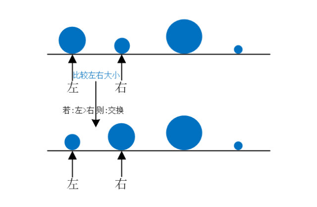

“然后左右下标同时向右移动，再次比较”，克接着说道，手不停的画着

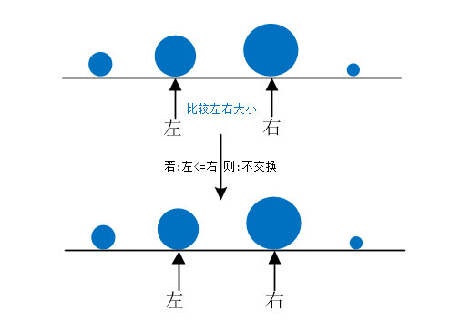

“这样一来，每次比较完，右下标指向的石头就是已经比较过的元素中的最大元素”，克微微笑了一下，看了看谦子，然后又画了一个图

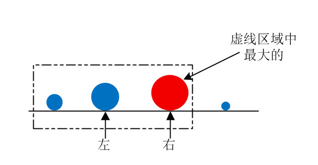

“按照这个做法，这一趟下来所有石子中最大的就跑到最右边了”，谦子悟出了其中的真谛，接着老师的话说了一句，自己在地上也画了一个图

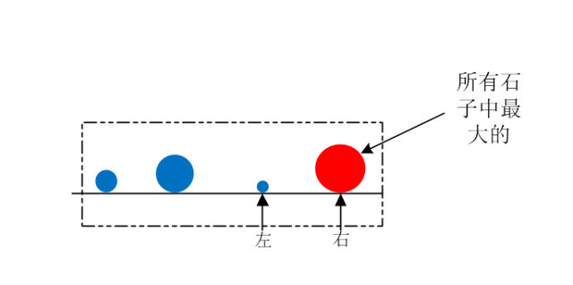

“这是第一趟排序，经过这趟排序之后，最大的就在最右边了，也就是排好序了，那么接下来就从剩下的三个石子中选最大的了，规则就和上面的一样了”，谦子继续说道，并画了一个图

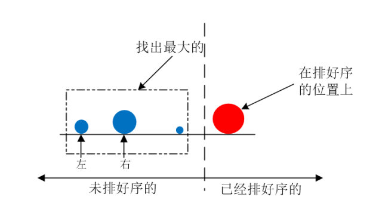

克脸上露出满意的笑容

然后克问，如果有 N 个石子，称从左到右找最大为一趟，那么要排好序需要多少趟？

谦子想了想，说道：“需要N-1次，因为如果因为N-1个数都排好了，那么最后一个数也就不用排了”，顺便画了一个图演示刚才四个石子的情况

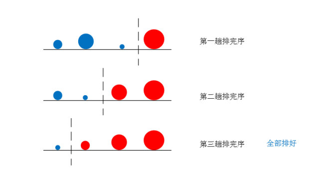

### 二、冒泡代码

“那你能把这个过程用代码实现吗？”，克问道

“这个。。。”，谦子挠了挠头，傻傻地笑了一下，克看了谦子一眼，转而在地下飞速地写了短短的几行代码

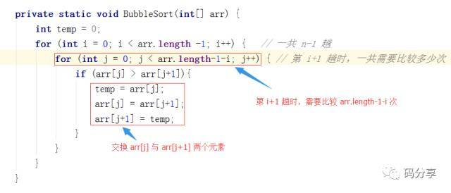

谦子心中暗暗惊叹老师的功力

“这个第一层循环是控制趟数，第二行能具体讲讲吗？”，谦子笑了笑问道

“第二层就是控制你第 i+1趟（因为i从0开始）所比较的次数，第 i +1 趟比较了 N – 1 -i 次”，克说道，最后画了两张图

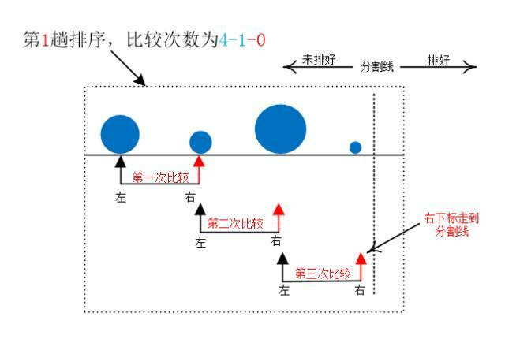

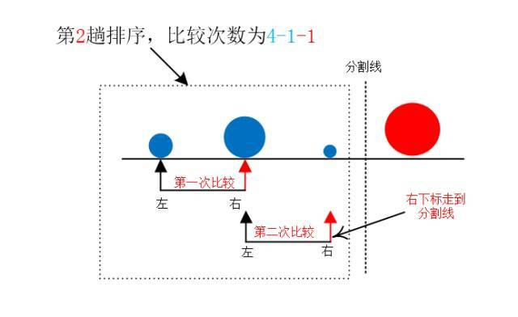

“随着趟数的增加，比较的次数也随之减小，这个规律很容易发现吧”，克说道

谦子点了点头

### 三、时间复杂度

“那你说说这个算法的时间复杂度吧”，克问道

谦子心里想到：

既然排序完需要3趟，第一趟需要比较3次，第二趟需要比较2次，第三趟需要比较1次，那一共比较了 3 + 2 + 1 次

那推广到数量为 n 的规模的话，那就需要 (n-1) + (n-2) +…+2+1 次，这不就是一个等差数列吗，很显然：

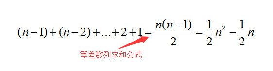

根据复杂度的规则，去掉低阶项（也就是n/2）,并去掉常数系数，那复杂度就是O(n^2)了

“O(n^2)”,谦子想了一会说道

“恩恩，不错”，克说道

### 四、稳定性

“那这个算法稳不稳定呢？”，克又问道

“哦，什么是稳定性？”，谦子问道

“哦，这个还没有给他讲”，克忽然想起来

“所谓稳定性，其实就是说，当你原来待排的元素中间有相同的元素，在没有排序之前它们之间有先后顺序，在排完后它们之间的先后顺序不变，我们就称这个算法是稳定的”，克说道，顺便画了一个图举了一个例子

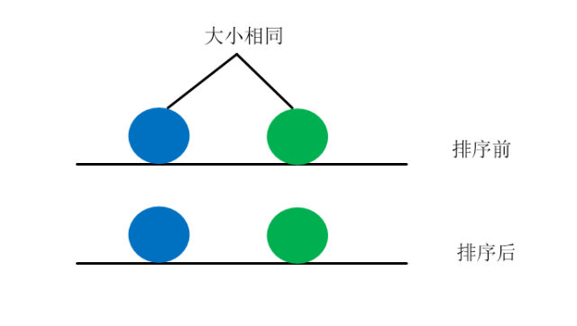

“看到了吧，原本同样大的石子，蓝色的在绿色的左边，拍完序后蓝色的仍然在绿色的左边，这就是稳定的”，克解释道

“哦，我懂了，那冒泡排序就是一个稳定的排序了，因为在交换的时候，如果两个石子相同，那么就不交换[if (arr[j] > arr[j+1]){ 交换}],相同元素不会因为算法中哪条语句相互交换位置的”

“恩恩，对的”，克说道

天色渐晚，克和弟子走在了回去的路上，回去的路上克告诉谦子今天的排序算法叫**冒泡排序**

### 五、优化一下冒泡排序的算法

```java
    /**
     * 冒泡排序
     * @param array
     * @return
     */
    public int[] bubbleSort(int[] array) {
		if (arr == null || arr.length < 2) {
			return;
		}
		// 当前指针从数组最后一个值开始冒泡
		// 先将当前数组中的最大值冒泡到最后一位
		// 然后当前数组长度减1，在该长度数组中继续寻找最大值
		// 依次类推，直到数组长度为1
		for (int cur = arr.length - 1; cur > 0; cur--) {
			for (int i = 0; i < cur; i++) {
				if (arr[i] > arr[i + 1]) {
					swap(arr, i, i + 1);
				}
			}
		}
}

	// 根据异或运算的交换律和结合律实现交换
	// 其中x ^ x == 0
	// x ^ 0 == x
	public void swap(int[] arr, int i, int j) {
        if (arr[i]==arr[j]){
            return;
        }
		arr[i] = arr[i] ^ arr[j];
		arr[j] = arr[i] ^ arr[j];
		arr[i] = arr[i] ^ arr[j];
	}

```

