# 漫画：什么是希尔排序算法？

> 希尔排序（ShellSort）是以它的发明者Donald Shell名字命名的，希尔排序是插入排序的改进版，实现简单，对于中等规模数据的性能表现还不错

### 一、排序思想

一天，一尘拿着扑克自己在那玩，刚被师傅看见了


> 数据有序程度越高，越高效（移动少）

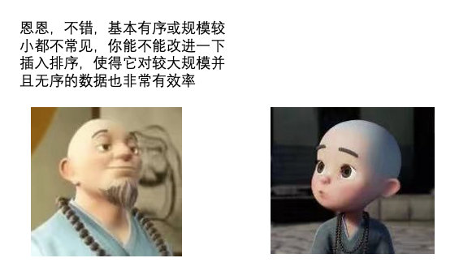


首先它把较大的数据集合分割成若干个小组（**逻辑上分组**），然后对每一个小组分别进行插入排序，此时，插入排序所作用的**数据量比较小**（每一个小组），插入的效率比较高

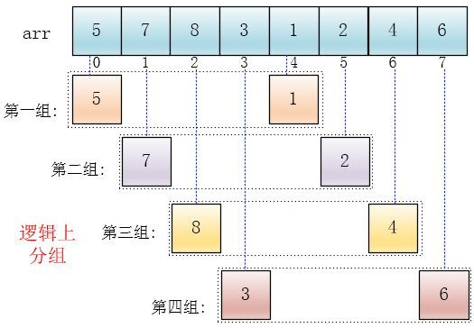

**注意：**下面有颜色的是逻辑上的分组，并没有实际地进行分组操作，在数组中的位置还是原来的样子，只是将他们看成这么几个分组（逻辑上分组）

可以看出，他是按下标相隔距离为4分的组，也就是说把下标相差4的分到一组，比如这个例子中a[0]与a[4]是一组、a[1]与a[5]是一组…，这里的差值（距离）被称为**增量**

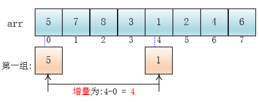

每个分组进行插入排序后，各个分组就变成了有序的了（整体不一定有序）

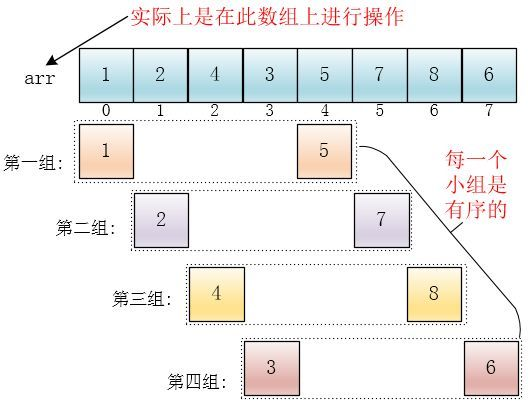

此时，整个数组变的**部分有序**了（有序程度可能不是很高）

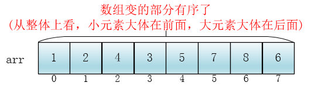

然后缩小增量为**上个增量的一半**:2，继续划分分组，此时，每个分组元素个数多了，但是，数组变的部分有序了，插入排序效率同样比较高

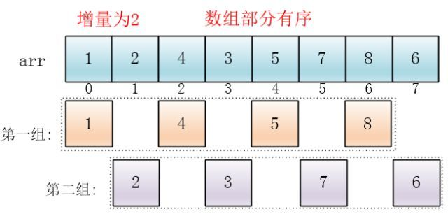

同理对每个分组进行排序（插入排序），使其每个分组各自有序

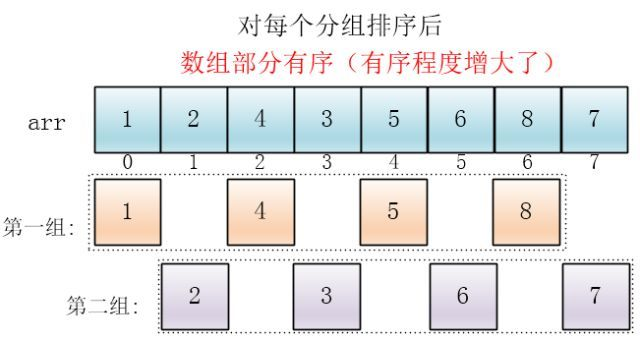

最后设置增量为上一个增量的一半：**1**，则整个数组被分为一组，此时，整个数组已经接近有序了，插入排序效率高

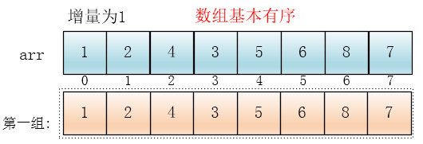

同理，对这仅有的一组数据进行排序，排序完成


### 二、排序代码


> 对于已经熟悉插入排序的一尘来说这并不是什么难事，很快，一尘写出了希尔排序的代码

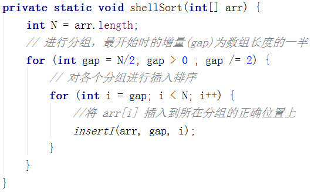


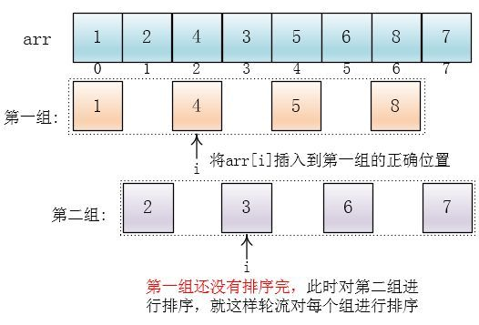

随后一尘写出了插入arr[i]到所在组正确位置的代码（**insertI**）

> insertI 和[直接插入排序]里的插入代码几乎完全一样

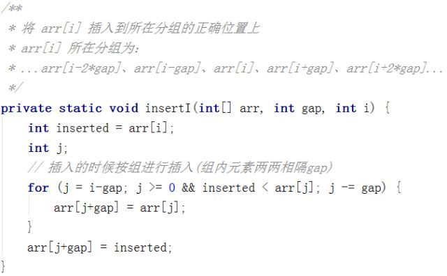

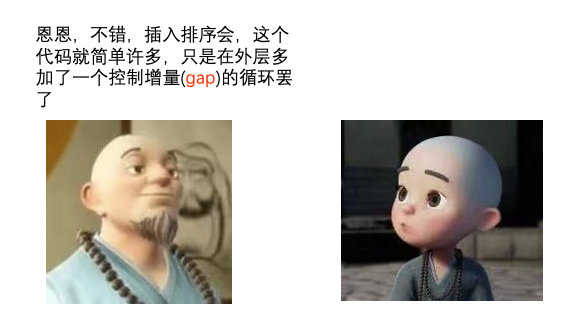

### 三、时间复杂度

> 接下来又是分析时间复杂度吧，一尘心里想

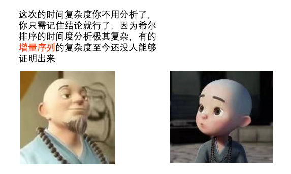


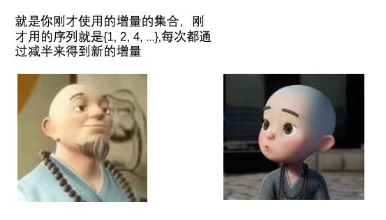

**希尔排序的复杂度和增量序列是相关的**

{1,2,4,8,…}(希尔增量)这种序列并不是很好的增量序列，使用这个增量序列的时间复杂度（最坏情形）是O(n^2)

Hibbard提出了另一个增量序列{1,3,7，…,2^k-1}，这种序列的时间复杂度(最坏情形)为O(n^1.5)

Sedgewick提出了几种增量序列，其最坏情形运行时间为O（n^1.3）,其中最好的一个序列是{1,5,19,41,109,…}

> 对不同增量的复杂度感性趣可以参考《数据结构与算法分析》一书或其他相关论文


### 四、稳定性


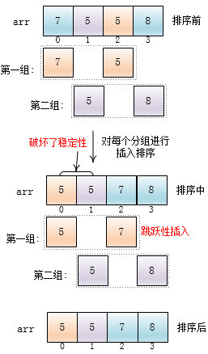

```java
    public static void shellSort(int[] arr) {
        int N = arr.length;
        // 进行分组,最开始时的增量(gap)为数组长度的一半
        for (int gap = N / 2; gap > 0; gap--) {
            // 对各个分组进行插入排序
            for (int i = gap; i < N; i++) {
                // 将arr[i]插入到所在分组的正确位置上
                insertI(arr, gap, i);
            }
        }
    }

    public static void insertI(int[] arr, int gap, int i) {
        int inserted = arr[i];
        int j;
        for (j = i - gap; j >= 0 && arr[j] > inserted; j--) {
            arr[j + gap] = arr[j];
        }
        arr[j + gap] = inserted;
    }
```

