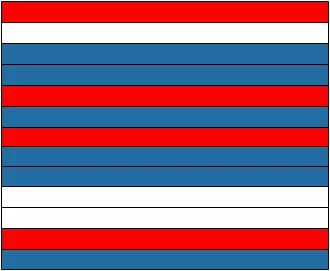
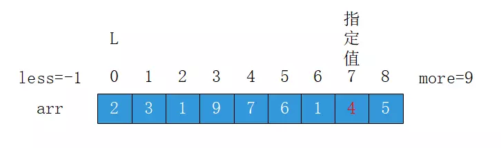
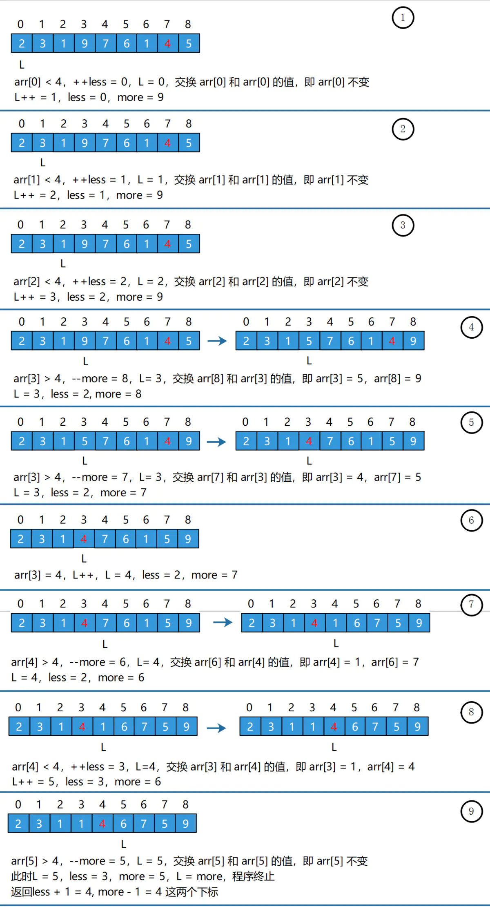

# 荷兰国旗问题

### 问题描述

荷兰国旗是由红白蓝3种颜色的条纹拼接而成，如下图所示：


假设这样的条纹有多条，且各种颜色的数量不一，并且随机组成了一个新的图形，新的图形可能如下图所示，但是绝非只有这一种情况：



需求是：把这些条纹按照颜色排好，红色的在上半部分，白色的在中间部分，蓝色的在下半部分，我们把这类问题称作荷兰国旗问题。

我们把荷兰国旗问题用数组的形式表达一下是这样的：

给定一个整数数组，给定一个值K，这个值在原数组中一定存在，要求把数组中小于K的元素放到数组的左边，大于K的元素放到数组的右边，等于K的元素放到数组的中间，最终返回一个整数数组，其中只有两个值，分别是等于K的数组部分的左右两个下标值。

例如，给定数组：[2, 3, 1, 9, 7, 6, 1, 4, 5]，给定一个值4，那么经过处理原数组可能得一种情况是：[2, 3, 1, 1, 4, 9, 7, 6, 5]，需要注意的是，小于4的部分不需要有序，大于4的部分也不需要有序，返回等于4部分的左右两个下标，即[4, 4]。

### 处理过程图示

我们以上面举的例子来看看处理过程的图示：



* less 用于记录小于 4 的区域的右下标，初始为-1，代表不存在

* more 用于记录大于 4 区域的左下标，初始为9，代表不存在

* L 用于正在遍历的元素的下标，初始值为0

* 从 arr[L] 即 arr[0] 开始遍历数组
  * 如果 arr[L] < 4, 交换 arr[++ less] 和 arr[L++] 的值
  * 如果 arr[L] > 4, 交换 arr[--more] 和 arr[L] 的值
  * 如果 arr[L] = 4, 不交换，L++，直接遍历下一个值
* 当 L >= more，退出循环。



### 代码

```java
public static int[] partition(int[] arr, int l, int r, int num) {
		// 小于区域初始值等于左边界减1
		// 大于区域等于右边界加1
		int less = l - 1;
		int more = r + 1;
		// 从左边界开始往后遍历
		// 能够遍历的条件是小于区域的边界值小区大于区域的边界值
		// 若当前值小于num,则将num与小于区域的下一个值交换
		// 小于区域加1,当前指针往后移
		// 若当前值大于num，
		// 则将当前值与大于区域的下一个值交换,大于区域左移,当前指针不动
		// 若当前值与num相等,当前值右移,其它不变
		while (l < more) {
			if (arr[l] < num) {
				swap(arr, ++less, l++);
			} else if (arr[l] > num) {
				swap(arr, --more, l);
			} else {
				l++;
			}
		}
		return new int[] { less + 1, more - 1 };
	}

	/*  数组切分问题
	 *  目一 给定一个数组ar，和一个数num，请把小于等于num的数放在数组的左边，
	 *  大于num的数放在数组的右边。
	 */
	public static void  partition(int arr[],int num) {
		// 当数组为空或数组长度小于2,则直接返回
		if (arr==null||arr.length<2) {
			return;
		}
		// 从左边界开始往后遍历,能够遍历的条件是小于区域的边界值小于大于区域的值
		// 当当前值大于num时,将当前值与大于区域的下一个值交换，大于区域左移
		// 否则当前指针往后移
		int less=0;
		int more=arr.length-1;
		while(less<more){
			//当前元素比比较数字大时 与最右端数字交换
			if (arr[less]>num) {
				swap(arr, less, more--);
			}else{//小于等于时 左端位置右移一位
				less++;
			}
		}
	}

	public static void swap(int[] arr, int i, int j) {
		int tmp = arr[i];
		arr[i] = arr[j];
		arr[j] = tmp;
	}
```

