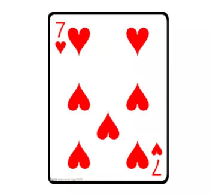
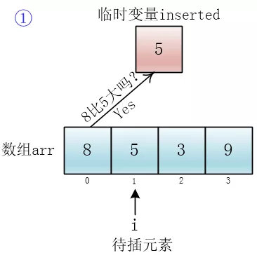

# 漫画：什么是插入排序算法？

> 面试官：聊聊插入排序

插入排序是一种比较简单直观的排序算法，适用处理数据量比较少或者部分有序的数据，今天我们来聊聊插入排序

### 一、排序思想


> 只见慧能拿出了一副牌，洗了洗牌，然后放在桌子上，从牌顶摸了几张牌


> 说着说着慧能又摸了一张牌




> 一尘不假思索地回答道


> 怎么判断？这一下还把小一尘给问愣住了，但是细想了一下整个过程，一尘答道


> 突然之间又学了一个知识点，每次知识都来得猝不及防，一尘心里想到


> 慧能拿来了笔和纸准备详细地说说


### 二、代码


> 早知道就不说这句话了，一尘心里想，但师命难违，还是硬着头皮想了想

一尘：首先我用一个数组存储要排序的数据（无序）


然后我用for循环从前到后遍历整个数组，将无序元素一个一个地插入到正确的位置（排好序的位置），第一个元素我认为它是排好序的，所以我从第二个元素开始遍历


随后，小一尘写下了如下代码

```java
public static void insertionSort(int [] arr) {
  for (int i = 1; i < arr.length; i++) {
    // 将 arr[i] 插入到正确的位置
    inserToRightPosition(arr, i);
  }
}
```


> 一尘解释道


一尘：是啊，这个怎么实现呢？咦，我可以用一个临时变量把**待插元素**（将要插入到有序集合的元素）存起来，然后逐个和有序集合里的元素比较，如果集合里的元素大于待插元素，就将它**向后移动一个单元**，这样当遇到有序集合中小于等于待插元素的元素时就有地方放待插元素了




小一尘又把插入方法(insertToRightPosition)实现了

```java
private static void inserToRightPosition(int[] arr, int i) {
  // 备份待插元素
  int inserted = arr[i];
  int j = i - 1;
  for(; j >= 0 && arr[j] > inserted; j--) {
    arr[j + 1] = arr[j]; // 将比待插元素大的元素后移
  }
  // 将待插元素插入正确的位置
  arr[j + 1] = inserted;
}
```

i 指向待插元素，j 会遍历有序数组中所有元素，直到找到合适的位置将**待插元素**(inserted)插入


### 三、时间复杂度


> 下面讨论最坏时间复杂度，即所有元素倒序

这段代码最耗时的地方就花在最内层for循环里面的操作上（比较和移动）了，我只要大概估算出这些操作执行的次数就可以了

对于n个元素，首先我的外层for循环要循环n-1次


然后insertToRightPosition里的内层for循环的循环次数是根据 i 来决定的，i = 1时,循环 1 次，i = 2,循环 2 次，…，i = n-1,循环 n-1次，那总共加起来就是


根据复杂度计算规则，保留高阶项，并去掉系数，那么时间复杂度为O(n^2)


### 四、稳定性


```java
    public static void insertionSort(int[] arr) {
        for (int i = 1; i < arr.length; i++) {
            // 将 arr[i] 插入到正确的位置
            inserToRightPosition(arr, i);
        }
    }

    private static void inserToRightPosition(int[] arr, int i) {
        // 备份待插元素
        int inserted = arr[i];
        int j = i - 1;
        for (; j >= 0 && arr[j] > inserted; j--) {
            arr[j + 1] = arr[j]; // 将比待插元素大的元素后移
        }
        // 将待插元素插入正确的位置
        arr[j + 1] = inserted;
    }

```

