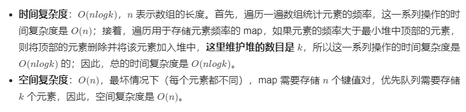
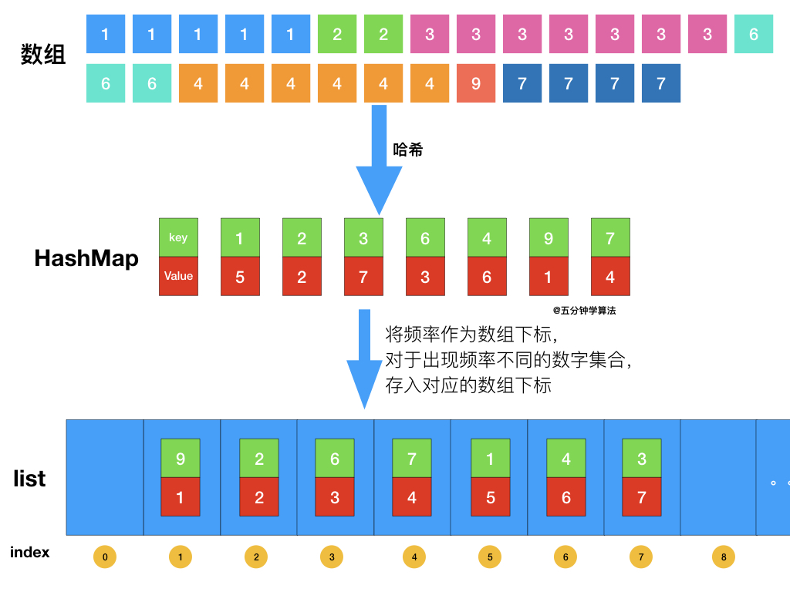
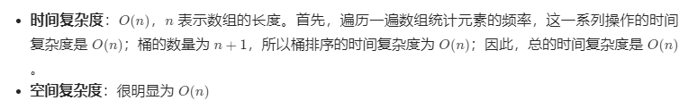

#### 剑指 Offer II 060. 出现频率最高的 k 个数字

给定一个整数数组 `nums` 和一个整数 `k` ，请返回其中出现频率前 `k` 高的元素。可以按 **任意顺序** 返回答案。

**示例 1:**

```shell
输入: nums = [1,1,1,2,2,3], k = 2
输出: [1,2]
```

**示例 2:**

```shell
输入: nums = [1], k = 1
输出: [1]
```

**提示：**

* 1 <= nums.length <= 105
* k 的取值范围是 [1, 数组中不相同的元素的个数]
* 题目数据保证答案唯一，换句话说，数组中前 k 个高频元素的集合是唯一的

**进阶：**所设计算法的时间复杂度 **必须** 优于 `O(n log n)` ，其中 `n` 是数组大小。

### 题解

### 解法一：最小堆

题目最终需要返回的是前 k 个频率最大的元素，可以想到借助堆这种数据结构，对于 k 频率之后的元素不用再去处理，进一步优化时间复杂度。


具体操作为：

- 借助 **哈希表** 来建立数字和其出现次数的映射，遍历一遍数组统计元素的频率

- 维护一个元素数目为 k的最小堆

- 每次都将新的元素与堆顶元素（堆中频率最小的元素）进行比较

- 如果新的元素的频率比堆顶端的元素大，则弹出堆顶端的元素，将新的元素添加进堆中

- 最终，堆中的 k个元素即为前 k 个高频元素


#### 复杂度分析



### 解法二：桶排序法

首先依旧使用哈希表统计频率，统计完成后，创建一个数组，将频率作为数组下标，对于出现频率不同的数字集合，存入对应的数组下标即可。



#### 复杂度分析



```java
class Solution {
    public int[] topKFrequent(int[] nums, int k) {
        List<Integer> result = new ArrayList<>();
        // 使用字典，统计每个元素出现的次数，元素为键，元素出现的次数为值
        Map<Integer, Integer> frequents = new HashMap<>();
        for (int num : nums) {
            frequents.put(num, frequents.getOrDefault(num, 0) + 1);
        }


        List<Integer>[] list = new ArrayList[nums.length + 1];
        for (int key : frequents.keySet()) {
            int frequent = frequents.get(key);
            if (list[frequent] == null) {
                list[frequent] = new ArrayList<>();
            }
            list[frequent].add(key);
        }

        for (int i = list.length - 1; i >= 0 && result.size() < k; i--) {
            if (list[i] == null) {
                continue;
            }
            for (int num : list[i]) {
                result.add(num);
                if (result.size() == k) {
                    break;
                }
            }
        }
        int[] ans = new int[result.size()];

        int index = 0;
        for (int num : result) {
            ans[index++] = num;
        }
        return ans;
    }

    public int[] topKFrequent1(int[] nums, int k) {
        // 使用字典，统计每个元素出现的次数，元素为键，元素出现的次数为值
        Map<Integer, Integer> frequents = new HashMap<>();
        for (int num : nums) {
            frequents.put(num, frequents.getOrDefault(num, 0) + 1);
        }

        // 遍历map，用最小堆保存频率最大的k个元素
        PriorityQueue<Integer> priorityQueue =
                new PriorityQueue<Integer>((a, b) -> frequents.get(a) - frequents.get(b));

        for (Integer key : frequents.keySet()) {
            if (priorityQueue.size() < k) {
                priorityQueue.add(key);
            } else if (frequents.get(key) > frequents.get(priorityQueue.peek())) {
                priorityQueue.remove();
                priorityQueue.add(key);
            }
        }

        int[] ans = new int[priorityQueue.size()];
        int index = 0;
        // 取出最小堆中的元素
        while (!priorityQueue.isEmpty()) {
            ans[index++] = priorityQueue.poll();
        }
        return ans;
    }

}
```

