# 计数排序


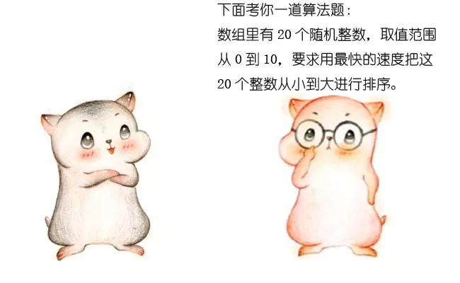

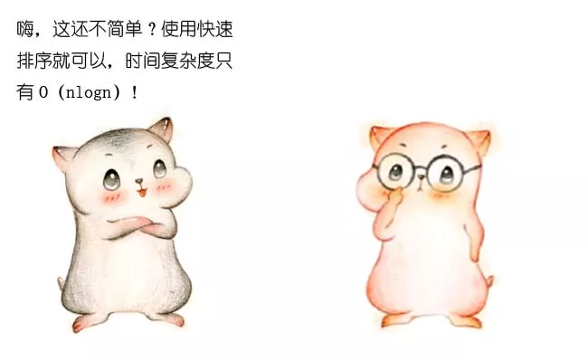


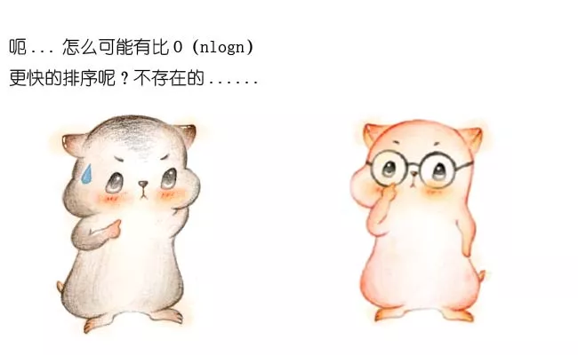


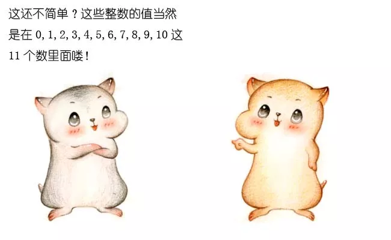


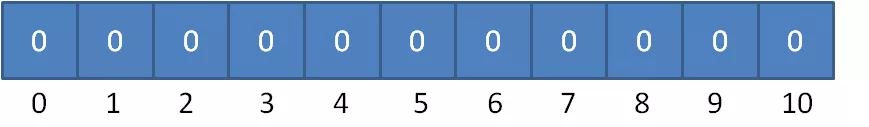

假定20个随机整数的值如下：

**9，3，5，4，9，1，2，7，8，1，3，6，5，3，4，0，10，9 ，7，9**

如何给这些无序非常简单，让我们遍历这个无序的随机数列，每一个整数按照其值对号入座，对应数组下标的元素进行加1操作。随机整数排序呢？

比如第一个整数是9，那么数组下标为9的元素加1：

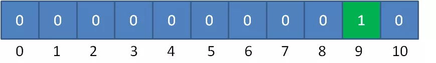

第二个整数是3，那么数组下标为3的元素加1：

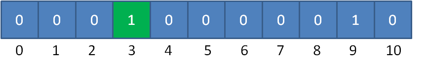

继续遍历数列并修改数组......

最终，数列遍历完毕时，数组的状态如下：

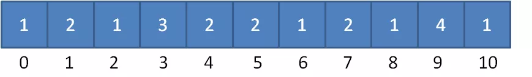

数组每一个下标位置的值，代表了数列中对应整数出现的次数。

有了这个“统计结果”，排序就很简单了。直接遍历数组，输出数组元素的下标值，元素的值是几，就输出几次：

**0，1，1，2，3，3，3，4，4，5，5，6，7，7，8，9，9，9，9，10**

显然，这个输出的数列已经是有序的了。


```java
public static int[] countSort(int[] array) {
    //1.得到数列的最大值
    int max = array[0];
    for(int i=1; i<array.length; i++){
        if(array[i] > max){
            max = array[i];
        }
    }
    //2.根据数列最大值确定统计数组的长度
    int[] countArray = new int[max+1];
    //3.遍历数列，填充统计数组
    for(int i=0; i<array.length; i++){
        countArray[array[i]]++;
    }
    //4.遍历统计数组，输出结果
    int index = 0;
    int[] sortedArray = new int[array.length];
    for(int i=0; i<countArray.length; i++){
        for(int j=0; j<countArray[i]; j++){
            sortedArray[index++] = i;
        }
    }
    return sortedArray;
}


public static void main(String[] args) {
    int[] array = new int[] {4,4,6,5,3,2,8,1,7,5,6,0,10};
    int[] sortedArray = countSort(array);
    System.out.println(Arrays.toString(sortedArray));
}

```

这段代码在一开头补充了一个步骤，就是求得数列的最大整数值max。后面创建的统计数组countArray，长度就是max+1，以此保证数组的最后一个下标是max。


**95\**，94，91，98，99，90，99，93，91，92\****

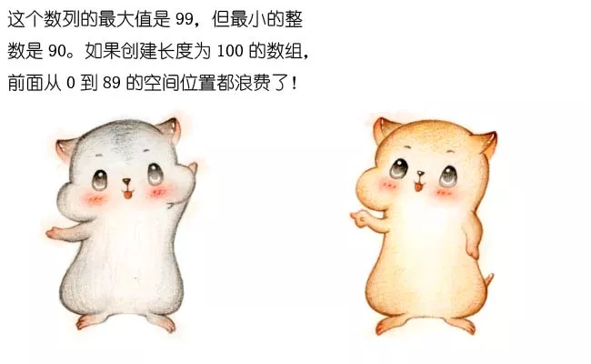

怎么解决这个问题呢？

很简单，我们不再以（输入数列的最大值+1）作为统计数组的长度，而是以（数列最大值和最小值的差+1）作为统计数组的长度。

同时，数列的最小值作为一个偏移量，用于统计数组的对号入座。

以刚才的数列为例，统计数组的长度为 99-90+1 = 10 ，偏移量等于数列的最小值 90 。

对于第一个整数95，对应的统计数组下标是 95-90 = 5，如图所示：

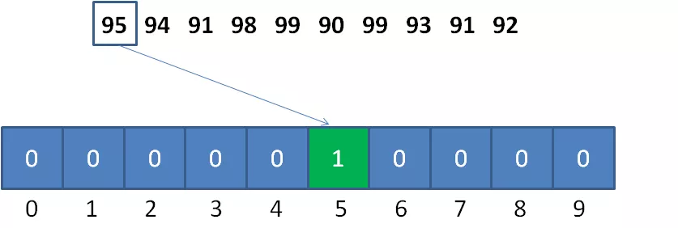


什么意思呢？让我们看看下面的例子：

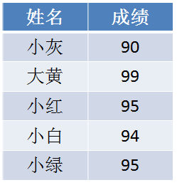

给定一个学生的成绩表，要求按成绩从低到高排序，如果成绩相同，则遵循原表固有顺序。

那么，当我们填充统计数组以后，我们只知道有两个成绩并列95分的小伙伴，却不知道哪一个是小红，哪一个是小绿：

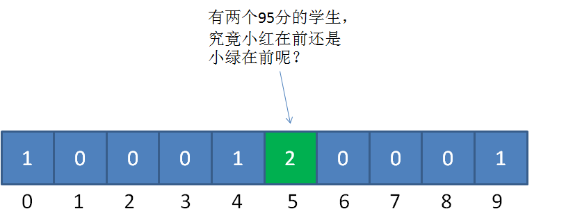


下面的讲解会有一些烧脑，请大家扶稳坐好。我们仍然以刚才的学生成绩表为例，把之前的统计数组变形成下面的样子：

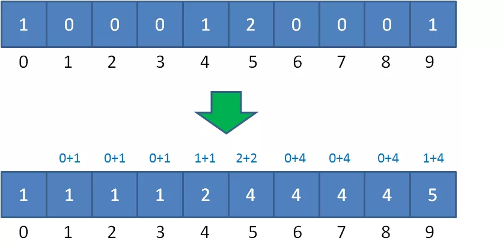

这是如何变形的呢？统计数组从第二个元素开始，每一个元素都加上前面所有元素之和。

为什么要相加呢？初次看到的小伙伴可能会觉得莫名其妙。

因为原来的统计数组（未变形）里面存储的是各个元素的个数，那么向后叠加的目的就是为了计算元素排序后的最终位置（准确来说是最大的最终位置）。比如元素 90 的个数为1, 94个数也为 1，那么向后叠加后94对应的统计数组（变形后）为 2 ，那它就最终的位置就是第二。

变形后的统计数组（countArray）中的值就代表着原数列元素排序后最大的最终位置（在重复元素的情况下还会有其他相同元素在此位置之前）。比如下标是5的值为4，说明 95 排序后的位置最大就是第四。

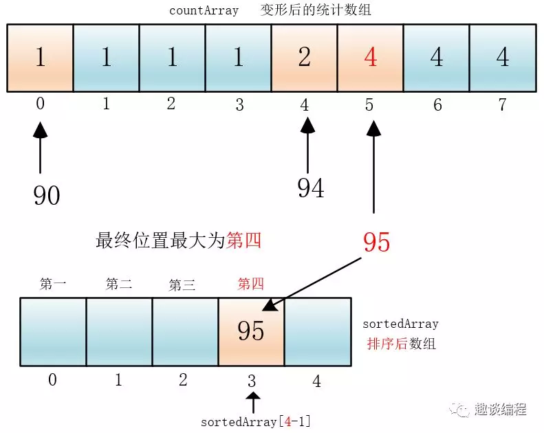

通过变形后的统计数组中的值对应排序后数组sortedArray的下标来控制最终的位置( 4 <---> sortedArray[4-1] );

那么另外一个95在哪？我们可以将accountArray[5] 里面的值减一（4-1），让它排在第三位。

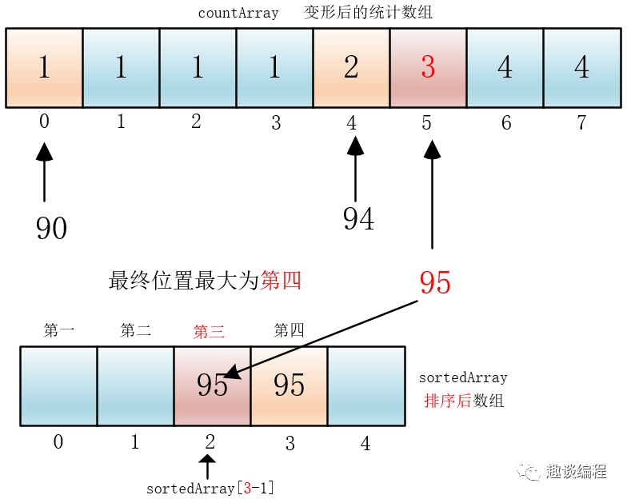

通过这样的递减，就可以将重复的元素全部安排妥当，先遇到小绿，就先安排小绿，再遇到小红，然后安排小红，这样小绿和小红排序前和排序后的次序也就可以相同了。

下来我们具体分析整个过程：

我们创建输出数组sortedArray，长度和输入数列一致。然后从后向前遍历输入数列：

第一步，我们遍历成绩表最后一行的小绿：

小绿是95分，我们找到countArray下标是5的元素，值是4，代表小绿的成绩排名位置在第4位。

同时，我们给countArray下标是5的元素值减1，从4变成3,，代表着下次再遇到95分的成绩时，最终排名是第3。

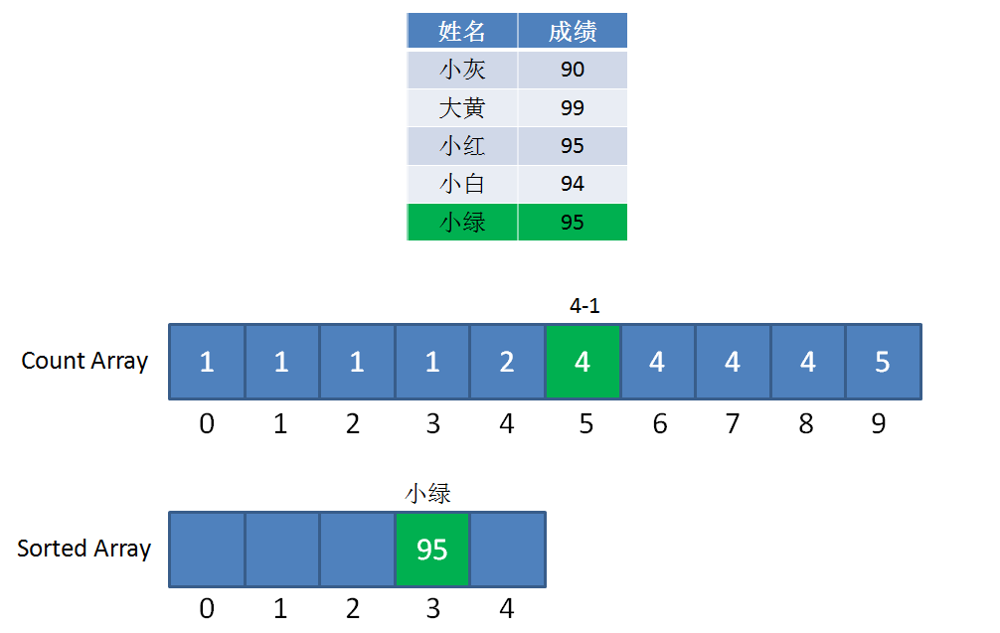

第二步，我们遍历成绩表倒数第二行的小白：

小白是94分，我们找到countArray下标是4的元素，值是2，代表小白的成绩排名位置在第2位。

同时，我们给countArray下标是4的元素值减1，从2变成1，代表着下次再遇到94分的成绩时（实际上已经遇不到了），最终排名是第1。

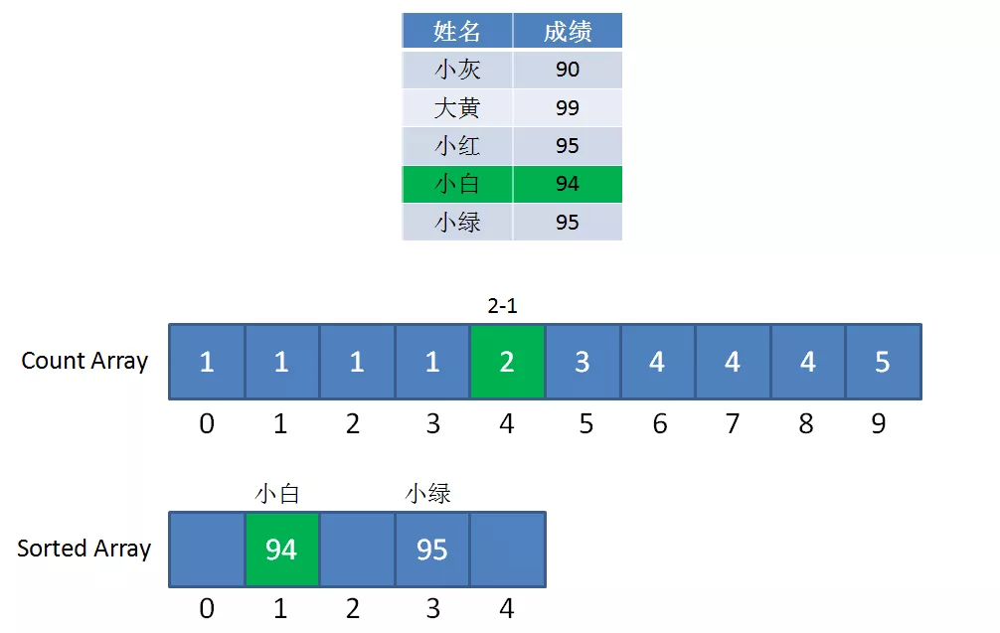

第三步，我们遍历成绩表倒数第三行的小红：

小红是95分，我们找到countArray下标是5的元素，值是3（最初是4，减1变成了3），代表小红的成绩排名位置在第3位。

同时，我们给countArray下标是5的元素值减1，从3变成2,，代表着下次再遇到95分的成绩时（实际上已经遇不到了），最终排名是第2。

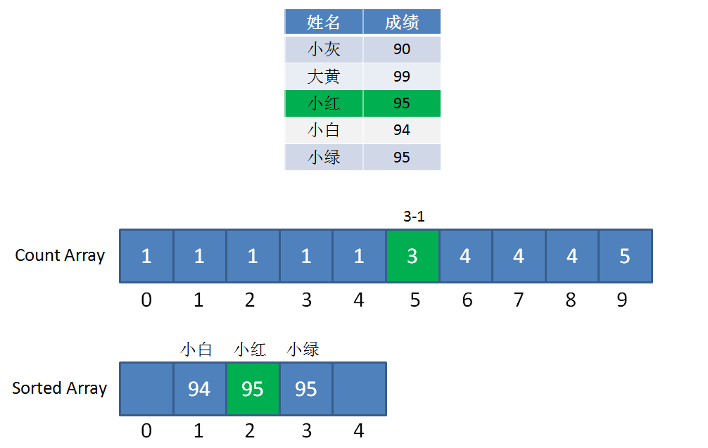

这样一来，同样是95分的小红和小绿就能够清楚地排出顺序了，也正因此，优化版本的计数排序属于**稳定排序**。

后面的遍历过程以此类推，这里就不再详细描述了。


```java
public static int[] countSort(int[] array) {
    //1.得到数列的最大值和最小值，并算出差值d
    int max = array[0];
    int min = array[0];
    for(int i=1; i<array.length; i++) {
        if(array[i] > max) {
            max = array[i];
        }
        if(array[i] < min) {
            min = array[i];
        }
    }
    int d = max - min;
    //2.创建统计数组并统计对应元素个数
    int[] countArray = new int[d+1];
    for(int i=0; i<array.length; i++) {
        countArray[array[i]-min]++;
    }
    //3.统计数组做变形，后面的元素等于前面的元素之和
    int sum = 0;
    for(int i=0;i<countArray.length;i++) {
        sum += countArray[i];
        countArray[i] = sum;
    }
    //4.倒序遍历原始数列，从统计数组找到正确位置，输出到结果数组
    int[] sortedArray = new int[array.length];
    for(int i=array.length-1;i>=0;i--) {
        sortedArray[countArray[array[i]-min]-1]=array[i];
        countArray[array[i]-min]--;
    }
    return sortedArray;
}

public static void main(String[] args) {
    int[] array = new int[] {95,94,91,98,99,90,99,93,91,92};
    int[] sortedArray = countSort(array);
    System.out.println(Arrays.toString(sortedArray));
}

```


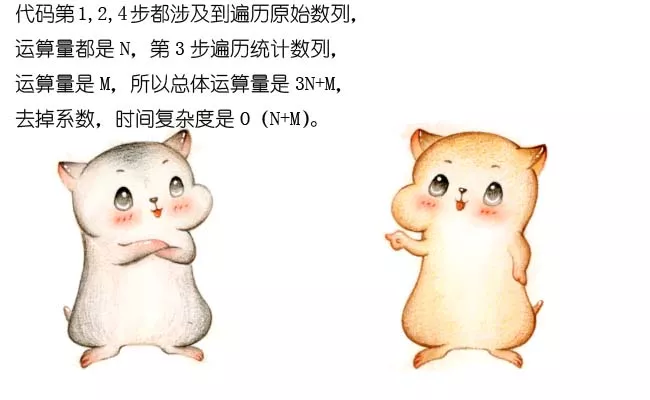


**1.当数列最大最小值差距过大时，并不适用计数排序。**

比如给定20个随机整数，范围在0到1亿之间，这时候如果使用计数排序，需要创建长度1亿的数组。不但严重浪费空间，而且时间复杂度也随之升高。

**2.当数列元素不是整数，并不适用计数排序。**

如果数列中的元素都是小数，比如25.213，或是0.00000001这样子，则无法创建对应的统计数组。这样显然无法进行计数排序。


