# 漫画：什么是选择排序算法？

> 选择排序是一种简单直观的算法，今天我们聊聊选择排序的思想，代码以及复杂度

### 排序思想

一天，小一尘和师傅下山去了，在集市中路经一个水果摊，只见水果摊上摆着色泽基本相同但大小不一的苹果


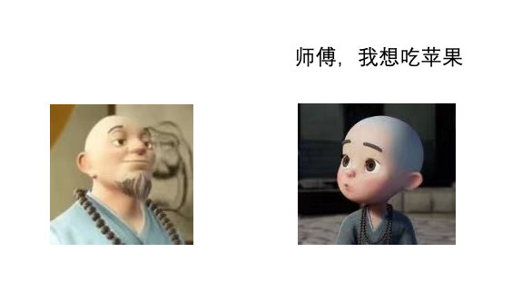

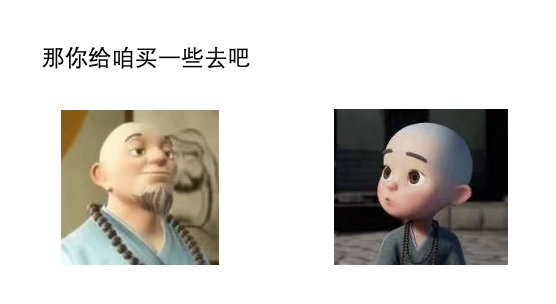

师傅答应后，小一尘就去水果摊前买苹果了

他拿了一个袋子，**从众多苹果中挑了一个最大的装入袋子，然后又从剩下的苹果中挑出了最大的放入口袋**，就这样挑了几个苹果然后结账

> 小一尘买完苹果后，走到师傅面前

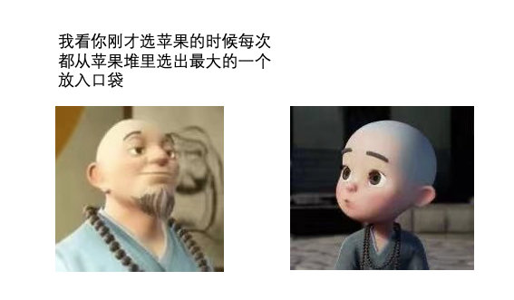


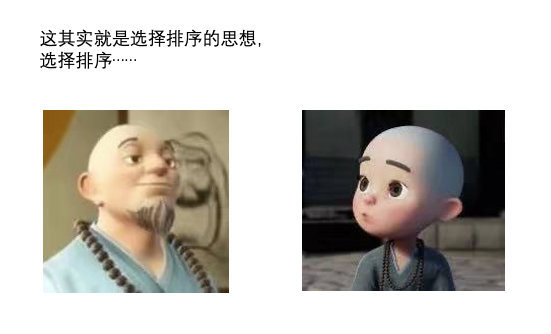

慧能：这其实就是选择排序的思想，选择排序就是不断地从未排序的元素中选择最大（或最小）的元素放入已排好序的元素集合中，直到未排序中仅剩一个元素为止。

> 买个苹果也不忘给我传授知识，一尘心里甚是感激

### 排序代码

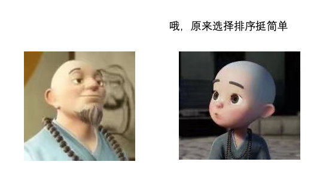

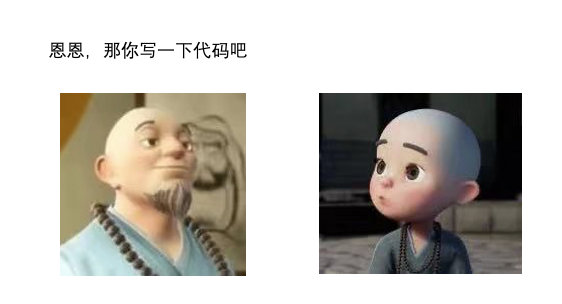

> 一尘眉头一紧

心中想到：

初始时肯定给我一个无序数组

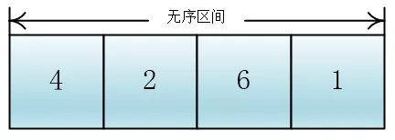

我先从这些元素中选出一个最小的（或最大的），和第一个元素进行交换，这样第一个元素就是最小的，第一个元素位置就变成有序区间了

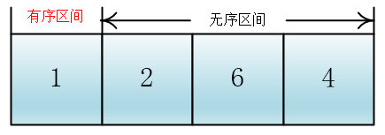

同理，在剩下的无序区间选择最小的元素，将最小元素与**无序区间的第一个元素**进行交换，交换后原来无序区间的第一个元素就变为有序区间的最后一个元素了，有序区间递增一

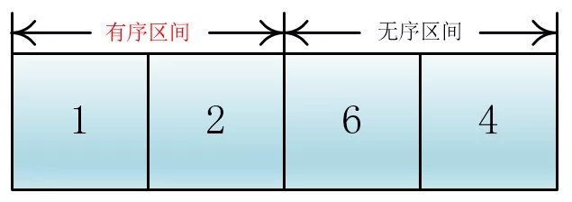

以此类推，全部元素就可以通过这样不断地选择以及交换排完序

**那如何选出最小的一个元素呢？**

很容易想到：先随便选一个元素假设它为最小的元素（默认为无序区间第一个元素），然后让这个元素与无序区间中的每一个元素进行比较，如果遇到比自己小的元素，那更新最小值下标，直到把无序区间遍历完，那最后的最小值就是这个无序区间的最小值

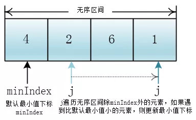

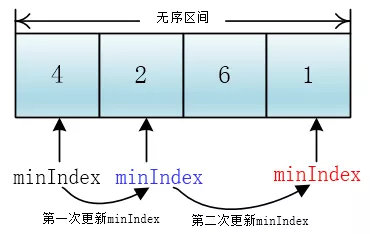

想到这里，一尘已经胸有成竹了，随手写出了如下代码

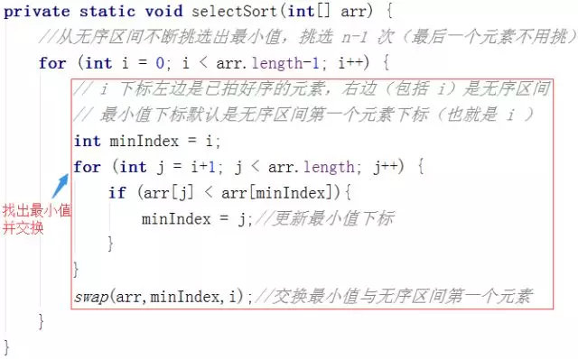

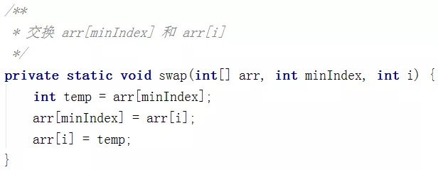

### 时间复杂度

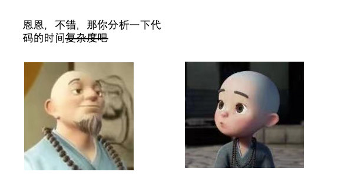

> 这段代码的时间复杂度不难，和冒泡排序，插入排序的非常像，一尘心里想到

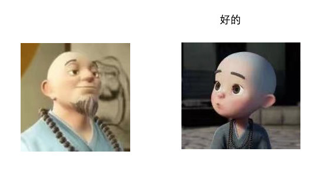

设有 n 个元素（n = arr.length）

代码执行的时间都花费在内层for循环中的**比较**语句和外层for循环里的**交换语句**了

外层for循环执行 n-1 次，那么交换（swap）就执行 n-1 次，时间复杂度为O(n)

内层for循环中的比较语句执行多少次呢？

i = 0 时，比较 n – 1 次

i = 1 时，比较 n – 2 次

…

i = n-2 时，比较 1 次

则一共比较了

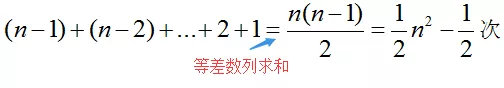

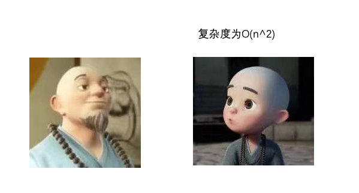

### 稳定性


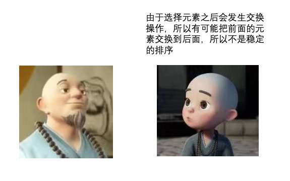

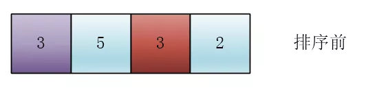

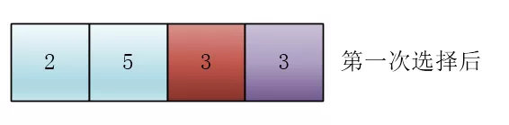

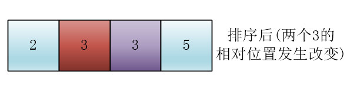

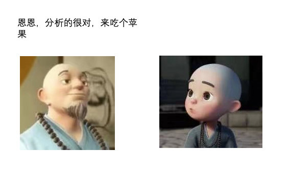

> 一尘和师傅提着苹果走向了回家的路

```java
	// 选择排序
	// 从数组下标为0的数开始往后遍历，找到最小的值后与下标为0的值替换
	// 接着从下标为1的数开始往后遍历，找到最小的值后与下标为1的值替换
	// 依次类推
	// 直到下标达到数据长度
	public static void selectionSort(int[] arr) {
		if (arr == null || arr.length < 2) {
			return;
		}
		for (int i = 0; i < arr.length - 1; i++) {
			int minIndex = i;
			for (int j = i + 1; j < arr.length; j++) {
				minIndex = arr[j] < arr[minIndex] ? j : minIndex;
			}
			swap(arr, i, minIndex);
		}
	}

	public static void swap(int[] arr, int i, int j) {
		int tmp = arr[i];
		arr[i] = arr[j];
		arr[j] = tmp;
	}

```

