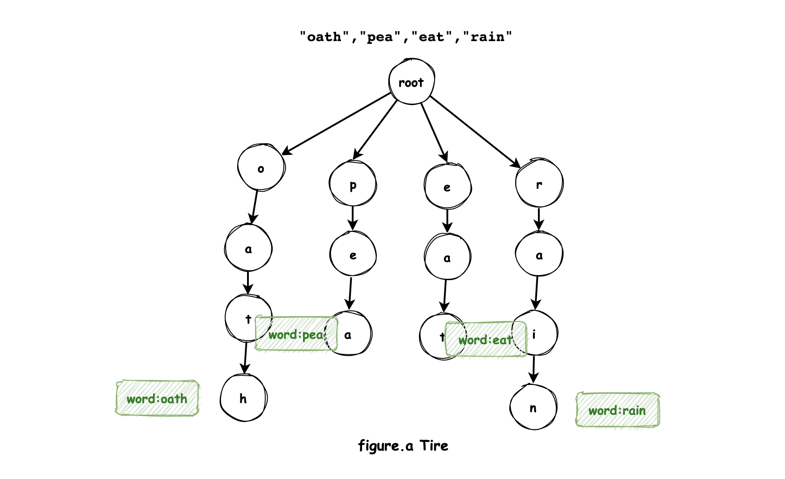

#### 212. 单词搜索 II

给定一个 `m x n` 二维字符网格 `board` 和一个单词（字符串）列表 `words`，找出所有同时在二维网格和字典中出现的单词。

单词必须按照字母顺序，通过 **相邻的单元格** 内的字母构成，其中“相邻”单元格是那些水平相邻或垂直相邻的单元格。同一个单元格内的字母在一个单词中不允许被重复使用。

**示例 1：**


```shell
输入：board = [["o","a","a","n"],["e","t","a","e"],["i","h","k","r"],["i","f","l","v"]], words = ["oath","pea","eat","rain"]
输出：["eat","oath"]
```

**示例 2：**


```shell
输入：board = [["a","b"],["c","d"]], words = ["abcb"]
输出：[]
```

**提示：**

* m == board.length
* n == board[i].length
* 1 <= m, n <= 12
* board[i][j] 是一个小写英文字母
* 1 <= words.length <= 3 * 104
* 1 <= words[i].length <= 10
* words[i] 由小写英文字母组成
* words 中的所有字符串互不相同

### 题解

#### 方法1：朴素版DFS

- 借用79题的解法，遍历每一个word，暴力

```java
class Solution {
    public List<String> findWords(char[][] board, String[] words) {
        Set<String> ans = new HashSet<>();

        for (String word : words) {
            if (exist(board, word)) {
                ans.add(word);
            }
        }

        return new ArrayList<>(ans);
    }

    int[] dx = new int[]{1, 0, -1, 0};
    int[] dy = new int[]{0, 1, 0, -1};

    public boolean exist(char[][] board, String word) {
        char[] charArray = word.toCharArray();
        int length = charArray.length;

        int n = board.length;
        int m = board[0].length;
        for (int i = 0; i < n; i++) {
            for (int j = 0; j < m; j++) {
                if (dfs(board, i, j, charArray, 0, length)) {
                    return true;
                }
            }
        }
        return false;
    }

    public boolean dfs(char[][] board, int i, int j, char[] charArray, int begin, int n) {
        if (i < 0 || i >= board.length || j < 0 || j >= board[0].length) {
            return false;
        }

        if (board[i][j] != charArray[begin]) {
            return false;
        }

        if (begin == n - 1) {
            return true;
        }

        char temp = board[i][j];
        board[i][j] = '.';

        for (int k = 0; k < 4; k++) {
            int x = i + dx[k];
            int y = j + dy[k];

            if (dfs(board, x, y, charArray, begin + 1, n)) {
                board[i][j] = temp;
                return true;
            }
        }
        board[i][j] = temp;
        return false;
    }
}
```

#### 方法2:Trie+回溯

- 也可以用`bool[m][n]`的访问数组标记某个字符的访问，替换掉`board[i][j] = '#'`



```java
class Solution {
 int[] dx = new int[]{1, 0, -1, 0};
    int[] dy = new int[]{0, 1, 0, -1};

    public List<String> findWords(char[][] board, String[] words) {
        Set<String> ans = new HashSet<>();
        int m = board.length;
        int n = board[0].length;

        Trie trie = new Trie();
        for (String word : words) {
            trie.insert(word);
        }

        boolean[][] visited = new boolean[m][n];
        for (int i = 0; i < m; i++) {
            for (int j = 0; j < n; j++) {
                dfs(board, visited, "", i, j, trie, ans);
            }
        }

        return new ArrayList<>(ans);
    }

    public void dfs(char[][] board, boolean[][] visited, String str, int x, int y, Trie trie, Set<String> ans) {
        if (visited[x][y]) {
            return;
        }

        str += board[x][y];

        if (!trie.startsWith(str)) {
            return;
        }

        if (trie.search(str)) {
            ans.add(str);
        }

        visited[x][y] = true;

        for (int k = 0; k < 4; k++) {
            int i = x + dx[k];
            int j = y + dy[k];
            if (i < 0 || i >= board.length || j < 0 || j >= board[0].length) {
                continue;
            }
            dfs(board, visited, str, i, j, trie, ans);
        }

        visited[x][y] = false;
    }


    public class Trie {

        Trie[] next = new Trie[26];
        boolean isEnd = false;

        /**
         * Initialize your data structure here.
         */
        public Trie() {

        }

        /**
         * Inserts a word into the trie.
         */
        public void insert(String word) {
            Trie cur = this;
            for (char c : word.toCharArray()) {
                if (cur.next[c - 'a'] == null) {
                    cur.next[c - 'a'] = new Trie();
                }
                cur = cur.next[c - 'a'];
            }
            cur.isEnd = true;
        }

        /**
         * Returns if the word is in the trie.
         */
        public boolean search(String word) {
            Trie cur = this;
            for (char c : word.toCharArray()) {
                if (cur.next[c - 'a'] == null) {
                    return false;
                }
                cur = cur.next[c - 'a'];
            }
            return cur.isEnd;
        }

        /**
         * Returns if there is any word in the trie that starts with the given prefix.
         */
        public boolean startsWith(String prefix) {
            Trie cur = this;
            for (char c : prefix.toCharArray()) {
                if (cur.next[c - 'a'] == null) {
                    return false;
                }
                cur = cur.next[c - 'a'];
            }
            return true;
        }
    }
}
```

