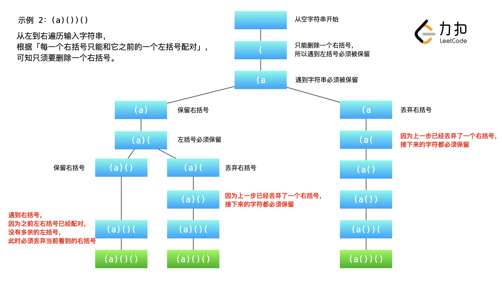

#### 301. 删除无效的括号

给你一个由若干括号和字母组成的字符串 `s` ，删除最小数量的无效括号，使得输入的字符串有效。

返回所有可能的结果。答案可以按 **任意顺序** 返回。

**示例 1：**

```shell
输入：s = "()())()"
输出：["(())()","()()()"]
```

**示例 2：**

```shell
输入：s = "(a)())()"
输出：["(a())()","(a)()()"]
```

**示例 3：**

```shell
输入：s = ")("
输出：[""]
```

**提示：**

- `1 <= s.length <= 25`
- `s` 由小写英文字母以及括号 `'('` 和 `')'` 组成
- `s` 中至多含 `20` 个括号

### 题解

### 方法一：回溯（深度优先遍历）

#### 1. 什么是「有效的括号」

题目输入的字符串由一系列「左括号」和「右括号」组成，但是有一些额外的括号，使得括号不能正确配对。

#### 2. 可以一次遍历计算出多余的「左括号」和「右括号」

**如果当前遍历到的左括号的数目严格小于右括号的数目则表达式无效（这一点非常重要）**。

因此，我们可以遍历一次输入字符串，统计「左括号」和「右括号」出现的次数。

* 当遍历到「右括号」的时候，
  * 如果此时「左括号」的数量不为 0，因为 **「右括号」可以与之前遍历到的「左括号」匹配**，此时「左括号」出现的次数 -1；
  * 如果此时「左括号」的数量为 0，「右括号」数量加 1；

* 当遍历到「左括号」的时候，「左括号」数量加 1。

通过这样的计数规则，最后「左括号」和「右括号」的数量就是各自最少应该删除的数量。

#### 3. 通过具体例子设计算法

> 友情提示：强烈建议大家根据示例 2 画出示意图，以理解程序的设计思想。

我们使用示例 2 向大家展示程序的执行流程。



说明：我们设计变量 leftCount 和 rightCount 分别表示在遍历的过程中已经遍历到的左括号和右括号的数量，统计它们是为了方便 剪枝。这是因为 只有当「已经遍历到的左括号的数量」严格大于「已经遍历到的右括号的数量」的时候，才可以继续添加「右括号」。大家可以结合代码进行理解。

#### 4. 去重使用「哈希表」

```java
class Solution {
    public List<String> removeInvalidParentheses(String s) {
        int n = s.length();
        char[] charArray = s.toCharArray();

        // 第一步: 遍历一次,计算多余的左右括号
        int leftRemove = 0;
        int rightRemove = 0;
        for (int i = 0; i < n; i++) {
            if (charArray[i] == '(') {
                leftRemove++;
            } else if (charArray[i] == ')') {
                // 遇到右括号的时候，须要根据已经存在的左括号数量决定
                if (leftRemove == 0) {
                    rightRemove++;
                } else if (leftRemove > 0) {
                    // 关键：一个右括号出现可以抵销之前遇到的左括号
                    leftRemove--;
                }
            }
        }

        StringBuilder path = new StringBuilder();
        Set<String> ans = new HashSet<>();
        dfs(charArray, 0, n, 0, 0, leftRemove, rightRemove, path, ans);
        return new ArrayList<>(ans);
    }

    public void dfs(char[] charArray, int index, int n, int leftCount, int rightCount, int leftRemove, int rightRemove, StringBuilder path, Set<String> ans) {
        if (index == n) {
            if (leftRemove == 0 && rightRemove == 0) {
                ans.add(path.toString());
            }
            return;
        }

        char ch = charArray[index];
        // 可能的操作 1：删除当前遍历到的字符
        if (ch == '(' && leftRemove > 0) {
            dfs(charArray, index + 1, n, leftCount, rightCount, leftRemove - 1, rightRemove, path, ans);
        } else if (ch == ')' && rightRemove > 0) {
            dfs(charArray, index + 1, n, leftCount, rightCount, leftRemove, rightRemove - 1, path, ans);
        }

        // 可能的操作 2：保留当前遍历到的字符
        path.append(ch);
        if (ch != '(' && ch != ')') {
            // 如果不是括号，继续深度优先遍历
            dfs(charArray, index + 1, n, leftCount, rightCount, leftRemove, rightRemove, path, ans);
        } else if (ch == '(') {
            // 考虑左括号
            dfs(charArray, index + 1, n, leftCount + 1, rightCount, leftRemove, rightRemove, path, ans);
        } else if (ch == ')' && rightCount < leftCount) {
            // 考虑右括号
            dfs(charArray, index + 1, n, leftCount, rightCount + 1, leftRemove, rightRemove, path, ans);
        }

        path.deleteCharAt(path.length() - 1);
    }
}
```

### 方法二：广度优先遍历

```java

public class Solution {


    public List<String> removeInvalidParentheses(String s) {
        List<String> ans = new ArrayList<>();

        // 广度优先遍历须要的队列和防止重复遍历的哈希表 visited
        Set<String> visited = new HashSet<>();
        visited.add(s);
        Queue<String> queue = new LinkedList();
        queue.add(s);


        // 找到目标值以后退出循环
        boolean found = false;
        while (!queue.isEmpty()) {
            // 最优解一定在同一层
            int size = queue.size();
            for (int i = 0; i < size; i++) {
                String front = queue.poll();
                if (isValid(front)) {
                    ans.add(front);
                    found = true;
                }


                int n = front.length();
                char[] charArray = front.toCharArray();
                for (int j = 0; j < n; j++) {
                    if (charArray[j] != '(' && charArray[j] != ')') {
                        continue;
                    }

                    // 注意 new String() 方法的 API，第 1 个参数是字符数组，第 2 个参数是字符数组的起始下标，第 3 个参数是截取的字符的长度
                    String next = new String(charArray, 0, j) + new String(charArray, j + 1, n - j - 1);
                    if (!visited.contains(next)) {
                        queue.add(next);
                        visited.add(next);
                    }
                }
            }

            // 这一层找到以后，退出外层循环，返回结果
            if (found) {
                break;
            }
        }

        return ans;
    }

    public boolean isValid(String s) {
        char[] charArray = s.toCharArray();
        int count = 0;
        for (char c : charArray) {
            if (c == '(') {
                count++;
            } else if (c == ')') {
                count--;
            }
            if (count < 0) {
                return false;
            }
        }
        return count == 0;
    }
}
```

