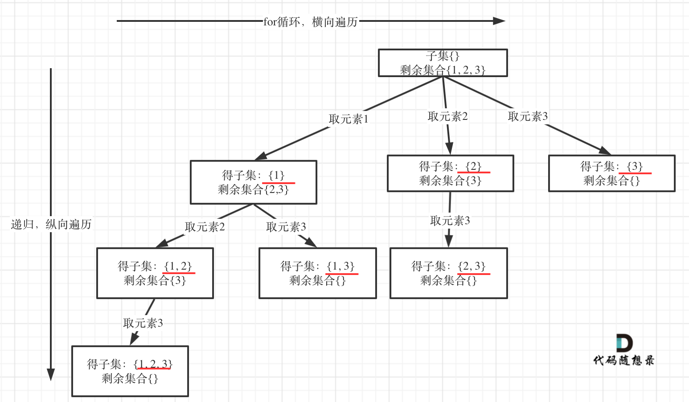

#### 78. 子集

给你一个整数数组 `nums` ，数组中的元素 **互不相同** 。返回该数组所有可能的子集（幂集）。

解集 **不能** 包含重复的子集。你可以按 **任意顺序** 返回解集。

**示例 1：**

```shell
输入：nums = [1,2,3]
输出：[[],[1],[2],[1,2],[3],[1,3],[2,3],[1,2,3]]
```

**示例 2：**

```shell
输入：nums = [0]
输出：[[],[0]]
```

**提示：**

- `1 <= nums.length <= 10`
- `-10 <= nums[i] <= 10`
- `nums` 中的所有元素 **互不相同**

### 题解

求子集问题和[回溯算法：求组合问题！](https://mp.weixin.qq.com/s/OnBjbLzuipWz_u4QfmgcqQ)和[回溯算法：分割问题！](https://mp.weixin.qq.com/s/Pb1epUTbU8fHIht-g_MS5Q)又不一样了。

如果把 子集问题、组合问题、分割问题都抽象为一棵树的话，**那么组合问题和分割问题都是收集树的叶子节点，而子集问题是找树的所有节点！**

其实子集也是一种组合问题，因为它的集合是无序的，子集{1,2} 和 子集{2,1}是一样的。

**那么既然是无序，取过的元素不会重复取，写回溯算法的时候，for就要从startIndex开始，而不是从0开始！**

有同学问了，什么时候for可以从0开始呢？

求排列问题的时候，就要从0开始，因为集合是有序的，{1, 2} 和{2, 1}是两个集合，排列问题我们后续的文章就会讲到的。

以示例中nums = [1,2,3]为例把求子集抽象为树型结构，如下：



从图中红线部分，可以看出**遍历这个树的时候，把所有节点都记录下来，就是要求的子集集合**。

```java
class Solution {
    public List<List<Integer>> subsets(int[] nums) {
        int n = nums.length;
        List<List<Integer>> ans = new ArrayList<>();
        Deque<Integer> path = new ArrayDeque<>();

        dfs(nums, 0, n, path, ans);
        return ans;
    }

    public void dfs(int[] nums, int begin, int n, Deque<Integer> path, List<List<Integer>> ans) {
        ans.add(new ArrayList<>(path));
        if (begin >= n) {
            return;
        }
        for (int i = begin; i < n; i++) {
            path.addLast(nums[i]);
            dfs(nums, i + 1, n, path, ans);
            path.removeLast();
        }
    }
}
```

