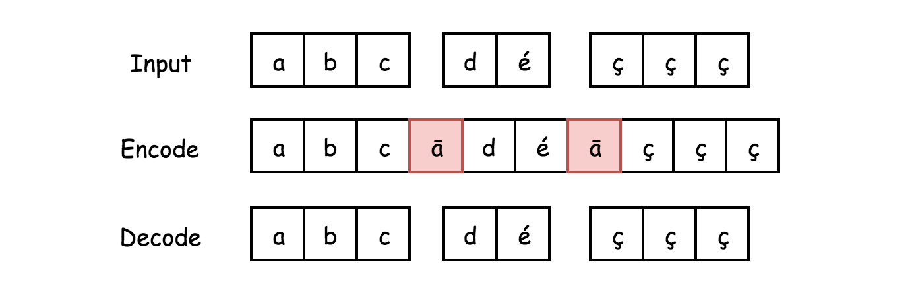

#### 271. 字符串的编码与解码

请你设计一个算法，可以将一个 **字符串列表** 编码成为一个 **字符串**。这个编码后的字符串是可以通过网络进行高效传送的，并且可以在接收端被解码回原来的字符串列表。

1 号机（发送方）有如下函数：

```shell
string encode(vector<string> strs) {
  // ... your code
  return encoded_string;
}
```

2 号机（接收方）有如下函数：

```shell
vector<string> decode(string s) {
  //... your code
  return strs;
}
```

1 号机（发送方）执行：

```shell
string encoded_string = encode(strs);
```

2 号机（接收方）执行：

```shell
vector<string> strs2 = decode(encoded_string);
```

此时，2 号机（接收方）的 `strs2` 需要和 1 号机（发送方）的 `strs` 相同。

请你来实现这个 `encode` 和 `decode` 方法。

**注意：**

* 因为字符串可能会包含 256 个合法 ascii 字符中的任何字符，所以您的算法必须要能够处理任何可能会出现的字符。
* 请勿使用 “类成员”、“全局变量” 或 “静态变量” 来存储这些状态，您的编码和解码算法应该是非状态依赖的。
* 请不要依赖任何方法库，例如 eval 又或者是 serialize 之类的方法。本题的宗旨是需要您自己实现 “编码” 和 “解码” 算法。

### 题解

#### 方法一：使用非 ASCII 码的分隔符

**算法：**

最简单的方法就是分隔符连接字符串。

而问题就是用什么作为分隔符？每个字符串可以包含 256 个有效的 ASCII 码字符。

可以使用非 ASCII 码的字符，例如 Python 中的 unichr(257) 和 Java 中的 Character.toString((char)257)（代表的是字符 ā）。



我们还是用了另一个非 ASCII 字符来识别字符为空的情况。

```java
public class Codec {
  // Encodes a list of strings to a single string.
  public String encode(List<String> strs) {
    if (strs.size() == 0) return Character.toString((char)258);

    String d = Character.toString((char)257);
    StringBuilder sb = new StringBuilder();
    for(String s: strs) {
      sb.append(s);
      sb.append(d);
    }
    sb.deleteCharAt(sb.length() - 1);
    return sb.toString();
  }

  // Decodes a single string to a list of strings.
  public List<String> decode(String s) {
    String d = Character.toString((char)258);
    if (s.equals(d)) return new ArrayList();

    d = Character.toString((char)257);
    return Arrays.asList(s.split(d, -1));
  }
}
```

**复杂度分析**

* 时间复杂度：均是O(*N*)，其中 N指的是字符串数组的大小。

* 空间复杂度：
  * `encode`：O(1)，只用了一个字符串变量。
  * `decode`：O(*N*)，使用了字符串数组。

#### 方法二：分块编码

**算法：**

这种方法基于 HTTP v1.1 使用的编码，它不依赖于输入字符集，因此比方法一更具有通用性和有效性。

数据流被分成块，每个块前面都有其字节大小。

**编码：**


* 遍历字符串数组。
  * 计算每个字符串的长度，并将长度大小转换为 4 个字节的字符串。
  * 将长度信息的字符串添加到编码字符串的前面。
    * 前面 4 个字节表示了编码字符串的长度。
    * 后面跟这字符串本身。

- 返回编码后的字符串。

**解码：**


* 初始化指针 `i = 0` 在编码字符串上迭代，当 `i < n`：
  * 读四个字节 `s[i: i + 4]`，代表的是字符串信息的长度，将 `s[i: i + 4]` 转化为整数 `length`。
  * 移动指针 `i += 4`。
  * 添加字符串到答案 `s[i: i + length]`。
  * 移动指针 `i += length`。

* 返回解码后的字符串数组。

```java
public class Codec {
  // Encodes string length to bytes string
  public String intToString(String s) {
    int x = s.length();
    char[] bytes = new char[4];
    for(int i = 3; i > -1; --i) {
      bytes[3 - i] = (char) (x >> (i * 8) & 0xff);
    }
    return new String(bytes);
  }

  // Encodes a list of strings to a single string.
  public String encode(List<String> strs) {
    StringBuilder sb = new StringBuilder();
    for(String s: strs) {
      sb.append(intToString(s));
      sb.append(s);
    }
    return sb.toString();
  }

  // Decodes bytes string to integer
  public int stringToInt(String bytesStr) {
    int result = 0;
    for(char b : bytesStr.toCharArray())
      result = (result << 8) + (int)b;
    return result;
  }

  // Decodes a single string to a list of strings.
  public List<String> decode(String s) {
    int i = 0, n = s.length();
    List<String> output = new ArrayList();
    while (i < n) {
      int length = stringToInt(s.substring(i, i + 4));
      i += 4;
      output.add(s.substring(i, i + length));
      i += length;
    }
    return output;
  }
}
```

