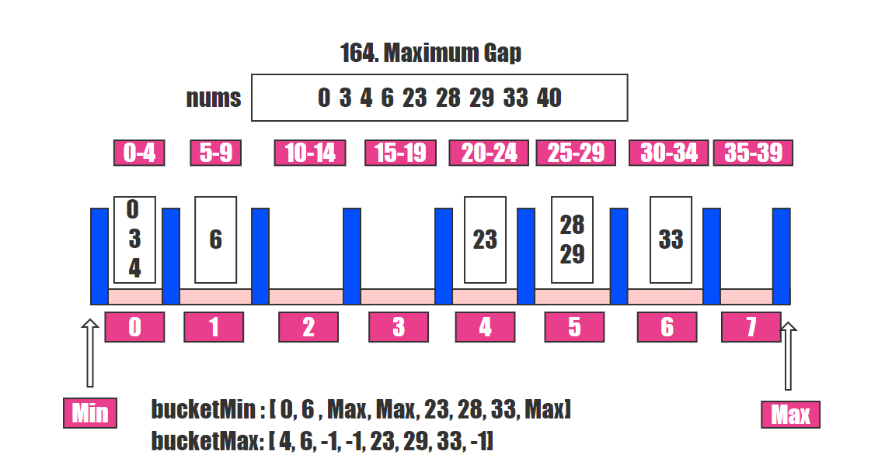

#### 164. 最大间距

给定一个无序的数组，找出数组在排序之后，相邻元素之间最大的差值。

如果数组元素个数小于 2，则返回 0。

**示例 1:**

```shell
输入: [3,6,9,1]
输出: 3
解释: 排序后的数组是 [1,3,6,9], 其中相邻元素 (3,6) 和 (6,9) 之间都存在最大差值 3。
```

**示例 2:**

```shell
输入: [10]
输出: 0
解释: 数组元素个数小于 2，因此返回 0。
```

**说明:**

- 你可以假设数组中所有元素都是非负整数，且数值在 32 位有符号整数范围内。
- 请尝试在线性时间复杂度和空间复杂度的条件下解决此问题。

### 题解

以`nums = [0, 3, 5, 6, 23, 28, 29, 33, 40]`为例

由于题目要求为线性时间复杂度 所以不能用`Arrays.sort`



这里用桶排序，只用考虑桶间的排序，不用考虑桶内的排序
用后一个桶的最小值减前一个桶的最大值，可以得到最大间距。

```java
//leetcode submit region begin(Prohibit modification and deletion)
class Solution {
    // 线性时间复杂度和空间复杂度 不能用Arrays.sort
    public int maximumGap(int[] nums) {
        if (nums.length < 2) {
            return 0;
        }

        int len = nums.length;

        // 找出最大值和最小值 为了方便后面确定桶的数量
        int max = -1;
        int min = Integer.MAX_VALUE;
        for (int i = 0; i < len; i++) {
            max = Math.max(max, nums[i]);
            min = Math.min(min, nums[i]);
        }

        // 排除nums全部为一样的数字，nums = [1,1,1,1,1,1];
        if (max - min == 0) {
            return 0;
        }

        // 用于存放每个桶的最小值
        int[] bucketMin = new int[len - 1];
        // 用于存放每个桶的最大值
        int[] bucketMax = new int[len - 1];

        Arrays.fill(bucketMin, Integer.MAX_VALUE);
        Arrays.fill(bucketMax, -1);

        // 确定桶的间距
        int interval = (int) Math.ceil((double) (max - min) /( len - 1));
        for (int i = 0; i < len; i++) {
            if (nums[i] == min || nums[i] == max) {
                continue;
            }
            // 找到每一个值所对应桶的索引
            int index = (nums[i] - min) / interval;
            // 更新每个桶的数据
            bucketMin[index] = Math.min(bucketMin[index], nums[i]);
            bucketMax[index] = Math.max(bucketMax[index], nums[i]);
        }

        // maxGap 表示桶之间最大的差距
        int maxGap = 0;
        // preMax 表示前一个桶的最大值
        int preMax = min;
        for (int i = 0; i < len - 1; i++) {
            // 表示某一个桶为空
            // 但凡某一个桶不为空，都会在前面的数据中更新掉bucketMax的值
            if (bucketMin[i] == Integer.MAX_VALUE) {
                continue;
            }
            maxGap = Math.max(maxGap, bucketMin[i] - preMax);
            preMax = bucketMax[i];
        }

        // [1,10000000]
        maxGap = Math.max(maxGap, max - preMax);
        return maxGap;
    }
}
//leetcode submit region end(Prohibit modification and deletion)

```

