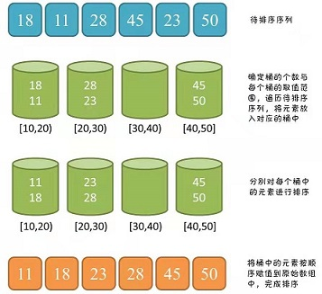

#### 220. 存在重复元素 III

给你一个整数数组 nums 和两个整数 k 和 t 。请你判断是否存在 两个不同下标 i 和 j，使得 abs(nums[i] - nums[j]) <= t ，同时又满足 abs(i - j) <= k 。

如果存在则返回 `true`，不存在返回 `false`。

**示例 1：**

```shell
输入：nums = [1,2,3,1], k = 3, t = 0
输出：true
```

**示例 2：**

```shell
输入：nums = [1,0,1,1], k = 1, t = 2
输出：true
```

**示例 3：**

```shell
输入：nums = [1,5,9,1,5,9], k = 2, t = 3
输出：false
```

**提示：**

* 0 <= nums.length <= 2 * 104
* -231 <= nums[i] <= 231 - 1
* 0 <= k <= 104
* 0 <= t <= 231 - 1

### 题解

**方法一: 滑动窗口**

```java
    // 滑动窗口
    public boolean containsNearbyAlmostDuplicate(int[] nums, int k, int t) {
        int n = nums.length;
        TreeSet<Long> set = new TreeSet<>();
        for (int i = 0; i < n; i++) {
            // 返回set中 大于或者等于 nums[i] - t 的最小元素
            Long ceiling = set.ceiling((long) nums[i] - (long) t);

            // 是否找到了符合条件的数
            if (ceiling != null && ceiling <= ((long) nums[i] + (long) t)) {
                return true;
            }

            set.add((long) nums[i]);
            if (i >= k) {
                set.remove((long)nums[i - k]);
            }
        }
        return false;
    }
```

**方法二: 桶排序**

**由于本题对元素的索引有要求，所以直接对 nums 数组进行排序的话会破坏了原来的索引，这显然是不行的，此时考虑 `<桶排序>`。**



**使用 map存储，key表示桶编号，value 表示桶中已存在的数字，一个桶里数字范围的个数是 t + 1**

获取桶编号采用 num / (t + 1) 的方式，也就是将绝对值小于等于 tt 的放在了一个桶中。但是在数组中存在负数的情况，则会存在 靠近 0 的负数 / (t + 1) 时桶编号也为 00， 因此采用 (num + 1) / (t + 1) - 1，表示当前的数字应该落在了哪一个桶中。

```java
public long getID(long num, long w) {

    if (num >= 0) {

        return num / w;
    }
    return (num + 1) / w - 1;
}
```

主要存在以下几种情况：

- **落在同一个桶中**：比如 **[10, 11]，t = 2** 相差小于等于 t*t* 则两个元素一定落在了相同的桶中，**此时一定满足两元素的绝对值小于等于 t**。

```java
// 在桶中已经存在了
if (map.containsKey(id)) {

    return true;
}
```

落在相邻的桶中：比如相邻的数字为 [5, 8]，t = 2 那么 5 / (2 + 1) = 1 落在了第 1 个桶中，8 / (2 + 1) = 2 落在了第 2 个桶中，容易发现 8 - 5 = 3 > t = 2 距离超出了 tt 的那么肯定是落在了不同的桶中，此时两元素一定不满足绝对值小于等于 t。

落在相邻的桶中：另一种情况比如相邻的数字为 [5, 6]，t = 2 分别落在了第 1 与第 2 个桶中，但是这个绝对值是小于等于 t 的。
所以 两元素落在相邻的桶时，需要判断一下绝对值是否小于等于 t，若满足则这两个元素也是符合条件的。

```java
// 相邻的桶中有在[num - t, num + t]内：左边相邻的桶中
if (map.containsKey(id - 1) && Math.abs(nums[i] - map.get(id - 1)) < w) {

    return true;
}
//右边相邻的桶中
if (map.containsKey(id + 1) && Math.abs(nums[i] - map.get(id + 1)) < w) {

    return true;
}
```

- **若两个元素没有落在相邻的桶则一定不满足绝对值小于等于 t**。

由于要求 abs(i - j) <= k，所以要一直维持一个大小为 k 的窗口，此时要判断桶中元素是否超过了 k：若超过了 k，则需要将最开始放入桶中的元素（nums[i - k]）进行删除，这样在循环中桶会一直保持 k个元素。

```shell
if (i >= k) {
    map.remove(getID(nums[i - k], w));
}
```

若 nums 数组全部遍历完，仍没有返回 true，则此时直接返回 false即可。

```java

//leetcode submit region begin(Prohibit modification and deletion)
class Solution {
    // 滑动窗口
    public boolean containsNearbyAlmostDuplicate(int[] nums, int k, int t) {
        int n = nums.length;
        TreeSet<Long> set = new TreeSet<>();
        for (int i = 0; i < n; i++) {
            // 返回set中 大于或者等于 nums[i] - t 的最小元素
            Long ceiling = set.ceiling((long) nums[i] - (long) t);

            // 是否找到了符合条件的数
            if (ceiling != null && ceiling <= ((long) nums[i] + (long) t)) {
                return true;
            }

            set.add((long) nums[i]);
            if (i >= k) {
                set.remove((long)nums[i - k]);
            }
        }
        return false;
    }

    // 桶排序
    public boolean containsNearbyAlmostDuplicate1(int[] nums, int k, int t) {
        if (t < 0) {
            return false;
        }
        int n = nums.length;

        Map<Long, Long> bucket = new HashMap<>();
        for (int i = 0; i < n; i++) {
            // 得到当前数的桶编号
            Long bucketIndex = getID(nums[i], t);
            // 该桶已经存在了
            if (bucket.containsKey(bucketIndex)) {
                return true;
            }
            // 相邻的桶中有在[num - t, num + t]内：左边相邻的桶中
            if (bucket.containsKey(bucketIndex - 1) && Math.abs(nums[i] - bucket.get(bucketIndex - 1)) <= t) {
                return true;
            }
            if (bucket.containsKey(bucketIndex + 1) && Math.abs(nums[i] - bucket.get(bucketIndex + 1)) <= t) {
                return true;
            }

            bucket.put(bucketIndex, (long) (nums[i]));
            if (i >= k) {
                bucket.remove(getID(nums[i - k], t));
            }
        }
        return false;
    }

    public long getID(long num, long t) {
        if (num >= 0) {
            return num / (t + 1);
        }
        return (num + 1) / (t + 1) - 1;
    }
}
//leetcode submit region end(Prohibit modification and deletion)

```

