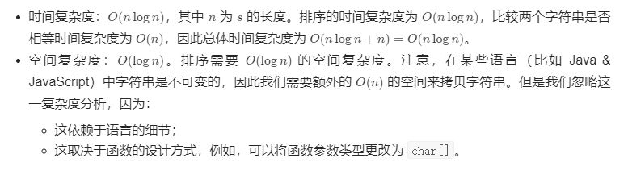

#### 242. 有效的字母异位词

给定两个字符串 *s* 和 *t* ，编写一个函数来判断 *t* 是否是 *s* 的字母异位词。

**示例 1:**

```shell
输入: s = "anagram", t = "nagaram"
输出: true
```

**示例 2:**

```shell
输入: s = "rat", t = "car"
输出: false
```

**说明:**

你可以假设字符串只包含小写字母。

**进阶:**

如果输入字符串包含 unicode 字符怎么办？你能否调整你的解法来应对这种情况？

### 题解

#### 方法一：排序

t 是 s 的异位词等价于「两个字符串排序后相等」。因此我们可以对字符串 s 和 t 分别排序，看排序后的字符串是否相等即可判断。此外，如果 s 和 t 的长度不同，t 必然不是 s 的异位词。

```java
class Solution {
    public boolean isAnagram(String s, String t) {
        if (s.length() != t.length()) {
            return false;
        }
        char[] str1 = s.toCharArray();
        char[] str2 = t.toCharArray();
        Arrays.sort(str1);
        Arrays.sort(str2);
        return Arrays.equals(str1, str2);
    }
}
```

**复杂度分析**



#### 方法二：哈希表

从另一个角度考虑，t 是 s 的异位词等价于「两个字符串中字符出现的种类和次数均相等」。由于字符串只包含 26 个小写字母，因此我们可以维护一个长度为 26 的频次数组 table，先遍历记录字符串 s 中字符出现的频次，然后遍历字符串 t，减去 table 中对应的频次，如果出现 table[i]<0，则说明 t 包含一个不在 s 中的额外字符，返回 false 即可。

```java
class Solution {
    public boolean isAnagram(String s, String t) {
        if (s.length() != t.length()) {
            return false;
        }
        int[] table = new int[26];
        for (int i = 0; i < s.length(); i++) {
            table[s.charAt(i) - 'a']++;
        }
        for (int i = 0; i < t.length(); i++) {
            table[t.charAt(i) - 'a']--;
            if (table[t.charAt(i) - 'a'] < 0) {
                return false;
            }
        }
        return true;
    }
}
```

对于进阶问题，Unicode 是为了解决传统字符编码的局限性而产生的方案，它为每个语言中的字符规定了一个唯一的二进制编码。而Unicode 中可能存在一个字符对应多个字节的问题，为了让计算机知道多少字节表示一个字符，面向传输的编码方式的UTF−8 和 UTF−16 也随之诞生逐渐广泛使用，具体相关的知识读者可以继续查阅相关资料拓展视野，这里不再展开。

回到本题，进阶问题的核心点在于「字符是离散未知的」，因此我们用哈希表维护对应字符的频次即可。同时读者需要注意 Unicode 一个字符可能对应多个字节的问题，不同语言对于字符串读取处理的方式是不同的。

```java
class Solution {
    public boolean isAnagram(String s, String t) {
        if (s.length() != t.length()) {
            return false;
        }

        Map<Character, Integer> table = new HashMap<>();
        for (int i = 0; i < s.length(); i++) {
            char ch = s.charAt(i);
            table.put(ch, table.getOrDefault(ch, 0) + 1);
        }

        for (int i = 0; i < t.length(); i++) {
            char ch = t.charAt(i);
            table.put(ch, table.getOrDefault(ch, 0) - 1);
            if (table.get(ch) < 0) {
                return false;
            }
        }
        return true;
    }
}
```

**复杂度分析**

- 时间复杂度：O(n)，其中 n 为 s 的长度。
- 空间复杂度：O(S)，其中 S 为字符集大小，此处 S=26