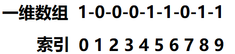
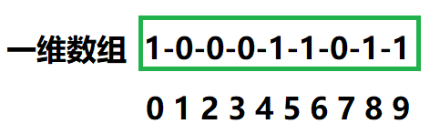
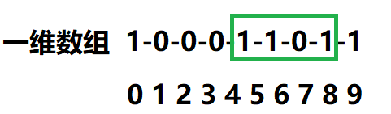
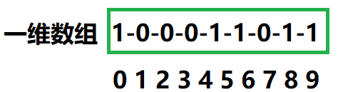
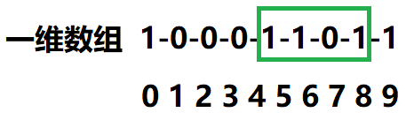
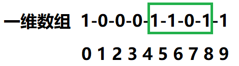

#### 296. 最佳的碰头地点

有一队人（两人或以上）想要在一个地方碰面，他们希望能够最小化他们的总行走距离。

给你一个 2D 网格，其中各个格子内的值要么是 0，要么是 1。

1 表示某个人的家所处的位置。这里，我们将使用 曼哈顿距离 来计算，其中 distance(p1, p2) = |p2.x - p1.x| + |p2.y - p1.y|。

**示例：**

```shell
输入: 

1 - 0 - 0 - 0 - 1
|   |   |   |   |
0 - 0 - 0 - 0 - 0
|   |   |   |   |
0 - 0 - 1 - 0 - 0

输出: 6 

解析: 给定的三个人分别住在(0,0)，(0,4) 和 (2,2):
     (0,2) 是一个最佳的碰面点，其总行走距离为 2 + 2 + 2 = 6，最小，因此返回 6。
```

### 题解

# 1、问题转化

题意计算举例的公式可以看出，一个点的横坐标和纵坐标计算是相互独立的。

因此我们可以把二维问题拆成两个一维的问题。

假设一个一维数组如下：



我们要找出一个点，使得所有的 1 到该点的距离之和最小。

其实我们一眼可以看出，这个最优碰头点是索引 6 的地方。

索引 6 所在的 1 不用说，它走到 6 的距离是 0；而索引 0 和索引 9 的 1 到达索引 6 位置的距离为 9-0 = 9。



而索引 5 和索引 8 到达索引 6 的距离为 8-5 = 3。总距离为 9 + 3 = 12。



那为什么索引 6 就是最优的碰头点呢？我们下面来逐一分析：

首先，无论碰头点在何处，索引 0 和索引 9 到达这个碰头点走的距离之和肯定是 9.



如果碰头点在索引 6 的左侧，那么索引 5、6、8 到碰头点的距离之和肯定大于 8-5：



如果碰头点在所有 6 的右侧，那么索引 5、6、8 到碰头点的距离之和肯定大于 8-5；



因此，位置 6 就是最优碰头点。

这个位置的索引恰好是所有 1 所在索引的中位数。

比如上面的 1 所在索引分别是 {0，5，6，8，9} ，中位数为 6。

# 2、代码逻辑

由于题目是二维问题，且距离计算时，横纵坐标的计算是相互独立的，因此把问题拆分成两个一维问题之和。

1、找出所有 1 所在的行(列)索引；

2、最优点肯定为中位数的地方（如果 1 的个数是偶数个，那么最优点在中间的两个 1 其中任意一个）；

3、分别计算行距离和纵距离，相加即可。

```java
class Solution {
 public int minTotalDistance(int[][] grid) {
        List<Integer> rows = collectRows(grid);
        List<Integer> cols = collectCols(grid);

        int row = rows.get(rows.size() / 2);
        int col = cols.get(cols.size() / 2);
        return minDistance1D(rows, row) + minDistance1D(cols, col);
    }


    private int minDistance1D(List<Integer> points, int origin) {
        int distance = 0;
        for (int point : points) {
            distance += Math.abs(point - origin);
        }
        return distance;
    }

    private List<Integer> collectRows(int[][] grid) {
        List<Integer> rows = new ArrayList<>();
        for (int row = 0; row < grid.length; row++) {
            for (int col = 0; col < grid[0].length; col++) {
                if (grid[row][col] == 1) {
                    rows.add(row);
                }
            }
        }
        return rows;
    }

    private List<Integer> collectCols(int[][] grid) {
        List<Integer> cols = new ArrayList<>();
        for (int col = 0; col < grid[0].length; col++) {
            for (int row = 0; row < grid.length; row++) {
                if (grid[row][col] == 1) {
                    cols.add(col);
                }
            }
        }
        return cols;
    }
}
```

