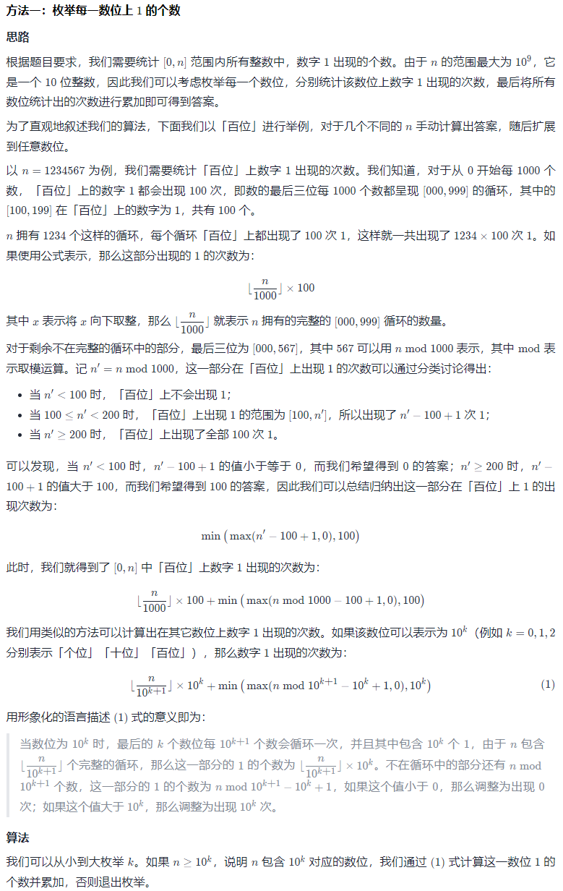

#### 233. 数字 1 的个数

给定一个整数 `n`，计算所有小于等于 `n` 的非负整数中数字 `1` 出现的个数。

**示例 1：**

```shell
输入：n = 13
输出：6
```

**示例 2：**

```shell
输入：n = 0
输出：0
```

**提示：**

- `0 <= n <= 109`

### 题解

**模拟**



```java
class Solution {
   public int countDigitOne(int n) {
        // mulk 表示 10^k
        // 在下面的代码中，可以发现 k 并没有被直接使用到（都是使用 10^k）
        // 但为了让代码看起来更加直观，这里保留了 k

        long mulk = 1;
        int ans = 0;
        while (mulk <= n) {
            ans += (n / (mulk * 10)) * mulk + Math.min(Math.max(n % (mulk * 10) - mulk + 1, 0), mulk);
            mulk *= 10;
        }
        return ans;
    }
}
```

