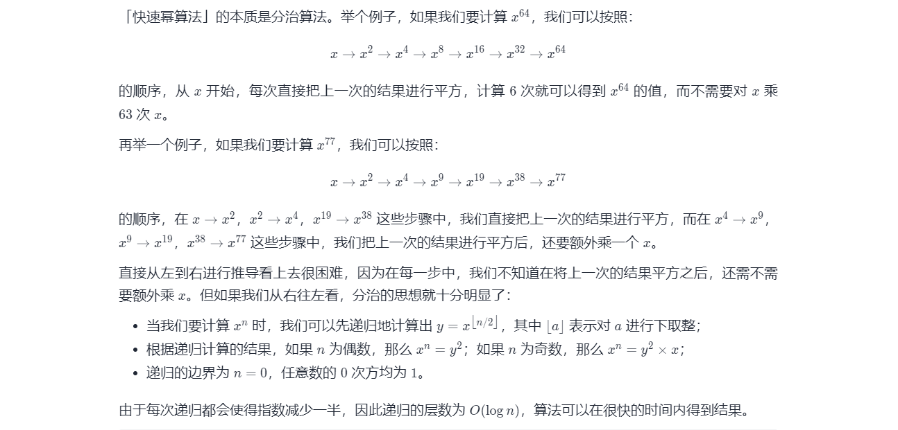
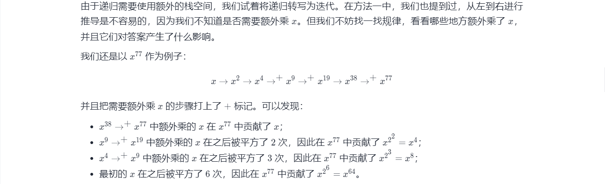
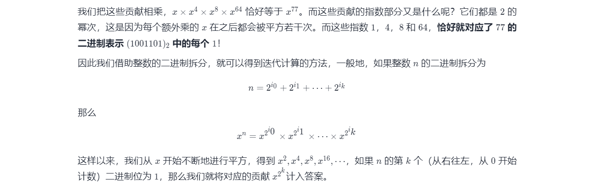

#### 50. Pow(x, n)

实现 pow(*x*, *n*)，即计算 x 的 n 次幂函数（即，x^n）。

**示例 1：**

```shell
输入：x = 2.00000, n = 10
输出：1024.00000
```

**示例 2：**

```shell
输入：x = 2.10000, n = 3
输出：9.26100
```

**示例 3：**

```shell
输入：x = 2.00000, n = -2
输出：0.25000
解释：2-2 = 1/22 = 1/4 = 0.25
```

**提示：**

- `-100.0 < x < 100.0`
- `-231 <= n <= 231-1`
- `-104 <= xn <= 104`

### 题解

#### 前言

本题的方法被称为「快速幂算法」，有递归和迭代两个版本。这篇题解会从递归版本的开始讲起，再逐步引出迭代的版本。

当指数 n 为负数时，我们可以计算 x^{-n} 再取倒数得到结果，因此我们只需要考虑 n为自然数的情况。

#### 方法一：快速幂 + 递归



```java
class Solution {
    public double myPow(double x, int n) {
        long N = n;
        return N >= 0 ? quickMul(x, N) : 1.0 / quickMul(x, -N);
    }

    public double quickMul(double x, long N) {
        if (N == 0) {
            return 1.0;
        }
        double y = quickMul(x, N / 2);
        return N % 2 == 0 ? y * y : y * y * x;
    }
}
```

**复杂度分析**

- 时间复杂度：O*(log*n)，即为递归的层数。

- 空间复杂度：O*(log*n)，即为递归的层数。这是由于递归的函数调用会使用栈空间。

#### 方法二：快速幂 + 迭代





```java
class Solution {
    public double myPow(double x, int n) {
        long N = n;
        return N >= 0 ? quickMul(x, N) : 1.0 / quickMul(x, -N);
    }

    public double quickMul(double x, long N) {
        double ans = 1.0;
        // 贡献的初始值为 x
        double x_contribute = x;
        // 在对 N 进行二进制拆分的同时计算答案
        while (N > 0) {
            // 如果 N 二进制表示的最低位为 1，那么需要计入贡献
            if ((N & 1) == 1) {
                ans *= x_contribute;
            }
            // 将贡献不断地平方
            x_contribute *= x_contribute;
            // 舍弃 N 二进制表示的最低位，这样我们每次只要判断最低位即可
            N = N >> 1;
        }
        return ans;
    }
}
```

```java
/**
 * 快速求幂：
 * p^q，计算中防止溢出，对MOD求余
 */
 
public long quickPow(int p, int q, int MOD) {
    long ans = 1L;
    long base = p;
    while (q != 0) {
        if ((q & 1) == 1) {
            ans = ans * base % MOD;
        }
        base = base * base % MOD;
        q >>>= 1;
    }
    return ans;
}

```

