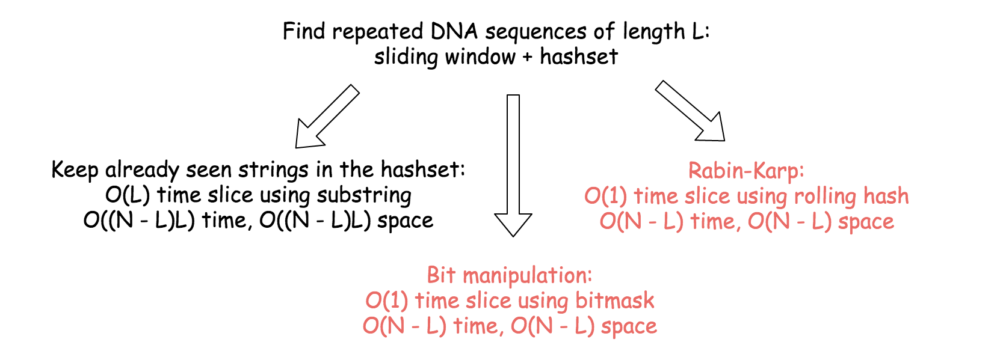
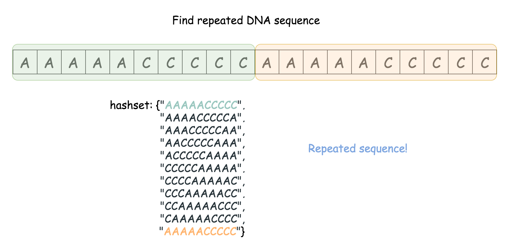
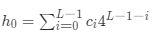
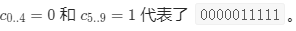
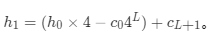
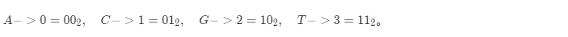
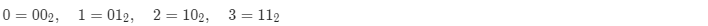
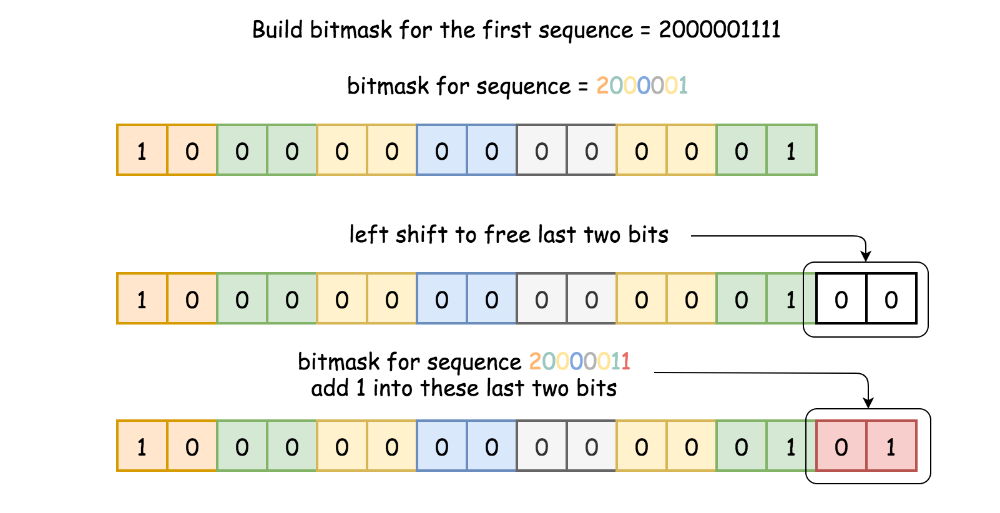
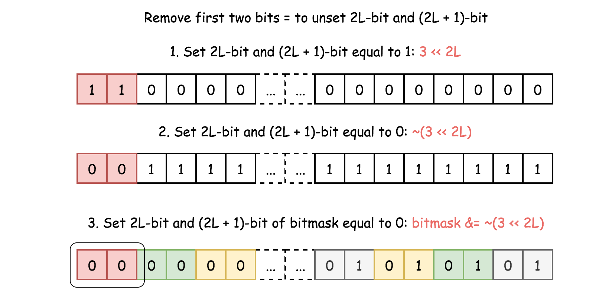

#### 187. 重复的DNA序列

所有 DNA 都由一系列缩写为 'A'，'C'，'G' 和 'T' 的核苷酸组成，例如："ACGAATTCCG"。在研究 DNA 时，识别 DNA 中的重复序列有时会对研究非常有帮助。

编写一个函数来找出所有目标子串，目标子串的长度为 10，且在 DNA 字符串 `s` 中出现次数超过一次。

**示例 1：**

```shell
输入：s = "AAAAACCCCCAAAAACCCCCCAAAAAGGGTTT"
输出：["AAAAACCCCC","CCCCCAAAAA"]
```

**示例 2：**

```shell
输入：s = "AAAAAAAAAAAAA"
输出：["AAAAAAAAAA"]
```

**提示：**

- `0 <= s.length <= 105`
- `s[i]` 为 `'A'`、`'C'`、`'G'` 或 `'T'`

### 题解

#### 概述

这个问题的衍生问题是解决任意长度 LL 的相同问题。在这里我们将 L=10 来简化问题。

我们将讨论三种不同的方法，它们都是基于滑动窗口和 hashset 的，关键是如何实现一个窗口切片。

在线性时间O(L) 内获取窗口切片很简单也比较笨。

总的来说，这样回导致 O((N−L)L) 的时间消耗和巨大的空间消耗。常数时间的窗口切片 O(1) 是一个好的方法，根据实现方式可以分为两种方法：

- Rabin-Karp 算法 = 使用旋转哈希算法实现常数窗口切片。
- 位操作 = 使用掩码实现常数窗口切片。

后面的两种方法具有 O(*N*−*L*) 的时间复杂度和适度的空间消耗，即使在长度很长的序列也是如此。



#### 方法一：线性时间窗口切片 + HashSet

**算法：**

- 沿长度为 N 的字符串移动长度为 L 的滑动窗口。

* 检查滑动窗口中的序列是否在 Hashset `seen` 中。
  * 如果是，则找到了重复的序列。更新输出。
  * 否则，将序列添加到 HashSet `seen` 中。



```java
class Solution {
    public List<String> findRepeatedDnaSequences(String s) {
        int L = 10;
        int n = s.length();

        Set<String> seen = new HashSet<>();
        Set<String> output = new HashSet<>();

        for (int i = 0; i < n - L + 1; i++) {
            String temp = s.substring(i, i + L);
            if (seen.contains(temp)) {
                output.add(temp);
            }
            seen.add(temp);
        }
        return new ArrayList<>(output);
    }
}
```

**复杂度分析**

* 时间复杂度：O((N−L)L)。在执行的循环中，有 N−L+1 个长度为 LL 的子字符串，这会导致 O((N−L)L) 时间复杂性。
* 空间复杂度：使用了 O((N−L)L) 去存储 HashSet，由于 L=10 最终为时间复杂度为 O(N)。

#### 方法二：Rabin-Karp：使用旋转哈希实现常数时间窗口切片

Rabin-Karp 算法用于多模式搜索，常用于重复检测和生物信息学中寻找两个或多个蛋白质的相似性。

在文章[最长的重复子串](https://leetcode.com/articles/longest-duplicate-substring/)中详细实现了 Rabin-Karp 算法，在这里我们做一个基本的实现。

其思想是对字符串进行切片并在滑动窗口中计算序列的哈希值，两者都是在一个常数的时间内进行的。

让我们使用 `AAAAACCCCCAAAAACCCCCCAAAAAGGGTTT` 作为例子。首先，将字符串转换为整数数组。

- 'A' -> 0, 'C' -> 1, 'G' -> 2, 'T' -> 3

AAAAACCCCCAAAAACCCCCCAAAAAGGGTTT -> 00000111110000011111100000222333。计算第一个序列的哈希值:0000011111。在基数为 4 的数字系统中，该序列可视为一个数字，并散列为：





现在我们考虑切片 AAAAACCCCC -> AAAACCCCCA。 在整数数组中表示 0000011111 -> 0000111110，若要删除前导 0 并添加末尾 0，则重新计算哈希：



可以发现窗口切片和计算散列都是在常数时间内完成的。

**算法：**

* 从序列初始位置遍历序列：从 `1` 到 `N-1`
  * 如果 start==0，计算第一个序列 s[0:L] 的哈希值。
  * 否则，从上一个哈希值计算旋转哈希。
  * 如果哈希值在 hashset 中，则找到了重复的序列，则更新输出。
  * 否则，添加到将哈希值添加到 hashset 中。

- 返回输出列表。

```java
class Solution {
    public List<String> findRepeatedDnaSequences(String s) {
        int L = 10;
        int n = s.length();

        if (n <= L) {
            return new ArrayList<>();
        }

        int a = 4;
        int aL = (int) Math.pow(a, L);

        Map<Character, Integer> toInt = new HashMap<>() {
            {
                put('A', 0);
                put('C', 1);
                put('G', 2);
                put('T', 3);
            }
        };

        int[] nums = new int[n];
        for (int i = 0; i < n; i++) {
            nums[i] = toInt.get(s.charAt(i));
        }


        Set<Integer> seen = new HashSet<>();
        Set<String> output = new HashSet<>();

        int h = 0;
        for (int i = 0; i < n - L + 1; i++) {
            if (i == 0) {
                for (int j = 0; j < L; j++) {
                    h = h * a + nums[j];
                }
            } else {
                h = h * a - nums[i - 1] * aL + nums[i + L - 1];
            }

            if (seen.contains(h)) {
                output.add(s.substring(i, i + L));
            }
            seen.add(h);
        }
        return new ArrayList<>(output);
    }
}
```

**复杂度分析**


#### 方法三：位操作：使用掩码实现常数时间窗口切片

其思想是对字符串进行切片，并在滑动窗口中计算序列的掩码，两者都是在一个恒定的时间内进行的。

和 Rabin-Karp 一样，将字符串转换为两个比特位整数数组。



```shell
GAAAAACCCCCAAAAACCCCCCAAAAAGGGTTT -> 200000111110000011111100000222333
```

计算第一个序列的掩码：`200000111`。序列中的每个数字（0、1、2 或 3）占用的位不超过2位：



因此，可以在循环中计算掩码：

- 左移以释放最后两位：`bitmask <<= 2`。
- 将当前数字存储到 `2000001111` 的后两位：`bitmask |= nums[i]`。



现在我们考虑切片：GAAAAACCCCC -> AAAAACCCCC。在整形数组中表示 20000011111 -> 0000011111，删除前导 2 并添加末尾 1。

添加末尾 1 很简单，和上面的思路一样：

- 左移以释放最后两位：`bitmask <<= 2`。
- 添加 1 到最后两位：`bitmask |= 1`。

现在的问题是删除前导 2。换句话说，问题是将 2L 位和 (2L + 1) 位设置为零。

我们可以使用一个技巧去重置第 n 位的值：`bitmask &= ~(1 << n)`。

这个技巧很简单：

* 1 << n 是设置第 n 位为 1。
* ~(1 << n) 是设置第 n 位为 0，且全部低位为 1。
* bitmask &= ~(1 << n) 是将 bitmask 第 n 位设置为 0。

技巧的简单使用方法是先设置第 2L 位，然后再设置 (2L + 1) 位：bitmask &= ~(1 << 2 * L) & ~(1 << (2 * L + 1)。可以简化为 bitmask &= ~(3 << 2 * L)：

* 3=(11)2，因此可以设置第 2L 位和第 (2L + 1) 位为 1。
* `~(3 << 2 * L)` 会设置第 2L 位 和第 (2L + 1) 位为 0，且所有低位为 1。
* `bitmask &= ~(3 << 2 * L)` 则会将 bitmask 第 2L 和第 (2L + 1) 位设置为 0。



可以看到窗口切片和掩码都是在一个常数时间内完成的。

**算法：**

* 遍历序列的起始位置：从 1 到 N - L。
  * 如果 `start == 0`，计算第一个序列 `s[0:L]` 的掩码。
  * 否则，从前一个掩码计算当前掩码。
  * 如果掩码在 hashset 中，说明是重复序列，更新输出。
  * 否则，将该掩码添加到 hashset。

- 返回输出列表。

```java
class Solution {
    public List<String> findRepeatedDnaSequences(String s) {
        int L = 10;
        int n = s.length();

        if (n <= L) {
            return new ArrayList<>();
        }

        int a = 4;
        int aL = (int) Math.pow(a, L);

        Map<Character, Integer> toInt = new HashMap<>() {
            {
                put('A', 0);
                put('C', 1);
                put('G', 2);
                put('T', 3);
            }
        };

        int[] nums = new int[n];
        for (int i = 0; i < n; i++) {
            nums[i] = toInt.get(s.charAt(i));
        }

        int bitMask = 0;
        Set<Integer> seen = new HashSet<>();
        Set<String> output = new HashSet<>();

        for (int i = 0; i < n - L + 1; i++) {
            if (i == 0) {
                for (int j = 0; j < L; j++) {
                    bitMask <<= 2;
                    bitMask |= nums[j];
                }
            } else {
                bitMask <<= 2;
                bitMask |= nums[i + L - 1];
                bitMask &= ~(3 << 2 * L);
            }

            if (seen.contains(bitMask)) {
                output.add(s.substring(i, i + L));
            }
            seen.add(bitMask);
        }
        return new ArrayList<>(output);
    }
}
```

