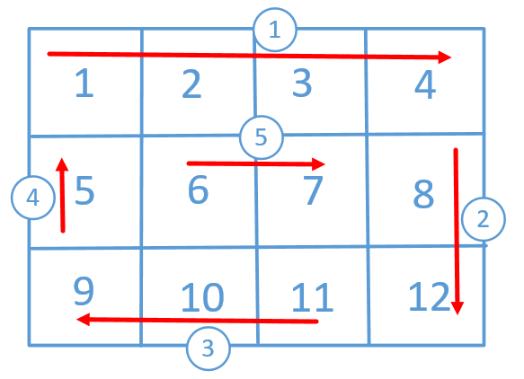
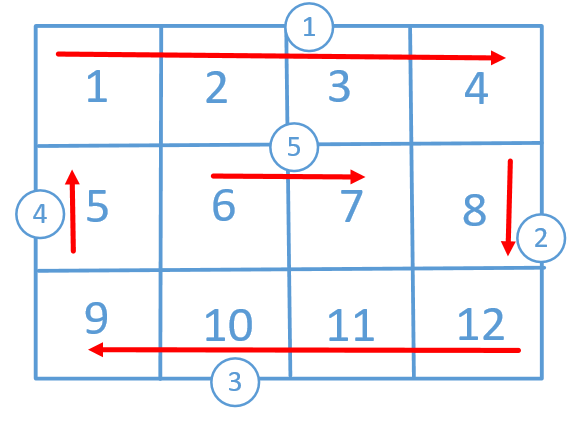

#### 54. 螺旋矩阵

给你一个 `m` 行 `n` 列的矩阵 `matrix` ，请按照 **顺时针螺旋顺序** ，返回矩阵中的所有元素。

**示例 1：**


```shell
输入：matrix = [[1,2,3],[4,5,6],[7,8,9]]
输出：[1,2,3,6,9,8,7,4,5]
```

**示例 2：**


```shell
输入：matrix = [[1,2,3,4],[5,6,7,8],[9,10,11,12]]
输出：[1,2,3,4,8,12,11,10,9,5,6,7]
```

**提示：**

- `m == matrix.length`

- `n == matrix[i].length`

- `1 <= m, n <= 10`

- `-100 <= matrix[i][j] <= 100`

### 题解

#  顺时针打印矩阵

顺时针打印，也就是下面这张图这样



代码没什么难度，主要是在打印的时候做一些边界的判断，看下代码

```java
public int[] spiralOrder(int[][] matrix) {
    if (matrix == null || matrix.length == 0)
        return new int[0];
    int m = matrix.length, n = matrix[0].length;
    int[] res = new int[m * n];
    int up = 0, down = m - 1, left = 0, right = n - 1, index = 0;
    while (true) {
        // 上面行，从左往右打印（行不变，改变列的下标）
        for (int col = left; col <= right; col++)
            res[index++] = matrix[up][col];
        if (++up > down)
            break;

        // 右边列，从上往下打印（列不变，改变行的下标）
        for (int row = up; row <= down; row++)
            res[index++] = matrix[row][right];
        if (--right < left)
            break;

        // 下面行，从右往左打印（行不变，改变列的下标）
        for (int col = right; col >= left; col--)
            res[index++] = matrix[down][col];
        if (--down < up)
            break;

        // 左边列，从下往上打印（列不变，改变行的下标）
        for (int row = down; row >= up; row--)
            res[index++] = matrix[row][left];
        if (++left > right)
            break;
    }
    return res;
}
```

看一下打印结果


再来看一种方式，就是每次打印的时候上面一行和下面一行都是完整打印，左边一列和右边一列打印的值是夹在上下两行之间的，打印一圈之后，再缩小圈的范围。和上面有一点点区别，但原理还是没变。



```java
public int[] spiralOrder(int[][] matrix) {
    if (matrix == null || matrix.length == 0)
        return new int[0];
    int n = matrix.length, m = matrix[0].length;
    int[] res = new int[m * n];
    int up = 0, down = n - 1;
    int left = 0, right = m - 1;
    int total = m * n;
    int index = 0;
    while (index < total) {
        //上面，从左往右打印
        for (int j = left; j <= right && index < total; j++)
            res[index++] = matrix[up][j];
        //右边，从上往下打印(注意这里i的取值范围)
        for (int i = up + 1; i <= down - 1 && index < total; i++)
            res[index++] = matrix[i][right];
        //下边，从右往左打印
        for (int j = right; j >= left && index < total; j--)
            res[index++] = matrix[down][j];
        //左边，从下往上打印(注意这里i的取值范围)
        for (int i = down - 1; i >= up + 1 && index < total; i--)
            res[index++] = matrix[i][left];
        left++;
        right--;
        up++;
        down--;
    }
    return res;
}
```

