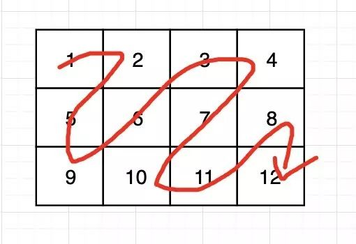
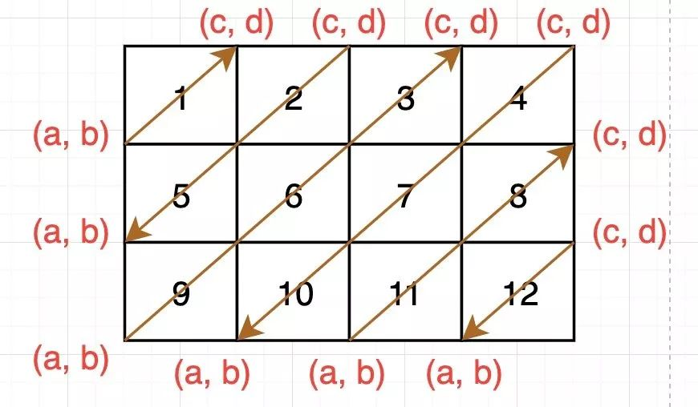

# “之”字形打印矩阵

【题目】 给定一个矩阵matrix，按照“之”字形的方式打印这 个矩阵，例如:



“之”字形打印的结果为：

```java
1，2，5，9，6，3，4，7，10，11， 8，12
```

【要求】 额外空间复杂度为O(1)。

【解法说明】和之前的题目类似，一旦我们陷于考虑局部的坐标如何变换，就会陷入细节边界之中，难以快速解决这道题目。我们换个思路，将整个过程切分为：**给定两个对角点坐标，遍历对角线**，然后寻找两个对角点坐标的变化规律。

给定两个对焦点坐标，遍历该对角线，实现起来非常简单：

```c++
void printDiagonal(int a, int b, int c, int d, vector<vector<int>> &matrix) {
    while (a >= c && b <= d) { // 从左下到右上的遍历方式
          cout << matrix[a--][b++] << " ";
    }
}
```



图中的`(a, b)`为对角线的左下角顶点，其中`a、b`均是变量，从左到右分别为每次变换的位置；一开始`(a, b)`和`(c, d)`都是`点1`，即`matrix[0][0]`；我们观察两个点的变换轨迹，可以发现，`(a, b)`先向下走，到底部再向右走；而`(c, d)`先向右走，到达最右边才向下走。

与此同时，每完成一次对角线遍历，我们发现，遍历的方向会发生改变，因此我们使用一个`bool`类型的`isUp`来记录状态。

因此，对角线函数需要进行修改：

```c++
void printDiagonal(int a, int b, int c, int d, vector<vector<int>> &matrix, bool isUp) {
    if (isUp) {
        while (a >= c && b <= d) {
            cout << matrix[a--][b++] << " ";
        }
    } else {
        while (a >= c && b <= d) {
            cout << matrix[c++][d--] << " ";
        }
    }
}
```

遍历所有对角线：

```c++
void ZigZagPrint(vector<vector<int>> &matrix) {
    bool isUp = true;
    int a = 0, b = 0, c = 0, d = 0;
    while (c != matrix.size()) { // c 如果为 n，说明右上角的对角线顶点已经到达矩阵的右下角，所有对角线都被遍历了
        printDiagonal(a, b, c, d, matrix, isUp);
        isUp = !isUp;
        b = (a == matrix.size() - 1) ? b + 1 : b; // 注意，我们要先更新b，然后才更新a
        a = (a == matrix.size() - 1) ? a : a + 1;
        c = (d == matrix[0].size() - 1) ? c + 1 : c; //同样的，先更新c，再更新d
        d = (d == matrix[0].size() - 1) ? d : d + 1;
    }
}
```

