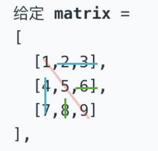

# 旋转正方形矩阵

如下图，先由对角线 `[1, 5, 9]` 为轴进行翻转：



于是数组变成了:

```java
[1,4,7]
[2,5,8]
[3,6,9]
```

再对每一行以中点进行翻转，就得到了

```java
[7,4,1]
[8,5,2]
[9,6,3]
```

**代码**

```java
class Solution {
    public void rotate(int[][] matrix) {
        int n = matrix.length;
        // 先以对角线（左上-右下）为轴进行翻转
        for (int i = 0; i < n - 1; i++) {
            for (int j = i + 1; j < n; j++) {
                int tmp = matrix[i][j];
                matrix[i][j] = matrix[j][i];
                matrix[j][i] = tmp;
            }
        }
        // 再对每一行以中点进行翻转
        int mid = n >> 1;
        for (int i = 0; i < n; i++) {
            for (int j = 0; j < mid; j++) {
                int tmp = matrix[i][j];
                matrix[i][j] = matrix[i][n - 1 - j];
                matrix[i][n - 1 - j] = tmp;
            }
        }
    }
}
```

