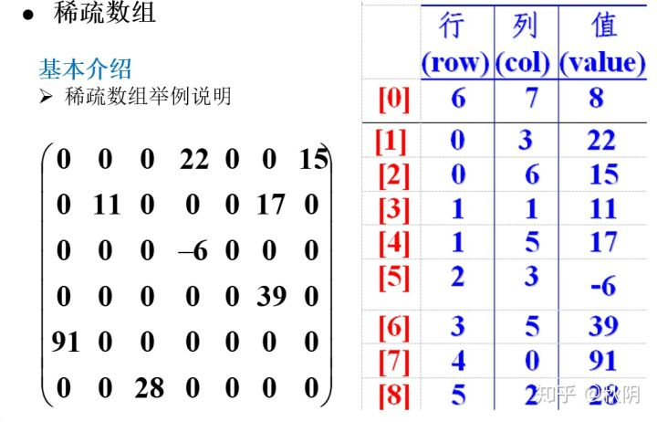

# 数据结构-稀疏数组

### 场景

当一个数组在中大部分元素为0，或者为同一个值的数组时，可以使用稀疏数组来保存该数组。

稀疏数组的处理方法;

1. 记录数组一共有几行几列，有多少个不同的值。

2. 把具有不同值的元素的行列有值记录在一个小规模的数组中，从而缩小程序的规模。

   

由7x6的数组转换成3x9的稀疏数组

## 二维数组转稀疏数组

1. 遍历原始的二维，得到有效数据的个数sum
2. 根据sum就可以创建稀疏数组sparseArr `int[sum + 1][3]`
3. 将二维数组的有效数据存入到稀疏数组中

代码实现

```java
//原始数组转稀疏数组
    public static int[][] arr2DToSpare(int[][] arrs2D){
        int sum = 0;//原始数组中有效元素的个数
        //1.遍历原始数组，得到有效元素的个数
        for (int[] ints : arrs2D) {
            for (int n : ints) {
                if (n != 0) {
                    sum ++;
                }
            }
        }
        //2.创建稀疏数组
        int[][] sparseArr = new int[sum + 1][3];
        sparseArr[0][0] = arrs2D[0].length;
        sparseArr[0][1] = arrs2D.length;
        sparseArr[0][2] = sum;
        //3.遍历原始数组，将有效元素存储到
        int count = 0;//记录是第几个非0数据
        for (int i = 0; i < arrs2D.length; i++) {
            int[] ints = arrs2D[i];
            for (int j = 0; j < ints.length; j++) {
                int anInt = ints[j];
                if (anInt != 0) {
                    count++;
                    sparseArr[count][0] = i;
                    sparseArr[count][1] = j;
                    sparseArr[count][2] = anInt;
                }
            }
        }
        return sparseArr;
    }
```

## 稀疏数组转二维数组

1. 读取稀疏数组的第一行，根据第一行的数据，创建原始的二维数组，比如上面的`chessArr2 = int[11][11]`
2. 再读取稀疏数组后几行的数据，并赋值给原始的二维数组即可。

代码实现

```java
//稀疏数组转原始数组
    static int[][] spareToArr2D(int[][] sparseArr){
        //创建原始数组
        int[][] arrs = new int[sparseArr[0][0]][sparseArr[0][1]];
        for (int i = 1; i <= sparseArr.length - 1; i++) {
            arrs[sparseArr[i][0]][sparseArr[i][1]] = sparseArr[i][2];
        }
        return arrs;
    }
```


## 数组磁盘存取

```java
//将数组输出到磁盘
    public static void saveArray(int[][] arr) {
        //OutputStream os = new FileOutputStream(new File("sparse.data"));
        BufferedWriter bw = null;//纯字符，使用字符流
        try {
            bw = new BufferedWriter(new FileWriter("sparse.data"));
            if (null != bw) {
                for (int[] intArr : arr) {
                    for (int i : intArr) {
                        bw.write(i + " ");
                    }
                    bw.newLine();
                }
                bw.flush();
            }

        } catch (IOException e) {
            e.printStackTrace();
        } finally {
            if (bw != null) {
                try {
                    bw.close();
                } catch (IOException e) {
                    e.printStackTrace();
                }
            }
        }
    }

    //从磁盘中读取数组
    public static int[][] readArray() {
        BufferedReader br = null;
        try {
            br = new BufferedReader(new FileReader("sparse.data"));
            //读取
            StringBuffer sb = new StringBuffer();
            while (br.ready()) {
                sb.append(br.readLine() + "\n");
            }
            //分行
            String str = sb.toString();
            String[] rowsStr = str.split("\n");
            int rows = rowsStr.length;
            int cols = rowsStr[0].split(" ").length;
            int[][] arr = new int[rows][cols];
            for (int i = 0; i < rowsStr.length; i++) {
                String[] colsStr = rowsStr[i].split(" ");
                for (int j = 0; j < colsStr.length; j++) {
                    arr[i][j] = Integer.parseInt(colsStr[j]);
                }
            }
            return arr;
        } catch (FileNotFoundException e) {
            e.printStackTrace();
        } catch (IOException e) {
            e.printStackTrace();
        } finally {
            if (null != br) {
                try {
                    br.close();
                } catch (IOException e) {
                    e.printStackTrace();
                }
            }
        }
        return null;
    }
```

