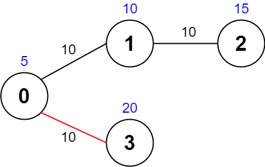
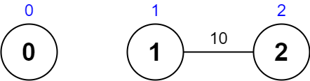

#### 5921. 最大化一张图中的路径价值

给你一张 无向 图，图中有 n 个节点，节点编号从 0 到 n - 1 （都包括）。同时给你一个下标从 0 开始的整数数组 values ，其中 values[i] 是第 i 个节点的 价值 。同时给你一个下标从 0 开始的二维整数数组 edges ，其中 edges[j] = [uj, vj, timej] 表示节点 uj 和 vj 之间有一条需要 timej 秒才能通过的无向边。最后，给你一个整数 maxTime 。

合法路径 指的是图中任意一条从节点 0 开始，最终回到节点 0 ，且花费的总时间 不超过 maxTime 秒的一条路径。你可以访问一个节点任意次。一条合法路径的 价值 定义为路径中 不同节点 的价值 之和 （每个节点的价值 至多 算入价值总和中一次）。

请你返回一条合法路径的 **最大** 价值。

**注意：**每个节点 **至多** 有 **四条** 边与之相连。

**示例 1：**


```shell
输入：values = [0,32,10,43], edges = [[0,1,10],[1,2,15],[0,3,10]], maxTime = 49
输出：75
解释：
一条可能的路径为：0 -> 1 -> 0 -> 3 -> 0 。总花费时间为 10 + 10 + 10 + 10 = 40 <= 49 。
访问过的节点为 0 ，1 和 3 ，最大路径价值为 0 + 32 + 43 = 75 。
```

**示例 2：**



```shell
输入：values = [5,10,15,20], edges = [[0,1,10],[1,2,10],[0,3,10]], maxTime = 30
输出：25
解释：
一条可能的路径为：0 -> 3 -> 0 。总花费时间为 10 + 10 = 20 <= 30 。
访问过的节点为 0 和 3 ，最大路径价值为 5 + 20 = 25 。
```

**示例 3：**


```shell
输入：values = [1,2,3,4], edges = [[0,1,10],[1,2,11],[2,3,12],[1,3,13]], maxTime = 50
输出：7
解释：
一条可能的路径为：0 -> 1 -> 3 -> 1 -> 0 。总花费时间为 10 + 13 + 13 + 10 = 46 <= 50 。
访问过的节点为 0 ，1 和 3 ，最大路径价值为 1 + 2 + 4 = 7 。
```

**示例 4：**



```shell
输入：values = [0,1,2], edges = [[1,2,10]], maxTime = 10
输出：0
解释：
唯一一条路径为 0 。总花费时间为 0 。
唯一访问过的节点为 0 ，最大路径价值为 0 。
```

**提示：**

* n == values.length
* 1 <= n <= 1000
* 0 <= values[i] <= 108
* 0 <= edges.length <= 2000
* edges[j].length == 3
* 0 <= uj < vj <= n - 1
* 10 <= timej, maxTime <= 100
* [uj, vj] 所有节点对 互不相同 。
* 每个节点 至多有四条 边。
* 图可能不连通。

### 题解

**图+回溯**

```java
class Solution {
    int ans = 0;

    public int maximalPathQuality(int[] values, int[][] edges, int maxTime) {
        Map<Integer, List<int[]>> graph = new HashMap<>();
        for (int[] edge : edges) {
            graph.computeIfAbsent(edge[0], t -> new ArrayList<>()).add(new int[]{edge[1], edge[2]});
            graph.computeIfAbsent(edge[1], t -> new ArrayList<>()).add(new int[]{edge[0], edge[2]});
        }

        int[] visited = new int[values.length];
        dfs(values, maxTime, graph, visited, 0, 0);
        return ans;
    }

    public void dfs(int[] values, int remainTime, Map<Integer, List<int[]>> graph, int[] visited, int node, int curValue) {
        // 当前节点未被访问时,增加累计价值
        if (visited[node] == 0) {
            curValue += values[node];
        }

        // 当前节点访问次数加1
        visited[node]++;

        // 遍历当前节点的相邻节点,因为可以走回头路,且有时间限制,所以这里不需要任何限制
        List<int[]> neighbors = graph.getOrDefault(node, new ArrayList<>());
        for (int[] neighbor : neighbors) {
            if (remainTime < neighbor[1]) {
                continue;
            }
            dfs(values, remainTime - neighbor[1], graph, visited, neighbor[0], curValue);
        }

        if (node == 0) {
            ans = Math.max(ans, curValue);
        }

        visited[node]--;
    }
}
```

