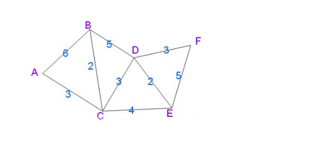

## SPFA算法

### 1 问题描述

何为spfa（Shortest Path Faster Algorithm）算法？

**spfa** **算法功能**给定一个加权连通图，选取一个顶点，称为起点，求取起点到其它所有顶点之间的最短距离，其显著特点是可以求含负权图的单源最短路径，且效率较高。（**PS：** **引用自百度百科**：spfa是求单源最短路径的一种算法，它还有一个重要的功能是判负环（在差分约束系统中会得以体现），在Bellman-ford算法的基础上加上一个队列优化，减少了冗余的松弛操作，是一种高效的最短路算法。）

**spfa算法思想：** spfa就是BellmanFord的一种实现方式，其具体不同在于，对于处理松弛操作时，采用了队列（先进先出方式）操作，从而大大提高了时间复杂度。

### 2 解决方案

spfa算法寻找单源最短路径的时间复杂度为O(m*E)。（其中m为所有顶点进队的平均次数，可以证明m一般小于等于2*图顶点个数，E为给定图的边集合）

首先看下代码中所使用的连通图（PS：改图为无向连通图，所以每两个顶点之间均有两条边）：



现在求取上图中顶点B到其它所有顶点之间的最短距离。

具体代码如下

```java
package com.liuzhen.chapter9;

import java.util.ArrayList;
import java.util.Scanner;

public class Spfa {
    
    public long[] result;         //用于得到第s个顶点到其它顶点之间的最短距离
    
    //内部类，用于存放图的具体边数据
    class edge {
        public int a;  //边的起点
        public int b;  //边的终点
        public int value;   //边的权值
        
        edge(int a, int b, int value) {
            this.a = a;
            this.b = b;
            this.value = value;
        }
    }
    /*
     * 参数n:给定图的顶点个数
     * 参数s:求取第s个顶点到其它所有顶点之间的最短距离
     * 参数edge:给定图的具体边
     * 函数功能：如果给定图不含负权回路，则可以得到最终结果，如果含有负权回路，则不能得到最终结果
     */
    public boolean getShortestPaths(int n, int s, edge[] A) {
        ArrayList<Integer> list = new ArrayList<Integer>();
        result = new long[n];
        boolean[] used = new boolean[n];
        int[] num = new int[n];
        for(int i = 0;i < n;i++) {
            result[i] = Integer.MAX_VALUE;
            used[i] = false;
        }
        result[s] = 0;     //第s个顶点到自身距离为0
        used[s] = true;    //表示第s个顶点进入数组队
        num[s] = 1;       //表示第s个顶点已被遍历一次
        list.add(s);      //第s个顶点入队
        while(list.size() != 0) {
            int a = list.get(0);   //获取数组队中第一个元素
            list.remove(0);         //删除数组队中第一个元素
            for(int i = 0;i < A.length;i++) {
                //当list数组队的第一个元素等于边A[i]的起点时
                if(a == A[i].a && result[A[i].b] > result[A[i].a] + A[i].value) { 
                    result[A[i].b] = result[A[i].a] + A[i].value;
                    if(!used[A[i].b]) {
                        list.add(A[i].b);
                        num[A[i].b]++;
                        if(num[A[i].b] > n)
                            return false;
                        used[A[i].b] = true;   //表示边A[i]的终点b已进入数组队
                    }
                }
            }
            used[a] = false;        //顶点a出数组对
        }
        return true;
    }
    
    public static void main(String[] args) {
        Spfa test = new Spfa();
        Scanner in = new Scanner(System.in);
        System.out.println("请输入一个图的顶点总数n起点下标s和边总数p：");
        int n = in.nextInt();
        int s = in.nextInt();
        int p = in.nextInt();        
        edge[] A = new edge[p];
        System.out.println("请输入具体边的数据：");
        for(int i = 0;i < p;i++) {
             int a = in.nextInt();
             int b = in.nextInt();
             int value = in.nextInt();
             A[i] = test.new edge(a, b, value);
        }
        if(test.getShortestPaths(n, s, A)) {
             for(int i = 0;i < test.result.length;i++)
                 System.out.print(test.result[i]+" ");
        } else
             System.out.println("给定图存在负环，没有最短距离");
    }
}
```

