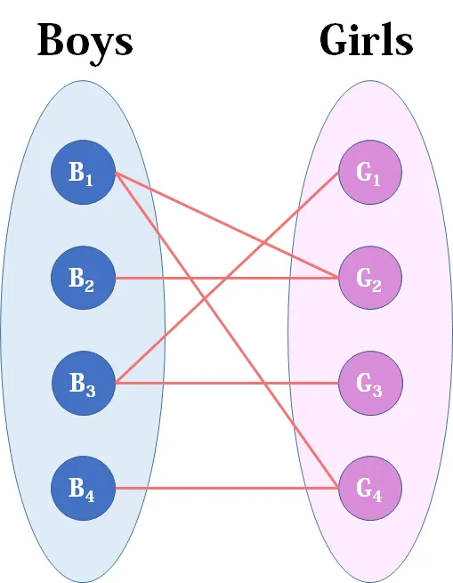
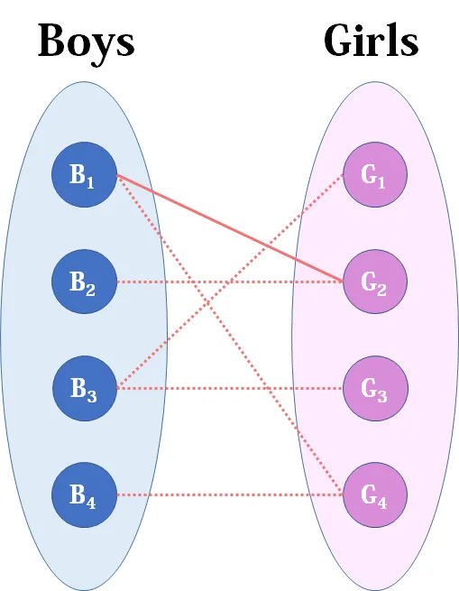
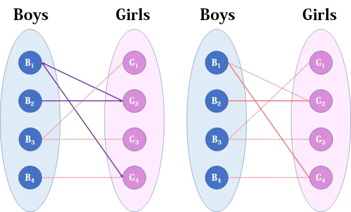
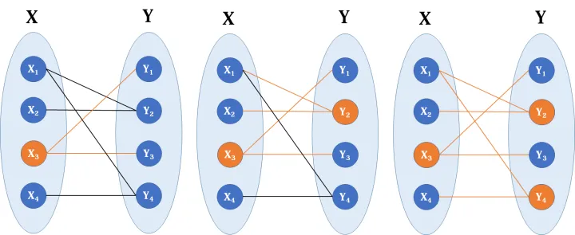

# 匈牙利算法

匈牙利算法（Hungarian algorithm）主要用于解决一些与二分图匹配有关的问题，所以我们先来了解一下二分图。

二分图（Bipartite graph）是一类特殊的图，它可以被划分为两个部分，每个部分内的点互不相连。下图是典型的二分图。


可以看到，在上面的二分图中，每条边的端点都分别处于点集X和Y中。匈牙利算法主要用来解决两个问题：求二分图的最大匹配数和最小点覆盖数。

这么说起来过于抽象了，我们现在从实际问题出发。

**最大匹配问题**

看完上面讲的，相信读者会觉得云里雾里的：这是啥？这有啥用？所以我们把这张二分图稍微做点手脚，变成下面这样：



现在Boys和Girls分别是两个点集，里面的点分别是男生和女生，边表示他们之间存在“暧昧关系"。最大匹配问题相当于，假如你是红娘，可以撮合任何一对有暧昧关系的男女，那么你最多能成全多少对情侣？（数学表述：在二分图中最多能找到多少条没有公共端点的边）

现在我们来看看匈牙利算法是怎么运作的：

我们从B1看起（男女平等，从女生这边看起也是可以的），他与G2有暧昧，那我们就先暂时把他与G2连接（注意这时只是你作为一个红娘在纸上构想，你没有真正行动，此时的安排都是暂时的）。



来看B2，B2也喜欢G2，这时G2已经“名花有主”了（虽然只是我们设想的），那怎么办呢？我们倒回去看G2目前被安排的男友，是B1，B1有没有别的选项呢？有，G4，G4还没有被安排，那我们就给B1安排上G4。



然后B3，B3直接配上G1就好了，这没什么问题。至于B4，他只钟情于G4，G4目前配的是B1。B1除了G4还可以选G2，但是呢，如果B1选了G2，G2的原配B2就没得选了。我们绕了一大圈，发现B4只能注定单身了，可怜。（其实从来没被考虑过的G3更可怜）


这就是匈牙利算法的流程，至于具体实现，我们来看看代码：

```c++
int M, N;            //M, N分别表示左、右侧集合的元素数量
int Map[MAXM][MAXN]; //邻接矩阵存图
int p[MAXN];         //记录当前右侧元素所对应的左侧元素
bool vis[MAXN];      //记录右侧元素是否已被访问过
bool match(int i)
{
    for (int j = 1; j <= N; ++j)
        if (Map[i][j] && !vis[j]) //有边且未访问
        {
            vis[j] = true;                 //记录状态为访问过
            if (p[j] == 0 || match(p[j])) //如果暂无匹配，或者原来匹配的左侧元素可以找到新的匹配
            {
                p[j] = i;    //当前左侧元素成为当前右侧元素的新匹配
                return true; //返回匹配成功
            }
        }
    return false; //循环结束，仍未找到匹配，返回匹配失败
}
int Hungarian()
{
    int cnt = 0;
    for (int i = 1; i <= M; ++i)
    {
        memset(vis, 0, sizeof(vis)); //重置vis数组
        if (match(i))
            cnt++;
    }
    return cnt;
}

```

其实流程跟我们上面描述的是一致的。注意这里使用了一个递归的技巧，我们不断往下递归，尝试寻找合适的匹配。

**最小点覆盖问题**

另外一个关于二分图的问题是求最小点覆盖：我们想找到最少的一些点，使二分图所有的边都至少有一个端点在这些点之中。



这为什么用匈牙利算法可以解决呢？你如果以为我要长篇大论很久就错了，我们只需要一个定理：

> 一个二分图中的最大匹配数等于这个图中的最小点覆盖数。

