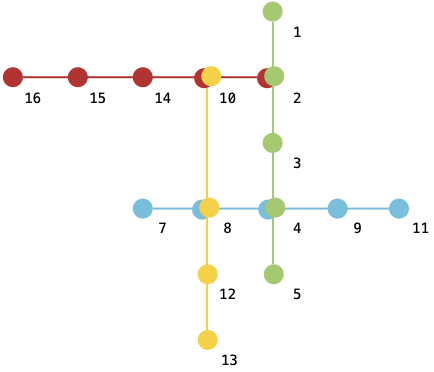
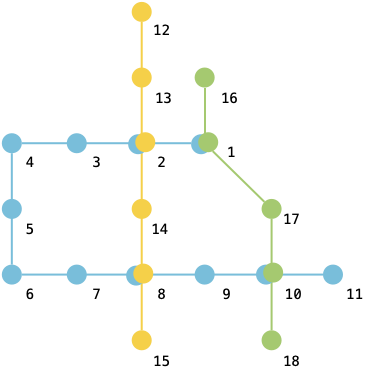

## 建信03. 地铁路线规划

某城市有若干条地铁线路，`lines` 记录了每条地铁线路依次停靠的站点（每条线路均是双向的）
李林想从站点 `start` 出发前往 `end`，请规划一条可行路线使得他可以以**最小的换乘次数**到达目的站点。若有多条路线满足要求，请返回**字典序最小**的路线（要求路线上无重复的站点）。

**注意：**

- 输入数据保证存在 `start` 到 `end` 的路线
- 任意路线上的点在该条路线上仅出现一次（即任意一条路线均不是环线）

**示例 1：**

> 输入：`lines = [[1,2,3,4,5],[2,10,14,15,16],[10,8,12,13],[7,8,4,9,11]], start = 1, end = 7`
>
> 输出：`[1,2,3,4,8,7]`
>
> 解释：路线如图所示
> 从站点 1 到站点 7 的最少换乘 1 次，路线为 [1,2,3,4,8,7]



**示例 2：**

> 输入：`lines = [[1,2,3,4,5,6,7,8,9,10,11],[12,13,2,14,8,15],[16,1,17,10,18]], start = 9, end = 1`
>
> 输出：`[9,8,7,6,5,4,3,2,1]`
>
> 解释：路线如图所示
> 从站点 9 到站点 1 的最少换乘 0 次，路线为 [9,8,7,6,5,4,3,2,1]



**提示：**

- `1 <= lines.length, lines[i].length <= 100`
- `1 <= lines[i][j], start, end <= 10000`

### 题解

**图+深度优先搜索**

```java
class Solution {
    int result = Integer.MAX_VALUE;
    List<Integer> resultPath = new ArrayList<>();

    public int[] metroRouteDesignI(int[][] lines, int start, int end) {

        Map<Integer, List<int[]>> graph = new HashMap<>();
        for (int i = 0; i < lines.length; i++) {
            int[] line = lines[i];
            for (int j = 0; j < line.length - 1; j++) {
                graph.computeIfAbsent(line[j], t -> new ArrayList<>()).add(new int[]{line[j + 1], i});
                graph.computeIfAbsent(line[j + 1], t -> new ArrayList<>()).add(new int[]{line[j], i});
            }
        }

        boolean[] visited = new boolean[10000];
        List<Integer> path = new ArrayList<>();
        path.add(start);
        visited[start] = true;

        for (int[] neighbor : graph.getOrDefault(start, new ArrayList<>())) {
            if (visited[neighbor[0]]) {
                continue;
            }
            path.add(neighbor[0]);
            visited[neighbor[0]] = true;
            dfs(graph, neighbor[0], neighbor[1], end, 0, visited, path);
            visited[neighbor[0]] = false;
            path.remove(path.size() - 1);
        }


        int[] ans = new int[resultPath.size()];
        for (int i = 0; i < resultPath.size(); i++) {
            ans[i] = resultPath.get(i);
        }
        return ans;
    }

    public void dfs(Map<Integer, List<int[]>> graph, int cur, int curRoute, int end, int cost, boolean[] visited, List<Integer> path) {

        if (cost > result) {
            return;
        }

        if (cur == end) {
            if (cost < result) {
                result = cost;
                resultPath = new ArrayList<>(path);
                return;
            }
            if (cost == result && compare(path, resultPath)) {
                result = cost;
                resultPath = new ArrayList<>(path);
                return;
            }
            return;
        }

        for (int[] neighbor : graph.getOrDefault(cur, new ArrayList<>())) {

            if (visited[neighbor[0]]) {
                continue;
            }

            path.add(neighbor[0]);
            visited[neighbor[0]] = true;
            int nextCost = cost;
            if (neighbor[1] != curRoute) {
                nextCost++;
            }
            dfs(graph, neighbor[0], neighbor[1], end, nextCost, visited, path);
            visited[neighbor[0]] = false;
            path.remove(path.size() - 1);
        }
    }

    public boolean compare(List<Integer> list1, List<Integer> list2) {
        int size = Math.min(list1.size(), list2.size());
        for (int i = 0; i < size; i++) {
            if (list1.get(i) < list2.get(i)) {
                return true;
            } else if (list1.get(i) > list2.get(i)) {
                return false;
            }
        }
        return true;
    }
}
```

