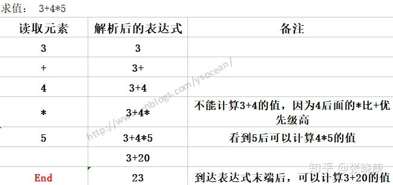

# 计算器系列(前中后缀表达式)

## **1、人如何解析算术表达式**

如何解析算术表达式？或者换种说法，遇到某个算术表达式，我们是如何计算的：

**①、求值 3+4-5**


这个表达式，我们在看到3+4后都不能直接计算3+4的值，直到看到4后面的 - 号，因为减号的优先级和前面的加号一样，所以可以计算3+4的值了，如果4后面是 * 或者 /，那么就要在乘除过后才能做加法操作，比如：

**②、求值 3+4\*5**



这个不能先求3+4的值，因为4后面的*运算级别比前面的+高。

## **2、计算机如何解析算术表达式**

对于前面的表达式 3+4-5，我们人是有思维能力的，能根据操作符的位置，以及操作符的优先级别能算出该表达式的结果。但是计算机怎么算？

计算机必须要向前（从左到右）来读取操作数和操作符，等到读取足够的信息来执行一个运算时，找到两个操作数和一个操作符进行运算，有时候如果后面是更高级别的操作符或者括号时，就必须推迟运算，必须要解析到后面级别高的运算，然后回头来执行前面的运算。我们发现这个过程是极其繁琐的，而计算机是一个机器，只认识高低电平，想要完成一个简单表达式的计算，我们可能要设计出很复杂的逻辑电路来控制计算过程，那更不用说很复杂的算术表达式，所以这样来解析算术表达式是不合理的，那么我们应该采取什么办法呢？

请大家先看看什么是前缀表达式，中缀表达式，后缀表达式：这三种表达式其实就是算术表达式的三种写法，以 3+4-5为例

　　①、前缀表达式：操作符在操作数的前面，比如 +-543

　　②、中缀表达式：操作符在操作数的中间，这也是人类最容易识别的算术表达式 3+4-5

　　③、后缀表达式：操作符在操作数的后面，比如 34+5-

上面我们讲的人是如何解析算术表达式的，也就是解析中缀表达式，这是人最容易识别的，但是计算机不容易识别，计算机容易识别的是前缀表达式和后缀表达式，将中缀表达式转换为前缀表达式或者后缀表达式之后，计算机能很快计算出表达式的值，那么中缀表达式是如何转换为前缀表达式和后缀表达式，以及计算机是如何解析前缀表达式和后缀表达式来得到结果的呢？

**3、后缀表达式**

后缀表达式，指的是不包含括号，运算符放在两个运算对象的后面，所有的计算按运算符出现的顺序，严格从左向右进行（不再考虑运算符的优先规则）。

　由于后缀表达式的运算符在两个操作数的后面，那么计算机在解析后缀表达式的时候，只需要从左向右扫描，也就是只需要向前扫描，而不用回头扫描，遇到运算符就将运算符放在前面两个操作符的中间（这里先不考虑乘方类似的单目运算），一直运算到最右边的运算符，那么就得出运算结果了。既然后缀表达式这么好，那么问题来了：

**如何将中缀表达式转换成后缀表达式**

对于这个问题，转换的规则如下：


　　**计算机如何实现后缀表达式的运算？**


## **4、前缀表达式**

　前缀表达式，指的是不包含括号，运算符放在两个运算对象的前面，严格从右向左进行（不再考虑运算符的优先规则），所有的计算按运算符出现的顺序。

​	**注意：后缀表达式是从左向右解析，而前缀表达式是从右向左解析。**

**如何将中缀表达式转换成前缀表达式**


**计算机如何实现前缀表达式的运算？**


```shell
class Solution {

    public int calculate(String s) {

        StringBuilder sb = new StringBuilder();
        if (s.charAt(0) == '-') {
            sb.append("0");
        }

        sb.append(s.charAt(0));
        for (int i = 1; i < s.length(); i++) {
            if (isOperate(s.charAt(i) + "") && (isOperate(s.charAt(i - 1) + "") || s.charAt(i - 1) == '(')) {
                sb.append("0");
            }
            sb.append(s.charAt(i));
        }

        List<String> inffix = expressionToList(sb.toString());
        List<String> suffix = inffixToSuffix(inffix);
        return calculateSuffix(suffix);
    }


    // 后缀表达式计算结果
    // 从左到右遍历
    // 遇到操作数就入栈
    // 遇到操作符就出栈,计算后再入栈
    // 先弹出操作数为b，后弹出操作数为a
    public int calculateSuffix(List<String> suffix) {
        Deque<Double> stack = new ArrayDeque<>();
        for (int i = 0; i < suffix.size(); i++) {
            String suffixValue = suffix.get(i);
            if (isOperate(suffixValue)) {
                double b = stack.poll();
                double a = stack.poll();
                double tempResult = 0;
                switch (suffixValue) {
                    case "+":
                        tempResult = a + b;
                        break;
                    case "-":
                        tempResult = a - b;
                        break;
                    case "*":
                        tempResult = a * b;
                        break;
                    case "/":
                        tempResult = a / b;
                        break;
                }
                int temp = (int) tempResult;
                stack.push((double) temp);
            } else {
                stack.push(Double.valueOf(suffixValue));
            }
        }
        double result = stack.poll();
        return (int) result;
    }

    // 前缀表达式计算结果
    // 从右边到左遍历
    // 遇到操作数就入栈,遇到操作符就出栈,计算后再入栈
    // 先弹出操作数为a，后弹出操作数为b
    // 前缀表达式计算结果
    // 从右边到左遍历
    // 遇到操作数就入栈,遇到操作符就出栈,计算后再入栈
    // 先弹出操作数为a，后弹出操作数为b
    public int calculatePrefix(List<String> prefix) {
        Deque<Double> stack = new ArrayDeque<>();
        for (int i = prefix.size() - 1; i >= 0; i--) {
            String prefixValue = prefix.get(i);
            if (isOperate(prefixValue)) {
                double a = stack.poll();
                double b = stack.poll();
                double tempResult = 0;
                switch (prefixValue) {
                    case "+":
                        tempResult = a + b;
                        break;
                    case "-":
                        tempResult = a - b;
                        break;
                    case "*":
                        tempResult = a * b;
                        break;
                    case "/":
                        tempResult = a / b;
                        break;
                }
                int temp = (int) tempResult;
                stack.push((double) temp);
            } else {
                stack.push(Double.valueOf(prefixValue));
            }
        }
        double result = stack.poll();
        return (int) result;
    }

    // "3+2*2"
    // 中缀表达式转后缀表达式
    // 从左到右遍历List集合,
    // 1 遇到操作数压如栈2
    // 2 遇到操作符，判断是否压入栈1
    //      1）判断栈1是否为空,或者栈1的栈顶是否为(，若是则直接压入栈1
    //      2) 比较操作符与栈顶元素的优先级,若大与栈顶元素,则直接压栈
    //      3）若小于栈顶元素的优先级,则将栈1栈顶元素弹出并压入栈2
    //      4）重复步骤1,直到该操作符压入栈1中
    //      5 若遇到) ，则将栈1 的栈顶元素弹出压入栈2,直到遇到(，并丢弃这对括号
    // 重复上述步骤,直到所有字符串都被压入栈中
    // 将栈1中的元素依次弹出,并压入栈2中
    // 依次弹出栈2中的元素,结果的逆序即后缀表达式
    public List<String> inffixToSuffix(List<String> inffixs) {
        List<String> suffix = new ArrayList<>();
        Deque<String> stack1 = new LinkedList<>();  // 只用于保存操作符
        Deque<String> stack2 = new LinkedList<>();  // 用于保存中间结果
        for (int i = 0; i < inffixs.size(); i++) {
            String inffix = inffixs.get(i);
            // 判断该字符串是操作数还是操作符
            if (isOperate(inffix)) { // 是操作符
                if (stack1.isEmpty() || stack1.peek().equals("(") || getPriority(inffix) > getPriority(stack1.peek())) {
                    stack1.push(inffix);
                } else if (getPriority(inffix) <= getPriority(stack1.peek())) {
                    while (!stack1.isEmpty() && !stack1.peek().equals("(") && getPriority(inffix) <= getPriority(stack1.peek())) {
                        stack2.push(stack1.poll());
                    }
                    stack1.push(inffix);
                }
            } else if (isNumber(inffix)) { // 是操作数，直接压入栈2
                stack2.push(inffix);
            } else if (inffix.equals("(")) { // 是左括号，直接压入栈1
                stack1.push(inffix);
            } else if (inffix.equals(")")) { // 是右括号
                while (!stack1.peek().equals("(")) {
                    stack2.push(stack1.poll());
                }
                stack1.poll();
            }
        }

        while (!stack1.isEmpty()) {
            stack2.push(stack1.poll());
        }

        while (!stack2.isEmpty()) {
            suffix.add(stack2.poll());
        }
        Collections.reverse(suffix);
        return suffix;
    }

    // 中缀表达式,转前缀表达式
    // 从右至左遍历字符串
    // 1 遇到操作数则压入栈2
    // 2 遇到操作符则判断是否压入栈1
    //      1)若栈1为空，或者栈顶元素为)，则直接压入栈1
    //      2)若操作的优先级比栈1 的栈顶元素的优先级高,或者相等,则压入栈1
    //      3）否则将栈1的栈顶元素弹出并压入栈2
    //      4）重复上述步骤,直到操作符压入栈中
    // 继续从右至左遍历字符串,直到表达式的最左边
    // 将栈1中的元素弹出，并依次压入栈2
    // 依次弹出栈2中的元素并输出,即为前缀表达式
    public List<String> inffixToPrefix(List<String> inffixs) {
        List<String> prefix = new LinkedList<>();
        Deque<String> stack1 = new LinkedList<>();
        Deque<String> stack2 = new LinkedList<>();

        for (int i = inffixs.size() - 1; i >= 0; i--) {
            String inffix = inffixs.get(i);
            if (isOperate(inffix)) {
                if (stack1.isEmpty() || stack1.peek().equals(")") || getPriority(inffix) >= getPriority(stack1.peek())) {
                    stack1.push(inffix);
                } else if (getPriority(inffix) < getPriority(stack1.peek())) {
                    while (!stack1.isEmpty() && !stack1.peek().equals(")") && getPriority(inffix) < getPriority(stack1.peek())) {
                        stack2.push(stack1.poll());
                    }
                    stack1.push(inffix);
                }
            } else if (isNumber(inffix)) {
                stack2.push(inffix);
            } else if (inffix.equals(")")) {
                stack1.push(inffix);
            } else if (inffix.equals("(")) {
                while (!stack1.peek().equals(")")) {
                    stack2.push(stack1.poll());
                }
                stack1.poll();
            }
        }
        while (!stack1.isEmpty()) {
            stack2.push(stack1.poll());
        }

        while (!stack2.isEmpty()) {
            prefix.add(stack2.poll());
        }
        return prefix;
    }

    // 表达式转中缀表达式
    public List<String> expressionToList(String expression) {
        String operand = "";
        List<String> inffix = new ArrayList<>();
        for (int i = 0; i < expression.length(); i++) {
            if (expression.charAt(i) == ' ') {
                continue;
            }
            if (isNumber(expression.charAt(i) + "")) {
                operand = operand + expression.charAt(i);
            } else {
                if (!operand.equals("")) {
                    inffix.add(operand);
                    operand = "";
                }
                inffix.add(expression.charAt(i) + "");
            }
        }
        if (!operand.equals("")) {
            inffix.add(operand);
        }
        return inffix;
    }

    public boolean isOperate(String c) {
        if (c.equals("+") || c.equals("-") || c.equals("*") || c.equals("/")) {
            return true;
        }
        return false;
    }

    public int getPriority(String c) {
        if (c.equals("+") || c.equals("-")) {
            return 0;
        } else if (c.equals("*") || c.equals("/")) {
            return 1;
        } else {
            return -1;
        }
    }


    public static boolean isNumber(String num) {
        return num.matches("\\d+");
    }
}
```

