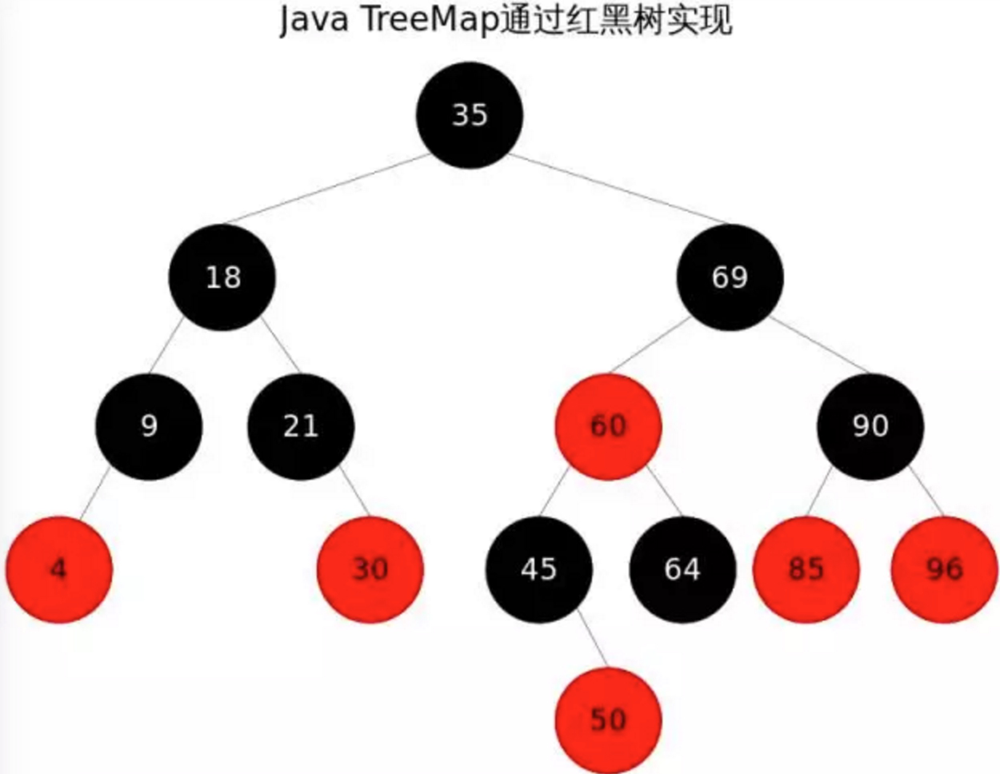
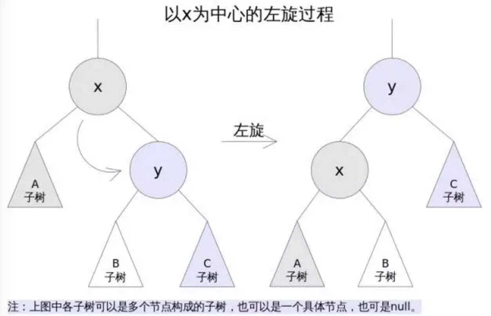
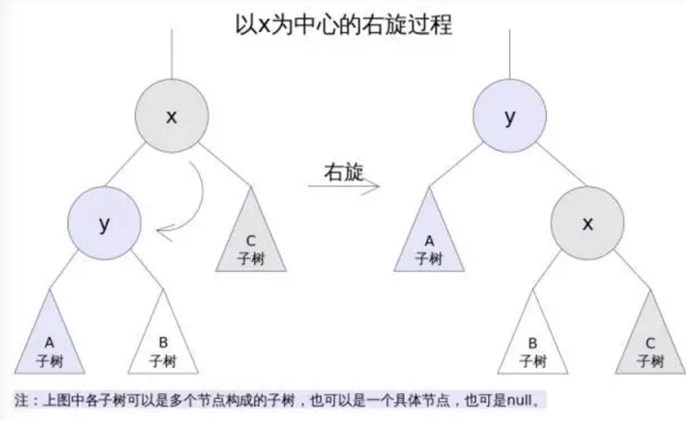
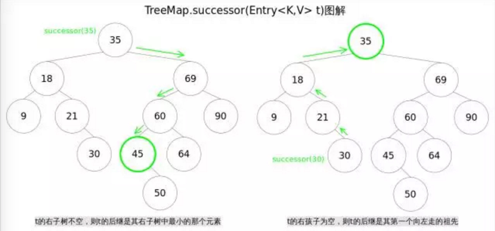
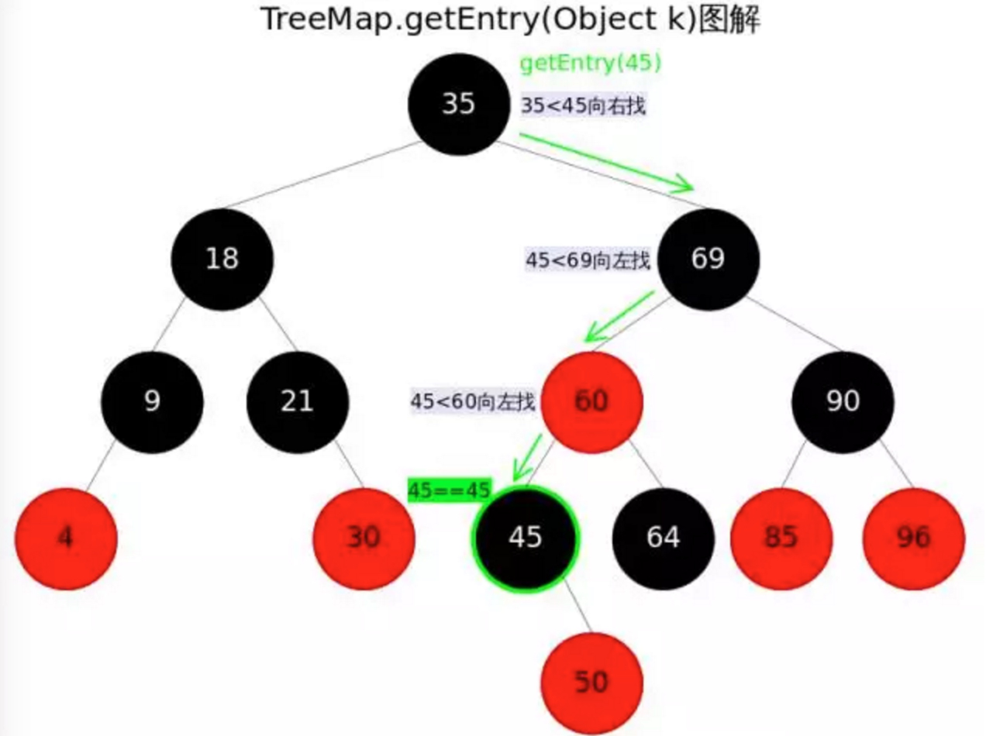
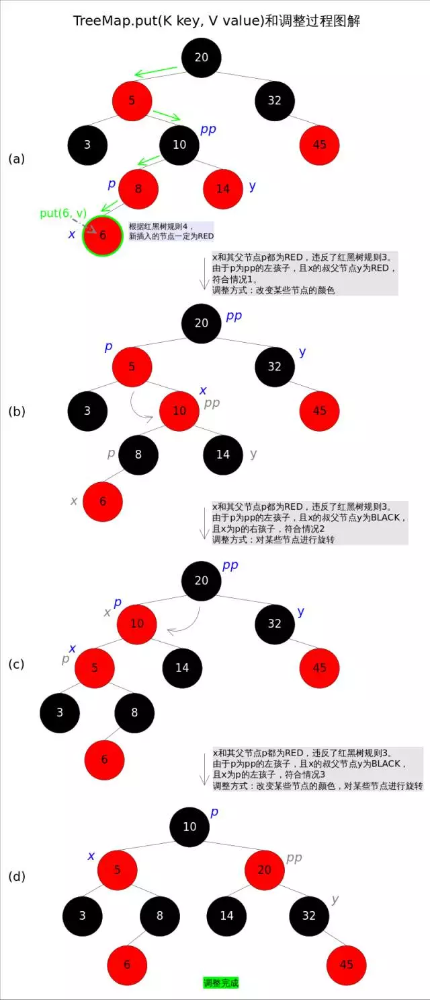
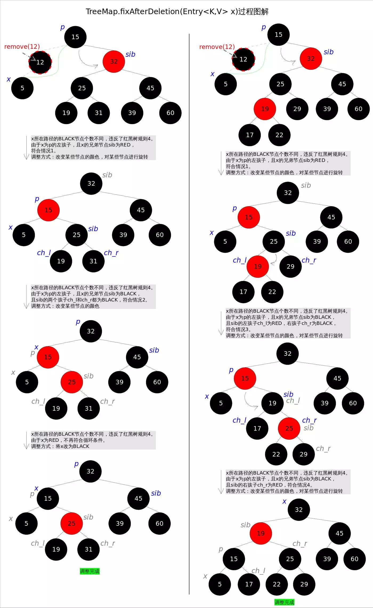

## TreeMap与红黑树

> **简介：** Java TreeMap实现了SortedMap接口，也就是说会按照key的大小顺序对Map中的元素进行排序，key大小的评判可以通过其本身的自然顺序（natural ordering），也可以通过构造时传入的比较器（Comparator）。

Java TreeMap实现了SortedMap接口，也就是说会按照key的大小顺序对Map中的元素进行排序，key大小的评判可以通过其本身的自然顺序（natural ordering），也可以通过构造时传入的比较器（Comparator）。

TreeMap底层通过红黑树（Red-Black tree）实现，也就意味着containsKey(), get(), put(), remove()都有着log(n)的时间复杂度。其具体算法实现参照了《算法导论》。

出于性能原因，TreeMap是非同步的（not synchronized），如果需要在多线程环境使用，需要程序员手动同步；或者通过如下方式将TreeMap包装成（wrapped）同步的：SortedMap m = Collections.synchronizedSortedMap(new TreeMap(...));



## 红黑二叉树

红黑树是一种近似平衡的二叉查找树，它能够确保任何一个节点的左右子树的高度差不会超过二者中较低那个的一陪。具体来说，红黑树是满足如下条件的二叉查找树（binary search tree）：

1. 每个节点要么是红色，要么是黑色。
2. 根节点必须是黑色
3. 红色节点不能连续（也即是，红色节点的孩子和父亲都不能是红色）。
4. 对于每个节点，从该点至null（树尾端）的任何路径，都含有相同个数的黑色节点。

在树的结构发生改变时（插入或者删除操作），往往会破坏上述条件3或条件4，需要通过调整使得查找树重新满足红黑树的条件。

调整可以分为两类：一类是颜色调整，即改变某个节点的颜色；另一类是结构调整，集改变检索树的结构关系。结构调整过程包含两个基本操作：左旋（Rotate Left），右旋（RotateRight）。

### **左旋**

左旋的过程是将x的右子树绕x逆时针旋转，使得x的右子树成为x的父亲，同时修改相关节点的引用。旋转之后，二叉查找树的属性仍然满足。



```java
TreeMap中左旋代码如下：
//Rotate Left
private void rotateLeft(Entry<K,V> p) {
    if (p != null) {
        Entry<K,V> r = p.right;
        p.right = r.left;
        if (r.left != null)
            r.left.parent = p;
        r.parent = p.parent;
        if (p.parent == null)
            root = r;
        else if (p.parent.left == p)
            p.parent.left = r;
        else
            p.parent.right = r;
        r.left = p;
        p.parent = r;
    }
}
```

### **右旋**

右旋的过程是将x的左子树绕x顺时针旋转，使得x的左子树成为x的父亲，同时修改相关节点的引用。旋转之后，二叉查找树的属性仍然满足。



```java
TreeMap中右旋代码如下：
//Rotate Right
private void rotateRight(Entry<K,V> p) {
    if (p != null) {
        Entry<K,V> l = p.left;
        p.left = l.right;
        if (l.right != null) l.right.parent = p;
        l.parent = p.parent;
        if (p.parent == null)
            root = l;
        else if (p.parent.right == p)
            p.parent.right = l;
        else p.parent.left = l;
        l.right = p;
        p.parent = l;
    }
}
```

### **寻找节点后继**

对于一棵二叉查找树，给定节点t，其后继（树中比大于t的最小的那个元素）可以通过如下方式找到： 

1. t的右子树不空，则t的后继是其右子树中最小的那个元素。
2. t的右孩子为空，则t的后继是其第一个向左走的祖先。



```java
//TreeMap中寻找节点后继的代码
// 寻找节点后继函数successor()
static <K,V> TreeMap.Entry<K,V> successor(Entry<K,V> t) {
    if (t == null)
        return null;
    else if (t.right != null) {// 1. t的右子树不空，则t的后继是其右子树中最小的那个元素
        Entry<K,V> p = t.right;
        while (p.left != null)
            p = p.left;
        return p;
    } else {// 2. t的右孩子为空，则t的后继是其第一个向左走的祖先
        Entry<K,V> p = t.parent;
        Entry<K,V> ch = t;
        while (p != null && ch == p.right) {
            ch = p;
            p = p.parent;
        }
        return p;
    }
}
```

## 方法剖析

### get() 

get(Object key)方法根据指定的key值返回对应的value，该方法调用了getEntry(Object key)得到相应的entry，然后返回entry.value。因此getEntry()是算法的核心。算法思想是根据key的自然顺序（或者比较器顺序）对二叉查找树进行查找，直到找到满足k.compareTo(p.key) == 0的entry。



```java
//getEntry()方法
final Entry<K,V> getEntry(Object key) {
    ......
    if (key == null)//不允许key值为null
        throw new NullPointerException();
    Comparable<? super K> k = (Comparable<? super K>) key;//使用元素的自然顺序
    Entry<K,V> p = root;
    while (p != null) {
        int cmp = k.compareTo(p.key);
        if (cmp < 0)//向左找
            p = p.left;
        else if (cmp > 0)//向右找
            p = p.right;
        else
            return p;
    }
    return null;
}
```

### put()

put(K key, V value)方法是将指定的key, value对添加到map里。该方法首先会对map做一次查找，看是否包含该元组，如果已经包含则直接返回，查找过程类似于getEntry()方法；如果没有找到则会在红黑树中插入新的entry，如果插入之后破坏了红黑树的约束，还需要进行调整（旋转，改变某些节点的颜色）。

```java
public V put(K key, V value) {
    ......
    int cmp;
    Entry<K,V> parent;
    if (key == null)
        throw new NullPointerException();
    Comparable<? super K> k = (Comparable<? super K>) key;//使用元素的自然顺序
    do {
        parent = t;
        cmp = k.compareTo(t.key);
        if (cmp < 0) t = t.left;//向左找
        else if (cmp > 0) t = t.right;//向右找
        else return t.setValue(value);
    } while (t != null);
    Entry<K,V> e = new Entry<>(key, value, parent);//创建并插入新的entry
    if (cmp < 0) parent.left = e;
    else parent.right = e;
    fixAfterInsertion(e);//调整
    size++;
    return null;
}
```

首先在红黑树上找到合适的位置，然后创建新的entry并插入（当然，新插入的节点一定是树的叶子）。难点是调整函数fixAfterInsertion()，1.改变某些节点的颜色，2.对某些节点进行旋转。



调整函数fixAfterInsertion()的具体代码如下，其中用到了rotateLeft()和rotateRight()函数。通过代码我们能够看到，情况2其实是落在情况3内的。情况4～情况6跟前三种情况是对称的，因此图解中并没有画出后三种情况

```java
//红黑树调整函数fixAfterInsertion()
private void fixAfterInsertion(Entry<K,V> x) {
    x.color = RED;
    while (x != null && x != root && x.parent.color == RED) {
        if (parentOf(x) == leftOf(parentOf(parentOf(x)))) {
            Entry<K,V> y = rightOf(parentOf(parentOf(x)));
            if (colorOf(y) == RED) {//如果y为null，则视为BLACK
                setColor(parentOf(x), BLACK);              // 情况1
                setColor(y, BLACK);                        // 情况1
                setColor(parentOf(parentOf(x)), RED);      // 情况1
                x = parentOf(parentOf(x));                 // 情况1
            } else {
                if (x == rightOf(parentOf(x))) {
                    x = parentOf(x);                       // 情况2
                    rotateLeft(x);                         // 情况2
                }
                setColor(parentOf(x), BLACK);              // 情况3
                setColor(parentOf(parentOf(x)), RED);      // 情况3
                rotateRight(parentOf(parentOf(x)));        // 情况3
            }
        } else {
            Entry<K,V> y = leftOf(parentOf(parentOf(x)));
            if (colorOf(y) == RED) {
                setColor(parentOf(x), BLACK);              // 情况4
                setColor(y, BLACK);                        // 情况4
                setColor(parentOf(parentOf(x)), RED);      // 情况4
                x = parentOf(parentOf(x));                 // 情况4
            } else {
                if (x == leftOf(parentOf(x))) {
                    x = parentOf(x);                       // 情况5
                    rotateRight(x);                        // 情况5
                }
                setColor(parentOf(x), BLACK);              // 情况6
                setColor(parentOf(parentOf(x)), RED);      // 情况6
                rotateLeft(parentOf(parentOf(x)));         // 情况6
            }
        }
    }
    root.color = BLACK;
}
```

### **remove()**

remove(Object key)的作用是删除key值对应的entry，该方法首先通过getEntry(Object key)方法找到key值对应的entry，然后调用deleteEntry(Entry<K,V> entry)删除对应的entry。由于删除操作会改变红黑树的结构，有可能破坏红黑树的约束，因此有可能要进行调整。deleteEntry该函数删除指定的entry并在红黑树的约束被破坏时进行调用fixAfterDeletion(Entry<K,V> x)进行调整。

由于红黑树是一棵增强版的二叉查找树，红黑树的删除操作跟普通二叉查找树的删除操作也就非常相似，唯一的区别是红黑树在节点删除之后可能需要进行调整。现在考虑一棵普通二叉查找树的删除过程，可以简单分为两种情况：

1. 删除点p的左右子树都为空，或者只有一棵子树非空。
2. 删除点p的左右子树都非空。

对于上述情况1，处理起来比较简单，直接将p删除（左右子树都为空时），或者用非空子树替代p（只有一棵子树非空时）；对于情况2，可以用p的后继s（树中大于x的最小的那个元素）代替p，然后使用情况1删除s（此时s一定满足情况1）。

基于以上逻辑，红黑树的节点删除函数deleteEntry()代码如下：

```java
// 红黑树entry删除函数deleteEntry()
private void deleteEntry(Entry<K,V> p) {
    modCount++;
    size--;
    if (p.left != null && p.right != null) {// 2. 删除点p的左右子树都非空。
        Entry<K,V> s = successor(p);// 后继
        p.key = s.key;
        p.value = s.value;
        p = s;
    }
    Entry<K,V> replacement = (p.left != null ? p.left : p.right);
    if (replacement != null) {// 1. 删除点p只有一棵子树非空。
        replacement.parent = p.parent;
        if (p.parent == null)
            root = replacement;
        else if (p == p.parent.left)
            p.parent.left  = replacement;
        else
            p.parent.right = replacement;
        p.left = p.right = p.parent = null;
        if (p.color == BLACK)
            fixAfterDeletion(replacement);// 调整
    } else if (p.parent == null) {
        root = null;
    } else { // 1. 删除点p的左右子树都为空
        if (p.color == BLACK)
            fixAfterDeletion(p);// 调整
        if (p.parent != null) {
            if (p == p.parent.left)
                p.parent.left = null;
            else if (p == p.parent.right)
                p.parent.right = null;
            p.parent = null;
        }
    }
}
```

只有删除点是BLACK的时候，才会触发调整函数，因为删除RED节点不会破坏红黑树的任何约束，而删除BLACK节点会破坏规则4。这里也要分成若干种情况。具体的调整操作只有两种：1.改变某些节点的颜色，2.对某些节点进行旋转。



上述图解的总体思想是：将情况1首先转换成情况2，或者转换成情况3和情况4。当然，该图解并不意味着调整过程一定是从情况1开始。通过代码我们能够看到，情况3其实是落在情况4内的。情况5～情况8跟前四种情况是对称的，因此图解中并没有画出后四种情况。通过后续代码我们还会发现几个有趣的规则：

a).如果是由情况1之后紧接着进入的情况2，那么情况2之后一定会退出循环（因为x为红色）；

b).一旦进入情况3和情况4，一定会退出循环（因为x为root）。

```java
private void fixAfterDeletion(Entry<K,V> x) {
    while (x != root && colorOf(x) == BLACK) {
        if (x == leftOf(parentOf(x))) {
            Entry<K,V> sib = rightOf(parentOf(x));
            if (colorOf(sib) == RED) {
                setColor(sib, BLACK);                   // 情况1
                setColor(parentOf(x), RED);             // 情况1
                rotateLeft(parentOf(x));                // 情况1
                sib = rightOf(parentOf(x));             // 情况1
            }
            if (colorOf(leftOf(sib))  == BLACK &&
                colorOf(rightOf(sib)) == BLACK) {
                setColor(sib, RED);                     // 情况2
                x = parentOf(x);                        // 情况2
            } else {
                if (colorOf(rightOf(sib)) == BLACK) {
                    setColor(leftOf(sib), BLACK);       // 情况3
                    setColor(sib, RED);                 // 情况3
                    rotateRight(sib);                   // 情况3
                    sib = rightOf(parentOf(x));         // 情况3
                }
                setColor(sib, colorOf(parentOf(x)));    // 情况4
                setColor(parentOf(x), BLACK);           // 情况4
                setColor(rightOf(sib), BLACK);          // 情况4
                rotateLeft(parentOf(x));                // 情况4
                x = root;                               // 情况4
            }
        } else { // 跟前四种情况对称
            Entry<K,V> sib = leftOf(parentOf(x));
            if (colorOf(sib) == RED) {
                setColor(sib, BLACK);                   // 情况5
                setColor(parentOf(x), RED);             // 情况5
                rotateRight(parentOf(x));               // 情况5
                sib = leftOf(parentOf(x));              // 情况5
            }
            if (colorOf(rightOf(sib)) == BLACK &&
                colorOf(leftOf(sib)) == BLACK) {
                setColor(sib, RED);                     // 情况6
                x = parentOf(x);                        // 情况6
            } else {
                if (colorOf(leftOf(sib)) == BLACK) {
                    setColor(rightOf(sib), BLACK);      // 情况7
                    setColor(sib, RED);                 // 情况7
                    rotateLeft(sib);                    // 情况7
                    sib = leftOf(parentOf(x));          // 情况7
                }
                setColor(sib, colorOf(parentOf(x)));    // 情况8
                setColor(parentOf(x), BLACK);           // 情况8
                setColor(leftOf(sib), BLACK);           // 情况8
                rotateRight(parentOf(x));               // 情况8
                x = root;                               // 情况8
            }
        }
    }
    setColor(x, BLACK);
}
```

