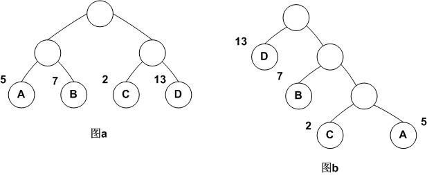
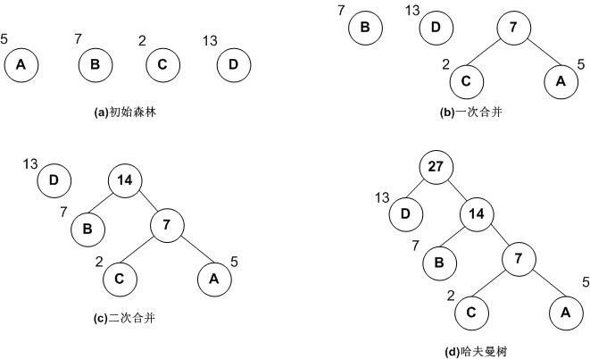
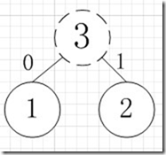
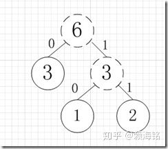
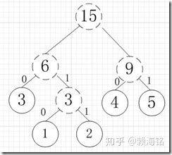
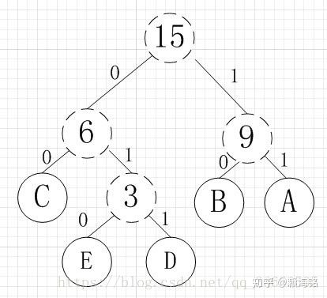

# 哈夫曼树

## 1、什么是哈夫曼树

什么是哈夫曼树呢？

哈夫曼树是一种带权路径长度最短的二叉树，也称为最优二叉树。下面用一幅图来说明。



它们的带权路径长度分别为：

```text
图a： WPL=5*2+7*2+2*2+13*2=54

图b： WPL=5*3+2*3+7*2+13*1=48
```

可见，图b的带权路径长度较小，我们可以证明图b就是哈夫曼树(也称为最优二叉树)。

## 2、如何构建哈夫曼树

一般可以按下面步骤构建：

（1）将所有左，右子树都为空的节点作为根节点。

（2）在森林中选出两棵根节点的权值最小的树作为一棵新树的左，右子树，且置新树的根节点的权值为其左，右子树上根节点的权值之和。注意，左子树的权值应小于右子树的权值。

（3）从森林中删除这两棵树，同时把新树加入到森林中。

（4）重复2、3步骤，直到森林中只有一棵树为止，此树便是哈夫曼树。

下面是构建哈夫曼树的图解过程：



## 3、哈夫曼编码

哈夫曼编码，主要目的是根据使用频率来最大化节省字符（编码）的存储空间。
简易的理解就是，假如我有A,B,C,D,E五个字符，出现的频率（即权值）分别为5,4,3,2,1,那么我们第一步先取两个最小权值作为左右子树构造一个新树，即取1，2构成新树，其结点为1+2=3，如图：



虚线为新生成的结点，第二步再把新生成的权值为3的结点放到剩下的集合中，所以集合变成{5,4,3,3}，再根据第二步，取最小的两个权值构成新树，如图：



再依次建立哈夫曼树，如下图：



其中各个权值替换对应的字符即为下图：



所以各字符对应的编码为：A->11,B->10,C->00,D->011,E->010

霍夫曼编码是一种无前缀编码。解码时不会混淆。其主要应用在数据压缩，加密解密等场合。
如果考虑到进一步节省存储空间，就应该将出现概率大（占比多）的字符用尽量少的0-1进行编码，也就是更靠近根（节点少），这也就是最优二叉树-哈夫曼树。

# 用Java实现赫夫曼树

```java
package com.cn.He;

import java.util.ArrayList;
import java.util.Collections;
import java.util.List;

/**
 * 用Java创建赫夫曼树
 */
public class HuffmanTree {

    public static void main(String[] args) {
        int[] arr = new int[]{3,7,8,29,5,11,23,14};
        Node node = createHuffmanTree(arr);
        System.out.println(node.value);
    }

    /**
     * 创建赫夫曼树
     * @param arr 树的节点
     */
    public static Node createHuffmanTree(int[] arr){
        //先使用数组中所有的元素创建若干个二叉树，只有几个节点的二叉树
        List<Node> nodes = new ArrayList<Node>();

        //循环创建二叉树
        for(int value:arr){
            nodes.add(new Node(value));
        }
        //循环处理
        while (nodes.size()>1){
            //排序
            Collections.sort(nodes);

            //取出最小的二叉树
            Node left = nodes.get(nodes.size()-1);
            //取出次小的二叉树
            Node right = nodes.get(nodes.size()-2);
            //创建一个新的二叉树
            Node parent = new Node(left.value+right.value);

            //把取出来的移除掉
            nodes.remove(left);
            nodes.remove(right);
            //放入原来的二叉树集合
            nodes.add(parent);
        }
        return nodes.get(0);
    }
}
```
