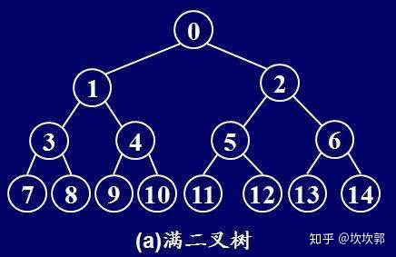
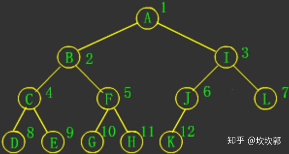

### 满二叉树和完全二叉树的区别

## **满二树叉**

- 对于满二叉树，除最后一层无任何子节点外，每一层上的所有结点都有两个子结点二叉树。

定义：一个二叉树，如果每一个层的结点数都达到最大值，则这个二叉树就是满二叉树。也就是说，如果一个二叉树的层数为K，且结点总数是(2^k) -1 ，则它就是满二叉树。

## **完全二叉树**

完全二叉树是效率很高的数据结构，完全二叉树是由满二叉树而引出来的。对于深度为K的，有n个结点的二叉树，当且仅当其每一个结点都与深度为K的满二叉树中编号从1至n的结点一一对应时称之为完全二叉树。

定义：若设二叉树的深度为h，除第 h 层外，其它各层 (1～h-1) 的结点数都达到最大个数，第 h 层所有的结点都连续集中在最左边，这就是完全二叉树。