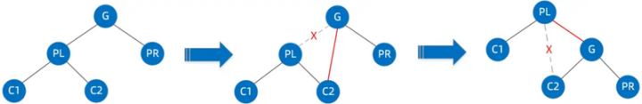
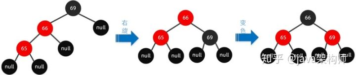
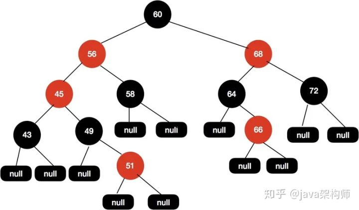

# 红黑树


————————————


————————————


二叉查找树（BST）具备什么特性呢？

1.**左**子树上所有结点的值均**小于或等于**它的根结点的值。

2.**右**子树上所有结点的值均**大于或等于**它的根结点的值。

3.左、右子树也分别为二叉排序树。

下图中这棵树，就是一颗典型的二叉查找树：


1.查看根节点**9**：


2.由于**10 > 9**，因此查看右孩子**13**：


3.由于**10 < 13**，因此查看左孩子**11**：


4.由于**10 < 11**，因此查看左孩子**10**，发现10正是要查找的节点：


假设初始的二叉查找树只有三个节点，根节点值为9，左孩子值为8，右孩子值为12：


接下来我们依次插入如下五个节点：7,6,5,4,3。依照二叉查找树的特性，结果会变成什么样呢？


1.节点是红色或黑色。

2.根节点是黑色。

3.每个叶子节点都是黑色的空节点（NIL节点）。

4 每个红色节点的两个子节点都是黑色。(从每个叶子到根的所有路径上不能有两个连续的红色节点)

5.从任一节点到其每个叶子的所有路径都包含相同数目的黑色节点。

下图中这棵树，就是一颗典型的红黑树：


什么情况下会破坏红黑树的规则，什么情况下不会破坏规则呢？我们举两个简单的栗子：

1.向原红黑树插入值为**14**的新节点：


由于父节点15是黑色节点，因此这种情况并不会破坏红黑树的规则，无需做任何调整。

2.向原红黑树插入值为**21**的新节点：


由于父节点22是红色节点，因此这种情况打破了红黑树的规则4（每个红色节点的两个子节点都是黑色），必须进行调整，使之重新符合红黑树的规则。


**变色：**

为了重新符合红黑树的规则，尝试把红色节点变为黑色，或者把黑色节点变为红色。

下图所表示的是红黑树的一部分，需要注意节点25并非根节点。因为节点21和节点22连续出现了红色，不符合规则4，所以把节点22从红色变成黑色：


但这样并不算完，因为凭空多出的黑色节点打破了规则5，所以发生连锁反应，需要继续把节点25从黑色变成红色：


此时仍然没有结束，因为节点25和节点27又形成了两个连续的红色节点，需要继续把节点27从红色变成黑色：


**左旋转：**

**逆时针**旋转红黑树的两个节点，使得父节点被自己的右孩子取代，而自己成为自己的左孩子。说起来很怪异，大家看下图：


图中，身为右孩子的Y取代了X的位置，而X变成了自己的左孩子。此为左旋转。

**右旋转：**

**顺时针**旋转红黑树的两个节点，使得父节点被自己的左孩子取代，而自己成为自己的右孩子。大家看下图：


图中，身为左孩子的Y取代了X的位置，而X变成了自己的右孩子。此为右旋转。


我们以刚才插入节点21的情况为例：


首先，我们需要做的是**变色**，把节点25及其下方的节点变色：


此时节点17和节点25是连续的两个红色节点，为了维持红黑树的规则，我们把节点8和节点17进行变色，由红色节点变成黑色节点。这样一来就形成了新的红黑树（这里感谢网友的指正，之前所讲的变换方式有问题）：


**几点说明：**

1. 关于红黑树自平衡的调整，插入和删除节点的时候都涉及到很多种Case，由于篇幅原因无法展开来一一列举，有兴趣的朋友可以参考维基百科，里面讲的非常清晰。
2. 漫画中红黑树调整过程的示例是一种比较复杂的情形，没太看明白的小伙伴也不必钻牛角尖，关键要懂得红黑树自平衡调整的主体思想。


## 红黑树的补充

### 对红黑树特性的理解

- 性质1：每个节点要么是红色，要么是黑色。
- 性质2：根节点永远是黑色的。
- 性质3：所有的叶子节点都是空节点（即null），并且是黑色的。
- 性质4：每个红色节点的两个子节点都是黑色。（从每个叶子到根的路径上不会有两个连续的红色节点。）
- 性质5：从任一节点到其子树中每个叶子节点的路径都包含相同数量的黑色节点。

对于性质 5，这里我们需要注意的是，这里的描述是从任一节点，从任一节点到它的子树的每个叶子节点黑色节点的数量都是相同的，这个数量被称为这个节点的**黑高**。

### 红黑树的插入

红黑树的插入和普通排序二叉树的插入基本一致，排序二叉树的要求是左子树上的所有节点都要比根节点小，右子树上的所有节点都要比跟节点大，当插入一个新的节点的时候，首先要找到当前要插入的节点适合放在排序二叉树哪个位置，然后插入当前节点即可。红黑树和排序二叉树不同的是，红黑树需要在插入节点调整树的结构来让树保持平衡。

一般情况下，红黑树中新插入的节点都是**红色**的，因为当前红黑树中从根节点到每个叶子节点的黑色节点数量是一样的，此时假如新的黑色节点的话，必然破坏规则，但加入红色节点却不一定，除非其父节点就是红色节点，因此加入红色节点，破坏规则的可能性小一些。

接下来我们重点来讲红黑树插入新节点后是如何保持平衡的。

给定下面这样一颗红黑树：


当我们插入值为66的节点的时候，示意图如下：


很明显，这个时候结构依然遵循着上述5大特性，无需启动自动平衡机制调整节点平衡状态。

如果再向里面插入值为51的节点呢，这个时候红黑树变成了这样。


这样的结构实际上是不满足性质4的，红色两个子节点必须是黑色的，这个时候我们需要调整这个树的结构来保证红黑树的平衡。首先尝试将49这个节点设置为黑色，如下示意图：


这个时候我们发现黑高是不对的，其中 60-56-45-49-51-null 这条路径有 4 个黑节点，其他路径的黑色节点是 3 个。接着调整红黑树，我们再次尝试把45这个节点设置为红色的，如下图所示：


这个时候我们发现问题又来了，56-45-43 都是红色节点的，出现了红色节点相连的问题。于是我们需要再把 56 和 43 设置为黑色的，如下图所示。


针对性质5（从任一节点到其子树中每个叶子节点的路径都包含相同数量的黑色节点），于是我们把 68 这个红色节点设置为黑色的。

但是并不是每次都是这么幸运的，当变色行不通的时候，我们需要考虑另一个手段就是旋转了。同样举例：


现在这颗红黑树，我们现在插入节点65。


我们尝试把 66 这个节点设置为黑色，如下图所示。


这样操作之后黑高又出现不一致的情况了，60-68-64-null 有 3 个黑色节点，而60-68-64-66-null 这条路径有 4 个黑色节点，这样的结构是不平衡的。

或者我们把 68 设置为黑色，把 64 设置为红色，如下图所示：


但是，同样的问题，上面这颗红黑树的黑色高度还是不一致，60-68-64-null 和 60-68-64-66-null 这两条路径黑色高度还是不一致。这种情况如果只通过变色的情况是不能保持红黑树的平衡的。

### 红黑树的旋转

接下来我们讲讲红黑树的旋转，旋转分为左旋和右旋。

### 左旋

旋转示意如图：


首先断开节点PL与右子节点G的关系，同时将其右子节点的引用指向节点C2；然后断开节点G与左子节点C2的关系，同时将G的左子节点的应用指向节点PL。接下来再放下 gif 图：


### 右旋

旋转示意如图：



首先断开节点G与左子节点PL的关系，同时将其左子节点的引用指向节点C2；然后断开节点PL与右子节点C2的关系，同时将PL的右子节点的应用指向节点G。右旋的gif展示：


介绍完了左旋和右旋基本操作，我们来详细介绍下红黑树的几种旋转场景。

### 左左节点旋转（插入节点的父节点是左节点，插入节点也是左节点）

如下图所示的红黑树，我们插入节点是65。


操作步骤如下可以围绕祖父节点 69 右旋，再结合变色，步骤如下所示：



### 左右节点旋转（插入节点的父节点是左节点，插入节点是右节点）

还是上面这颗红黑树，我们再插入节点 67


这种情况我们可以这样操作，先围绕父节点 66 左旋，然后再围绕祖父节点 69 右旋，最后再将 67 设置为黑色，把 69 设置为红色，如下图所示。


### 右左节点旋转（插入节点的父节点是右节点，插入节点左节点）

如下图这种情况，我们要插入节点68


这种情况，我们可以先围绕父节点 69 右旋，接着再围绕祖父节点 66 左旋，最后把 68 节点设置为黑色，把 66 设置为红色，我们的具体操作步骤如下所示。


### 右右节点旋转（插入节点的父节点是右节点，插入节点也是右节点）

还是来上面的图来举例，我们在这颗红黑树上插入节点 70


我们可以这样操作围绕祖父节点 66 左旋，再把旋转后的根节点 69 设置为黑色，把 66 这个节点设置为红色。具体可以参看下图：


### 红黑树在 Java 中的实现

Java 中的红黑树实现类是 TreeMap ，接下来我们尝试从源码角度来逐行解释 TreeMap 这一套机制是如何运作的。

```java
// TreeMap中使用Entry来描述每个节点
 static final class Entry<K,V> implements Map.Entry<K,V> {
        K key;
        V value;
        Entry<K,V> left;
        Entry<K,V> right;
        Entry<K,V> parent;
        boolean color = BLACK;
        ...
 }
```

TreeMap 的put方法。

```java
public V put(K key, V value) {
        //先以t保存链表的root节点
        Entry<K,V> t = root;
        //如果t=null,表明是一个空链表，即该TreeMap里没有任何Entry作为root
        if (t == null) {
            compare(key, key); // type (and possibly null) check
            //将新的key-value创建一个Entry，并将该Entry作为root
            root = new Entry<>(key, value, null);
            size = 1;
            //记录修改次数加1
            modCount++;
            return null;
        }
        int cmp;
        Entry<K,V> parent;
        // split comparator and comparable paths
        Comparator<? super K> cpr = comparator;
        //如果比较器cpr不为null，即表明采用定制排序
        if (cpr != null) {
            do {
                //使用parent上次循环后的t所引用的Entry
                parent = t;
                 //将新插入的key和t的key进行比较
                cmp = cpr.compare(key, t.key);
                //如果新插入的key小于t的key，t等于t的左边节点
                if (cmp < 0)
                    t = t.left;
                //如果新插入的key大于t的key，t等于t的右边节点    
                else if (cmp > 0)
                    t = t.right;
                else
                //如果两个key相等，新value覆盖原有的value，并返回原有的value
                    return t.setValue(value);
            } while (t != null);
        }
        else {
            if (key == null)
                throw new NullPointerException();
            @SuppressWarnings("unchecked")
                Comparable<? super K> k = (Comparable<? super K>) key;
            do {
                parent = t;
                cmp = k.compareTo(t.key);
                if (cmp < 0)
                    t = t.left;
                else if (cmp > 0)
                    t = t.right;
                else
                    return t.setValue(value);
            } while (t != null);
        }
        //将新插入的节点作为parent节点的子节点
        Entry<K,V> e = new Entry<>(key, value, parent);
        //如果新插入key小于parent的key,则e作为parent的左子节点
        if (cmp < 0)
            parent.left = e;
        //如果新插入key小于parent的key，则e作为parent的右子节点
        else
            parent.right = e;
        //修复红黑树
        fixAfterInsertion(e);
        size++;
        modCount++;
        return null;
}

//插入节点后修复红黑树
private void fixAfterInsertion(Entry<K,V> x) {
    x.color = RED;

    //直到x节点的父节点不是根，且x的父节点是红色
    while (x != null && x != root && x.parent.color == RED) {
        //如果x的父节点是其父节点的左子节点
        if (parentOf(x) == leftOf(parentOf(parentOf(x)))) {
            //获取x的父节点的兄弟节点
            Entry<K,V> y = rightOf(parentOf(parentOf(x)));
            //如果x的父节点的兄弟节点是红色
            if (colorOf(y) == RED) {     
                //将x的父节点设置为黑色
                setColor(parentOf(x), BLACK);
                //将x的父节点的兄弟节点设置为黑色
                setColor(y, BLACK);
                //将x的父节点的父节点设为红色
                setColor(parentOf(parentOf(x)), RED);
                x = parentOf(parentOf(x));
            }
            //如果x的父节点的兄弟节点是黑色
            else {   
                //TODO 对应情况第二种，左右节点旋转
                //如果x是其父节点的右子节点
                if (x == rightOf(parentOf(x))) {
                    //将x的父节点设为x
                    x = parentOf(x);
                    //右旋转
                    rotateLeft(x);
                }
                //把x的父节点设置为黑色
                setColor(parentOf(x), BLACK);
                //把x的父节点父节点设为红色
                setColor(parentOf(parentOf(x)), RED);
                rotateRight(parentOf(parentOf(x)));
            }
        }
        //如果x的父节点是其父节点的右子节点
        else {
            //获取x的父节点的兄弟节点
            Entry<K,V> y = leftOf(parentOf(parentOf(x)));
            //只着色的情况对应的是最开始例子，没有旋转操作，但是要对应多次变换
            //如果x的父节点的兄弟节点是红色  
            if (colorOf(y) == RED) {
                //将x的父节点设置为黑色
                setColor(parentOf(x), BLACK);
                //将x的父节点的兄弟节点设为黑色
                setColor(y, BLACK);
                //将X的父节点的父节点（G）设置红色
                setColor(parentOf(parentOf(x)), RED);
                //将x设为x的父节点的节点
                x = parentOf(parentOf(x));
            }
            //如果x的父节点的兄弟节点是黑色
            else {
                //如果x是其父节点的左子节点
                if (x == leftOf(parentOf(x))) {
                    //将x的父节点设为x
                    x = parentOf(x);
                    //右旋转
                    rotateRight(x);
                }
                //将x的父节点设为黑色
                setColor(parentOf(x), BLACK);
                //把x的父节点的父节点设为红色
                setColor(parentOf(parentOf(x)), RED);
                rotateLeft(parentOf(parentOf(x)));
            }
        }
    }
    //将根节点强制设置为黑色
    root.color = BLACK;
}
```

TreeMap的插入节点和普通的排序二叉树没啥区别，唯一不同的是，在TreeMap 插入节点后会调用方法fixAfterInsertion(e)来重新调整红黑树的结构来让红黑树保持平衡。

我们重点关注下红黑树的fixAfterInsertion(e)方法，接下来我们来分别介绍两种场景来演示fixAfterInsertion(e)方法的执行流程

### 第一种场景：只需变色即可平衡

同样是拿这颗红黑树举例，现在我们插入节点 51。


当我们需要插入节点51的时候，这个时候TreeMap 的 put 方法执行后会得到下面这张图。


接着调用fixAfterInsertion(e)方法，如下代码流程所示。


当第一次进入循环后，执行后会得到下面的红黑树结构。



在把 x 重新赋值后，重新进入 while 循环，此时的 x 节点为 45 。


执行上述流程后，得到下面所示的红黑树结构。


这个时候x被重新赋值为60，因为60是根节点，所以会退出 while 循环。在退出循序后，会再次把根节点设置为黑色，得到最终的结构如下图所示。


最后经过两次执行while循环后，我们的红黑树会调整成现在这样的结构，这样的红黑树结构是平衡的，所以路径的黑高一致，并且没有红色节点相连的情况。

### 第二种场景 旋转搭配变色来保持平衡

接下来我们再来演示第二种场景，需要结合变色和旋转一起来保持平衡。

给定下面这样一颗红黑树：


现在我们插入节点66，得到如下树结构。


同样地，我们进入fixAfterInsertion(e)方法。


最终我们得到的红黑树结构如下图所示：


调整成这样的结构我们的红黑树又再次保持平衡了。

演示 TreeMap 的流程就拿这两种场景举例了，其他的就不一一举例了。

### 红黑树的删除

删除相对插入来说，的确是要复杂一点，但是复杂的地方是因为在删除节点的这个操作情况有很多种，但是插入不一样，插入节点的时候实际上这个节点的位置是确定的，在节点插入成功后只需要调整红黑树的平衡就可以了。

但是删除不一样的是，删除节点的时候我们不能简单地把这个节点设置为null，因为如果这个节点有子节点的情况下，不能简单地把当前删除的节点设置为null，这个被删除的节点的位置需要有新的节点来填补。这样一来，需要分多种情况来处理了。

### 删除节点是根节点

直接删除根节点即可。

### 删掉节点的左子节点和右子节点都是为空	

直接删除当前节点即可。

### 删除节点有一个子节点不为空

这个时候需要使用子节点来代替当前需要删除的节点，然后再把子节点删除即可。

给定下面这棵树，当我们需要删除节点69的时候。


首先用子节点代替当前待删除节点，然后再把子节点删除。


最终的红黑树结构如下面所示，这个结构的红黑树我们是不需要通过变色+旋转来保持红黑树的平衡了，因为将子节点删除后树已经是平衡的了。


### 待删除节点为黑色节点

黑色的节点被删除后，树的黑高就会出现不一致的情况，这个时候就需要重新调整结构。

还是拿上面这颗删除节点后的红黑树举例，我们现在需要删除节点67。


因为67 这个节点的两个子节点都是null，所以直接删除,得到如下图所示结构：


这个时候我们树的黑高是不一致的，左边黑高是3，右边是2，所以我们需要把64节点设置为红色来保持平衡。


### 删除节点两个子节点都不为空

删除节点两个子节点都不为空的情况下，跟上面有一个节点不为空的情况下也是有点类似，同样是需要找能替代当前节点的节点，找到后，把能替代删除节点值复制过来，然后再把替代节点删除掉。

- 先找到替代节点，也就是前驱节点或者后继节点
- 然后把前驱节点或者后继节点复制到当前待删除节点的位置，然后在删除前驱节点或者后继节点。

那么什么叫做前驱，什么叫做后继呢？ 前驱是左子树中最大的节点，后继则是右子树中最小的节点。

前驱或者后继都是最接近当前节点的节点，当我们需要删除当前节点的时候，也就是找到能替代当前节点的节点，能够替代当前节点肯定是最接近当前节点。

在当前删除节点两个子节点不为空的场景下，我们需要再进行细分，主要分为以下三种情况。

#### 第一种，前驱节点为黑色节点，同时有一个非空节点

如下面这样一棵树，我们需要删除节点64：


首先找到前驱节点，把前驱节点复制到当前节点：


接着删除前驱节点。


这个时候63和60这个节点都是红色的，我们尝试把60这个节点设置为红色即可使整个红黑树达到平衡。


#### 第二种，前驱节点为黑色节点，同时子节点都为空

前驱节点是黑色的，子节点都为空，这个时候操作步骤与上面基本类似。

如下操作步骤：


因为要删除节点64，接着找到前驱节点63，把63节点复制到当前位置，然后将前驱节点63删除掉，变色后出现黑高不一致的情况下，最后把63节点设置为黑色，把65节点设置为红色，这样就能保证红黑树的平衡。

#### 第三种，前驱节点为红色节点，同时子节点都为空

给定下面这颗红黑树，我们需要删除节点64的时候


同样地，我们找到64的前驱节点63，接着把63赋值到64这个位置。


然后删除前驱节点。


删除节点后不需要变色也不需要旋转即可保持树的平衡。