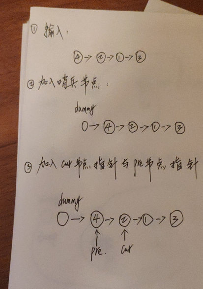
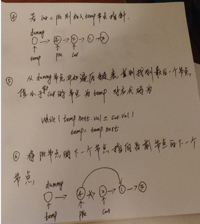
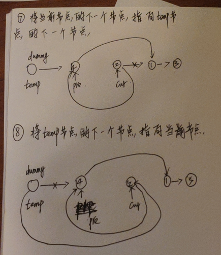
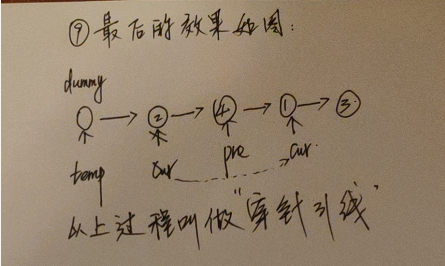

#### 147. 对链表进行插入排序

对链表进行插入排序。


插入排序的动画演示如上。从第一个元素开始，该链表可以被认为已经部分排序（用黑色表示）。
每次迭代时，从输入数据中移除一个元素（用红色表示），并原地将其插入到已排好序的链表中。

**插入排序算法：**

1. 插入排序是迭代的，每次只移动一个元素，直到所有元素可以形成一个有序的输出列表。
2. 每次迭代中，插入排序只从输入数据中移除一个待排序的元素，找到它在序列中适当的位置，并将其插入。
3. 重复直到所有输入数据插入完为止。

**示例 1：**

```shell
输入: 4->2->1->3
输出: 1->2->3->4
```

**示例 2：**

```shell
输入: -1->5->3->4->0
输出: -1->0->3->4->5
```

### 题解









```java
/**
 * Definition for singly-linked list.
 * public class ListNode {
 *     int val;
 *     ListNode next;
 *     ListNode() {}
 *     ListNode(int val) { this.val = val; }
 *     ListNode(int val, ListNode next) { this.val = val; this.next = next; }
 * }
 */
class Solution {
    public ListNode insertionSortList(ListNode head) {
        if (head == null || head.next == null) {
            return head;
        }

        // 哨兵节点
        ListNode dummyNode = new ListNode(0);
        // 将哨兵节点连接至链表
        dummyNode.next = head;
        
        // 定义preNode与curNode
        ListNode preNode与 = head;
        ListNode curNode = head.next;
        
        while (curNode != null) {
            // 若当前节点的值大于等于前一个节点的值,则不需要进行插入排序(穿针引线)
            if (curNode.val >= preNode.val) {
                preNode = preNode.next;
                curNode = curNode.next;
                continue;
            }


            // 从哨兵节点开始,寻找最后一个小于等于当前节点值的temp节点
            ListNode tempNode = dummyNode;
            while (tempNode.next.val <= curNode.val) {
                tempNode = tempNode.next;
            }
            
            // 保存当前节点的下一个节点
            ListNode nextNode = curNode.next;
            // 开始穿针引线
            preNode.next = nextNode;
            curNode.next = tempNode.next;
            tempNode.next = curNode;
            // 将当前节点执行下一个节点,进入下一轮循环
            curNode = nextNode;
        }
        return dummyNode.next;
    }
}
```

