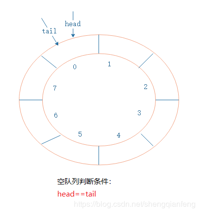
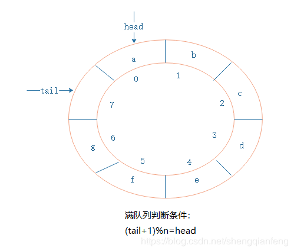
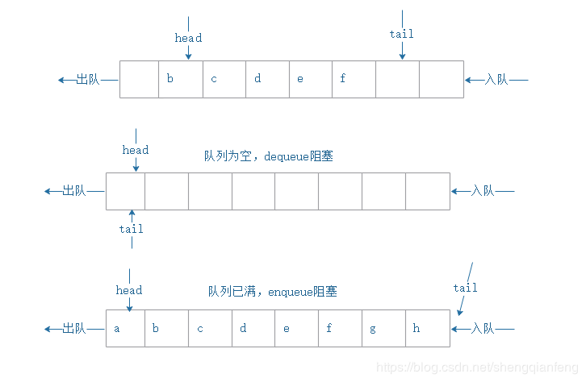

# 环形队列的实现及阻塞队列

如果我们使用数组来实现队列，当队列尾部没有空闲空间时，即便整个队列有空闲空间，新数据也将无法入队。除非采用“数据搬移”的方法，将队尾的数据全部搬移到队列头部，这样队列尾巴才有空间可以进行入队操作。

那么，有没有别的办法呢？这里就用到了环形队列

### 环形队列

环形队列，其实是队列尾部和首部相接的结构，初始状态时，head和tail指针分别指向下标为0的位置，如图：



需要关注：***\*循环队列为空的判断条件是head==tail\**。**

随着新元素入队，head指针保持不边，tail指针往后移动，指向一个空闲位置。同样当有元素出队列时，head指针也会自然往后移动。


当队列不断加入元素，tail指针不断后移，由于队列大小有限，队列什么时候满了呢？其实是满足一个条件：

**(tail+1)%n=head,这里n为队列的大小。可以看出循环队列浪费了一个空间位置。**



循环队列的代码实现：

```java
package com.study.algorithm.queue;
 
/**
 * @author jeffSheng
 * 
 * 循环队列的实现
 */
public class CycleQueue {
 
    // 数组：items，数组大小：n
    private String[] items;
    private int n = 0;
    // head 表示队头下标，tail 表示队尾下标
    private int head = 0;
    private int tail = 0;
 
    // 申请一个大小为 capacity 的数组
    public CycleQueue(int capacity) {
        items = new String[capacity];
        n = capacity;
    }
 
    // 入队
    public boolean add(String item) {
        // 队列满了
        if ((tail + 1) % n == head) return false;
        items[tail] = item;
        tail = (tail + 1) % n;
        return true;
    }
 
    // 出队
    public String poll() {
        // 如果 head == tail 表示队列为空
        if (head == tail) return null;
        String ret = items[head];
        head = (head + 1) % n;
        return ret;
    }
}
```

### 阻塞队列

阻塞队列，简单说就是当队列为空时，从对头取元素会被阻塞。当队列满时，从队尾入队会阻塞。

