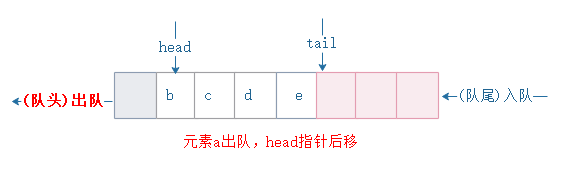

# 队列的数组实现

队列是一种先进先出的数据结构。在队尾插入数据，在队头出队。

### 数组实现队列

使用tail和head指针分别指向队列的队尾和队头。在初始状态下队列为空，tail和head同时指向下标为0的位置（这里是用数组来实现的方式）。


依次往队列中插入a、b、c、d后，head指针指向队列队头元素a下标为0，而tail指针指向队尾空闲位置下标为4.


队列元素是从队尾进入队列的，进入队列后tail指针向后移动一位，当tail=n（n为队列大小 ）时，队列尾部没有空闲空间可以插入。如图 再插入元素e，指针后移。


出队的时候，从队头出队，head指针也往后移动一位。



基本的出队和入队就是 这样子代码实现也不难。

```java
package com.study.algorithm.queue;
 
// 用数组实现的队列
public class ArrayQueue {
  // 数组：items，数组大小：n
  private String[] items;
  //队列大小
  private int n = 0;
  // head 表示队头下标，tail 表示队尾下标
  private int head = 0;
  private int tail = 0;
 
  // 申请一个大小为 capacity 的数组
  public ArrayQueue(int capacity) {
    items = new String[capacity];
    n = capacity;
  }
 
  // 入队
  public boolean add(String item) {
    // 如果 tail == n 表示队列已经满了
    if (tail == n) return false;
    items[tail] = item;
    ++tail;
    return true;
  }
  
 
 
  // 出队
  public String poll() {
    // 如果 head == tail 表示队列为空
    if (head == tail) return null;
    String ret = items[head];
    ++head;
    return ret;
  }
}
```

但是当队列不停入队和出队时，由于head和tail都只会往后移动，那么极端情况下tail=n（n为队列大小），队列尾巴没有空闲空间，但队列并没有满，如图：


直接可以想到的办法就是“数据搬移“，将队列队尾的元素一起搬移到队列头部。


但是并不是在出队的时候进行搬移，而是入队的时候，判断队尾是否满足入队条件，如果队尾已满则进行数据搬移。代码实现如下：

```java

package com.study.algorithm.queue;
 
// 用数组实现的队列
public class ArrayQueue {
  // 数组：items，数组大小：n
  private String[] items;
  //队列大小
  private int n = 0;
  // head 表示队头下标，tail 表示队尾下标
  private int head = 0;
  private int tail = 0;
 
  // 申请一个大小为 capacity 的数组
  public ArrayQueue(int capacity) {
    items = new String[capacity];
    n = capacity;
  }
 
  // 入队操作，将 item 放入队尾
  public boolean add(String item) {
    // tail == n 表示队列末尾没有空间了
    if (tail == n) {
      // tail ==n && head==0，表示整个队列都占满了
      if (head == 0) return false;
      // 数据搬移
      for (int i = head; i < tail; ++i) {
        items[i-head] = items[i];
      }
      // 搬移完之后重新更新 head 和 tail
      tail -= head;
      head = 0;
    }
 
    items[tail] = item;
    ++tail;
    return true;
  }
 
 
 
  // 出队
  public String poll() {
    // 如果 head == tail 表示队列为空
    if (head == tail) return null;
    String ret = items[head];
    ++head;
    return ret;
  }
}
```

### 时间复杂度分析

在平常情况下，队列的入队和出队操作时间复杂度都是O(1)，但是在进行“数据搬移”改造的情况下呢？出队操作不变还是O(1)，而入队呢？

如果队尾没有满，可以直接入队，时间复杂度为O(1)。

如果队尾已满的情况下，就必须进行数据搬移了，tail=n,搬移的时间复杂度为O(n).

总体情况来看，tail的可能是0~n的任意值，在0~n-1的时候队列入队的时间复杂度都是O(1)，不需要搬移直接入队即可；只有当tail=n的时候时间复杂度才迅速飙升为O(n)，即需要进行n次搬移，此时n次的搬移如果均摊到0~n-1这n次上，其实总体的均摊复杂度还是O(1)。这里我是使用摊还分析法分析的结果。你也可以说下你的分析方法！


