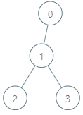
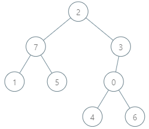

#### 1938. 查询最大基因差

给你一棵 n 个节点的有根树，节点编号从 0 到 n - 1 。每个节点的编号表示这个节点的 独一无二的基因值 （也就是说节点 x 的基因值为 x）。两个基因值的 基因差 是两者的 异或和 。给你整数数组 parents ，其中 parents[i] 是节点 i 的父节点。如果节点 x 是树的 根 ，那么 parents[x] == -1 。

给你查询数组 queries ，其中 queries[i] = [nodei, vali] 。对于查询 i ，请你找到 vali 和 pi 的 最大基因差 ，其中 pi 是节点 nodei 到根之间的任意节点（包含 nodei 和根节点）。更正式的，你想要最大化 vali XOR pi 。

请你返回数组 `ans` ，其中 `ans[i]` 是第 `i` 个查询的答案。

**示例 1：**



```shell
输入：parents = [-1,0,1,1], queries = [[0,2],[3,2],[2,5]]
输出：[2,3,7]
解释：查询数组处理如下：
- [0,2]：最大基因差的对应节点为 0 ，基因差为 2 XOR 0 = 2 。
- [3,2]：最大基因差的对应节点为 1 ，基因差为 2 XOR 1 = 3 。
- [2,5]：最大基因差的对应节点为 2 ，基因差为 5 XOR 2 = 7 。
```

**示例 2：**



```shell
输入：parents = [3,7,-1,2,0,7,0,2], queries = [[4,6],[1,15],[0,5]]
输出：[6,14,7]
解释：查询数组处理如下：
- [4,6]：最大基因差的对应节点为 0 ，基因差为 6 XOR 0 = 6 。
- [1,15]：最大基因差的对应节点为 1 ，基因差为 15 XOR 1 = 14 。
- [0,5]：最大基因差的对应节点为 2 ，基因差为 5 XOR 2 = 7 。
```

**提示：**

* 2 <= parents.length <= 105
* 对于每个 不是 根节点的 i ，有 0 <= parents[i] <= parents.length - 1 。
* parents[root] == -1
* 1 <= queries.length <= 3 * 104
* 0 <= nodei <= parents.length - 1
* 0 <= vali <= 2 * 105

### 题解

**字典树+二叉树**

```java
class Solution {
    public int[] maxGeneticDifference(int[] parents, int[][] queries) {
        // 构造一棵树，维护 父->一堆孩子的关系
        Map<Integer, List<Integer>> tree = new HashMap<>();
        for (int i = 0; i < parents.length; i++) {
            tree.computeIfAbsent(parents[i], t -> new ArrayList<>()).add(i);
        }


        // 构造查询map    node->queryVal -> res   res先写0
        Map<Integer, Map<Integer, Integer>> queryMap = new HashMap();
        for (int i = 0; i < queries.length; i++) {
            queryMap.computeIfAbsent(queries[i][0], t -> new HashMap<>()).put(queries[i][1], 0);
        }

        Trie trie = new Trie();
        // 从root开始dfs
        for (int root : tree.get(-1)) {
            dfs(trie, tree, queryMap, root);
        }


        // 把结果拼出来
        int[] ans = new int[queries.length];
        for (int i = 0; i < queries.length; i++) {
            ans[i] = queryMap.get(queries[i][0]).get(queries[i][1]);
        }
        return ans;
    }

    // dfs 深度优先搜索
    public void dfs(Trie trie, Map<Integer, List<Integer>> tree, Map<Integer, Map<Integer, Integer>> queryMap, int root) {
        trie.insert(root);

        // 做完root对应的查询
        if (queryMap.containsKey(root)) {
            Map<Integer, Integer> map = queryMap.get(root);
            for (int key : map.keySet()) {
                map.put(key, trie.search(key));
            }
        }

        // 下一层
        if (tree.containsKey(root)) {
            for (int node : tree.get(root)) {
                dfs(trie, tree, queryMap, node);
            }
        }

        // 回溯
        trie.delete(root);
    }


    class Trie {
        Trie root;
        Trie[] next;
        public int count = 0;

        public Trie() {
            next = new Trie[2];
            root = this;
        }


        public void insert(int val) {
            root = this;
            for (int i = 30; i >= 0; i--) {
                int index = ((val >> i) & 1);
                if (root.next[index] == null) {
                    root.next[index] = new Trie();
                }
                root = root.next[index];
                root.count++;
            }
        }

        public void delete(int val) {
            root = this;
            for (int i = 30; i >= 0; i--) {
                int index = ((val >> i) & 1);
                if (root.next[index].count == 1) {
                    root.next[index] = null;
                    return;
                } else {
                    root = root.next[index];
                    root.count--;
                }
            }
        }

        public int search(int num) {
            int res = 0;
            root = this;
            for (int i = 30; i >= 0; i--) {
                int index = ((num >> i) & 1);
                index ^= 1;
                if (root.next[index] != null) {
                    res |= (1 << i);
                } else {
                    index ^= 1;
                }
                root = root.next[index];
            }
            return res;
        }
    }
}
```

