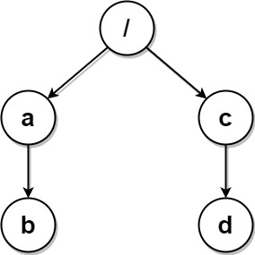
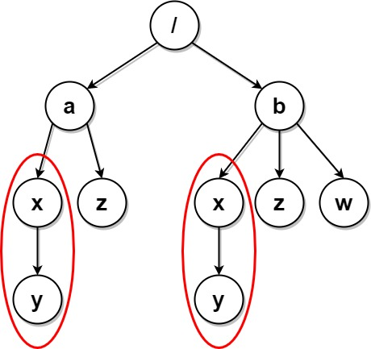

#### 1948. 删除系统中的重复文件夹

由于一个漏洞，文件系统中存在许多重复文件夹。给你一个二维数组 `paths`，其中 `paths[i]` 是一个表示文件系统中第 `i` 个文件夹的绝对路径的数组。

- 例如，`["one", "two", "three"]` 表示路径 `"/one/two/three"` 。

如果两个文件夹（不需要在同一层级）包含 非空且相同的 子文件夹 集合 并具有相同的子文件夹结构，则认为这两个文件夹是相同文件夹。相同文件夹的根层级 不 需要相同。如果存在两个（或两个以上）相同 文件夹，则需要将这些文件夹和所有它们的子文件夹 标记 为待删除。

* 例如，下面文件结构中的文件夹 `"/a"` 和 `"/b"` 相同。它们（以及它们的子文件夹）应该被 **全部** 标记为待删除：
  * `/a`
  * `/a/x`
  * `/a/x/y`
  * `/a/z`
  * `/b`
  * `/b/x`
  * `/b/x/y`
  * `/b/z`
  * /b/z
* 然而，如果文件结构中还包含路径 "/b/w" ，那么文件夹 "/a" 和 "/b" 就不相同。注意，即便添加了新的文件夹 "/b/w" ，仍然认为 "/a/x" 和 "/b/x" 相同。

一旦所有的相同文件夹和它们的子文件夹都被标记为待删除，文件系统将会 删除 所有上述文件夹。文件系统只会执行一次删除操作。执行完这一次删除操作后，不会删除新出现的相同文件夹。

返回二维数组 `ans` ，该数组包含删除所有标记文件夹之后剩余文件夹的路径。路径可以按 **任意顺序** 返回。

**示例 1：**


```shell
输入：paths = [["a"],["c"],["d"],["a","b"],["c","b"],["d","a"]]
输出：[["d"],["d","a"]]
解释：文件结构如上所示。
文件夹 "/a" 和 "/c"（以及它们的子文件夹）都会被标记为待删除，因为它们都包含名为 "b" 的空文件夹。
```

**示例 2：**


```shell
输入：paths = [["a"],["c"],["a","b"],["c","b"],["a","b","x"],["a","b","x","y"],["w"],["w","y"]]
输出：[["c"],["c","b"],["a"],["a","b"]]
解释：文件结构如上所示。
文件夹 "/a/b/x" 和 "/w"（以及它们的子文件夹）都会被标记为待删除，因为它们都包含名为 "y" 的空文件夹。
注意，文件夹 "/a" 和 "/c" 在删除后变为相同文件夹，但这两个文件夹不会被删除，因为删除只会进行一次，且它们没有在删除前被标记。
```

**示例 3：**



```shell
输入：paths = [["a","b"],["c","d"],["c"],["a"]]
输出：[["c"],["c","d"],["a"],["a","b"]]
解释：文件系统中所有文件夹互不相同。
注意，返回的数组可以按不同顺序返回文件夹路径，因为题目对顺序没有要求。
```

**示例 4：**


```shell
输入：paths = [["a"],["a","x"],["a","x","y"],["a","z"],["b"],["b","x"],["b","x","y"],["b","z"]]
输出：[]
解释：文件结构如上所示。
文件夹 "/a/x" 和 "/b/x"（以及它们的子文件夹）都会被标记为待删除，因为它们都包含名为 "y" 的空文件夹。
文件夹 "/a" 和 "/b"（以及它们的子文件夹）都会被标记为待删除，因为它们都包含一个名为 "z" 的空文件夹以及上面提到的文件夹 "x" 。
```

**示例 5：**



```shell
输入：paths = [["a"],["a","x"],["a","x","y"],["a","z"],["b"],["b","x"],["b","x","y"],["b","z"],["b","w"]]
输出：[["b"],["b","w"],["b","z"],["a"],["a","z"]]
解释：本例与上例的结构基本相同，除了新增 "/b/w" 文件夹。
文件夹 "/a/x" 和 "/b/x" 仍然会被标记，但 "/a" 和 "/b" 不再被标记，因为 "/b" 中有名为 "w" 的空文件夹而 "/a" 没有。
注意，"/a/z" 和 "/b/z" 不会被标记，因为相同子文件夹的集合必须是非空集合，但这两个文件夹都是空的。
```

**提示：**

* `1 <= paths.length <= 2 * 104`
* `1 <= paths[i].length <= 500`
* `1 <= paths[i][j].length <= 10`
* `1 <= sum(paths[i][j].length) <= 2 * 105`
* `path[i][j] 由小写英文字母组成`
* `不会存在两个路径都指向同一个文件夹的情况`
* `对于不在根层级的任意文件夹，其父文件夹也会包含在输入中`

### 题解

**前缀树**

```java
class Solution {
    public List<List<String>> deleteDuplicateFolder(List<List<String>> paths) {
        TrieNode root = new TrieNode();
        for (List<String> path : paths) {
            root.insert(path);
        }
        delete(root, new HashMap<>());
        List<List<String>> ans = new ArrayList<>();
        dfs(root, new ArrayList<>(), ans);
        return ans;
    }

    String delete(TrieNode root, Map<String, TrieNode> map) {
        if (root.children.isEmpty()) return "";
        StringBuilder sb = new StringBuilder();
        for (Map.Entry<String, TrieNode> e : root.children.entrySet()) {
            String folder = e.getKey();
            TrieNode child = e.getValue();
            String serialization = delete(child, map);
            sb.append('(').append(folder).append(serialization).append(')');
        }
        String serialized = sb.toString();
        if (map.containsKey(serialized)) {// 已经存在此序列化值，两者都删除
            map.get(serialized).deleted = true;
            root.deleted = true;
        } else {
            map.put(serialized, root);
        }
        return serialized;
    }

    void dfs(TrieNode root, List<String> path, List<List<String>> ans) {
        for (Map.Entry<String, TrieNode> e : root.children.entrySet()) {
            String folder = e.getKey();
            TrieNode child = e.getValue();
            if (child.deleted) {
                continue;
            }
            path.add(folder);
            dfs(child, path, ans);
            path.remove(path.size() - 1);
        }
        if (!path.isEmpty()) {
            ans.add(new ArrayList<>(path));
        }
    }

    class TrieNode {
        Map<String, TrieNode> children;
        boolean deleted;

        /**
         * Initialize your data structure here.
         */
        public TrieNode() {
            // 这里不能用HashMap 问题出在顺序上，比如 a 有两个子结点 d和t, 然后b有两个子结点 t 和 d. 按道理a和b都应该被删除，但是我输出时发现一个是(d)(t), 一个是(t)(d), 导致无法匹配没有标记删除。
            children = new TreeMap<>();
            deleted = false;
        }

        /**
         * Inserts a path into the trie.
         */
        public void insert(List<String> path) {
            TrieNode cur = this;
            for (String folder : path) {
                if (!cur.children.containsKey(folder)) {
                    cur.children.put(folder, new TrieNode());
                }

                cur = cur.children.get(folder);
            }
        }
    }

}
```

