## 并查集的概念

在计算机科学中，**并查集** 是一种树形的数据结构，用于处理**不交集**的合并(union)及查询(find)问题。

**并查集** 可用于查询 **网络** 中两个节点的状态， 这里的网络是一个抽象的概念， 不仅仅指互联网中的网络， 也可以是人际关系的网络、交通网络等。

**并查集** 除了可以用于查询 **网络** 中两个节点的状态， 还可以用于数学中集合相关的操作， 如求两个集合的并集等。

**并查集** 对于查询两个节点的 **连接状态** 非常高效。对于两个节点是否相连，也可以通过求解 **查询路径** 来解决， 也就是说如果两个点的连接路径都求出来了，自然也就知道两个点是否相连了，但是如果仅仅想知道两个点是否相连，使用 **路径问题** 来处理效率会低一些，**并查集** 就是一个很好的选择。

## 并查集的操作

1. Find：确定元素属于哪一个子集。它可以被用来确定两个元素是否属于同一子集。
2. Union：将两个子集合并成同一个集合。

## 并查集的实现和优化

### Quick Find方式实现的并查集

**Quick Find** 顾名思义就是并查集查询操作快，合并比较慢。

我们通过一个数组来实现一个并查集，数组索引作为数据编号：

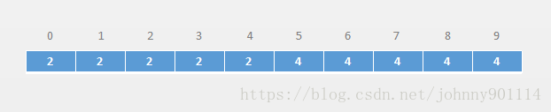

从上面的图可以知道：**0、1、2、3、4** 属于一个集合，**5、6、7、8、9**属于一个集合。

4 和 5 两个元素就不属于同一个集合(或者不相连)，因为他们对应的编号不一样。4 对应的编号是 2 ，5对应的编号是 4

如果要合并两个集合(**union(1,5)**)，因为 **1** 和 **5** 是属于两个不同的集合
合并后，以前分别和元素 **1** 连接的元素；和 **5** 连接的元素，也都连接起来了：

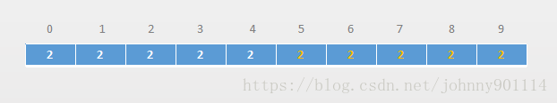

根据上面的描述得知，基于上面实现方案的并查集，查询操作的时间复杂度为 **O(1)**，合并操作的时间复杂度为 **O(n)**

代码如下所示：

```java
public class UnionFind1 implements UF {

    private int[] array;

    public UnionFind1(int size) {
        array = new int[size];
        for (int i = 0; i < array.length; i++) {
            array[i] = i;
        }
    }

    @Override
    public int size() {
        return array.length;
    }

    private int find(int p) {
        return array[p];
    }

    @Override
    public boolean isConnected(int p, int q) {
        return find(p) == find(q);
    }

    @Override
    public void unionElements(int p, int q) {
        int pID = find(p);
        int qID = find(q);
        //如果本身就是相连的
        if (qID == pID) {
            return;
        }
        for (int i = 0; i < array.length; i++) {
            if (array[i] == pID) {
                array[i] = qID;
            }
        }
    }
}
```

### Quick Union 实现的并查集

从上面的实现的并查集我们知道，查询的时间复杂度为 **O(1)** ，合并的时间复杂度为 **O(n)**，如果数据量一大 **O(n)** 复杂度就显得很慢了。 下面我们就来优化下上面实现的并查集。

通过树形结构来描述节点之间的关系，底层存储通过数组来存储。

以前我们介绍到树都是父节点指向子节点的，这里我们是通过子节点来指向父节点，根节点指向它自己。

数组索引用来表示元素编号，存储的是元素编号对应的父节点编号。如下图所示：

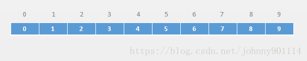

从上图可以看出，每个节点的父节点编号都是它自己，说明每个节点都是一个根节点，那么这个数组就表示一个森林：


例如：合并 **1**、**2**， 合并**3** 和 **4**，就变成：

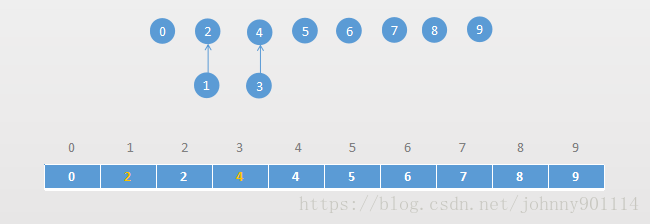

合并 **1**、**3** ，找到 **1** 和 **3** 的对应的根节点，然后让 **1** 的根节点指向 **3** 的根节点：

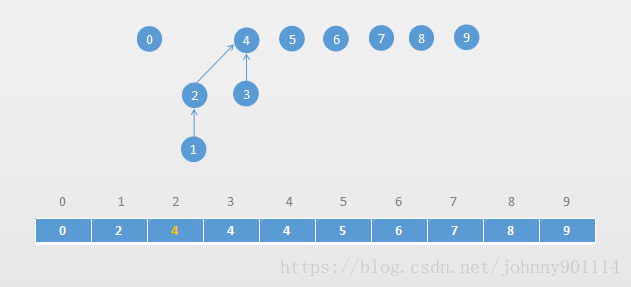

从上面的分析，合并和查找操作的时间复杂度为 **O(h)**，**h**就是树的高度。
相对 **Quick Find** 实现的并查集 **Quick Union** 实现的并查集牺牲了一点查找的性能，提高了合并的性能。

代码如下：

```java
public class UnionFind2 implements UF {

    private int[] parents;

    public UnionFind2(int size) {
        parents = new int[size];
        for (int i = 0; i < parents.length; i++) {
            parents[i] = i;
        }
    }

    @Override
    public int size() {
        return parents.length;
    }

    @Override
    public boolean isConnected(int p, int q) {
        return find(p) == find(q);
    }

    /**
     * 查询某个节点的根节点
     * 时间复杂度为O(h)
     *
     * @param p
     * @return
     */
    private int find(int p) {
        while (p != parents[p]) {
            p = parents[p];
        }
        return p;
    }

    /**
     * 合并操作
     * @param p
     * @param q
     */
    public void unionElements(int p, int q) {
        int pRoot = find(p);
        int qRoot = find(q);
        if (pRoot == qRoot)  {
            return;
        }
        parents[pRoot] = qRoot;
    }

}
```

上面两个实现并查集的性能对比：

测试方法：

```java
private static double test(UF uf, int m) {

    long startTime = System.nanoTime();
    Random random = new Random();
    for (int i = 0; i < m; i++) {
        int p = random.nextInt(uf.size());
        int q = random.nextInt(uf.size());
        uf.unionElements(p, q);
    }

    for (int i = 0; i < m; i++) {
        int p = random.nextInt(uf.size());
        int q = random.nextInt(uf.size());
        uf.isConnected(p, q);
    }
    long endTime = System.nanoTime();
    return (endTime - startTime) / 1000000000.0;
}

int size = 100000; 元素个数
int p = 10000; //操作次数
double countTime1 = test(new UnionFind1(size), p);
double countTime2 = test(new UnionFind2(size), p);
```

输出结果：

```java
UnionFind1 = 7.639128918
UnionFind2 = 12.913540497
```

发现 Quick Union 版本的并查集比 Quick Find 版本的并查集慢很多。
这是因为对于Quick Find 的并查集查询的操作时间复杂度为 O(1)，Quick Union的合并和查询都是O(h)，并且生成的树深度可能很深。

下面就对 Quick Union 版本的并查集进行优化。

### 基于size的优化

上面Quick Union版本的并查集基于树形结构实现的，但是没有对树的高度进行任何优化和限制。

所以导致在上面的性能比对中 Quick Union 的并查集性能很差。

我们来看下 Quick Union 版本的并查集是怎么导致树的高度变得很高的

假设我们经过了这样的几次 **union** 操作：

**union(0,1)**

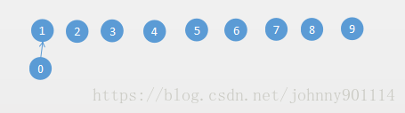

**union(0,2)**

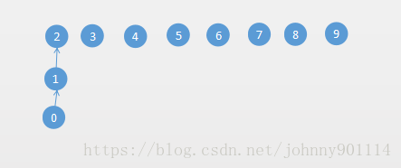

**union(0,3)**

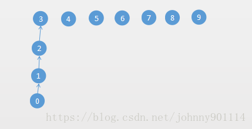

那么基于size优化的思路就是：节点个数少的往节点个数多的树去合并。

例如执行上面的 **union(0,2)**：

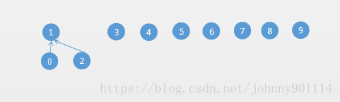

代码实现如下：

```java
public class UnionFind3 implements UF {

    private int[] parents;
    private int[] sz;//记录每棵树的节点个数

    public UnionFind3(int size) {
        parents = new int[size];
        sz = new int[size];
        for (int i = 0; i < parents.length; i++) {
            parents[i] = i;
            sz[i] = 1;//每个根节点的一开始都只有一个节点
        }
    }

    @Override
    public int size() {
        return parents.length;
    }

    @Override
    public boolean isConnected(int p, int q) {
        return find(p) == find(q);
    }

    /**
     * 查询某个节点的根节点
     * 时间复杂度为O(h)
     *
     * @param p
     * @return
     */
    private int find(int p) {
        while (p != parents[p]) {
            p = parents[p];
        }
        return p;
    }

    public void unionElements(int p, int q) {
        int pRoot = find(p);
        int qRoot = find(q);
        if (pRoot == qRoot) {
            return;
        }
        //根据根节点的子节点个数来判断合并方向
        if (sz[pRoot] < sz[qRoot]) {
            parents[pRoot] = qRoot;
            sz[qRoot] += sz[pRoot];
        } else {
            parents[qRoot] = pRoot;
            sz[pRoot] += sz[qRoot];
        }

    }

}
```

现在来对比下上面三个版本的并查集性能：

```java
//十万级别
int size = 100000;
int p = 100000; 
UnionFind1 = 7.707820549
UnionFind2 = 12.475811439
UnionFind3 = 0.036647197    //基于size的优化
```

通过上面的优化，性能得到了极大的改善。基于size的并查集优化方案，主要是降低每棵树的高度。

### 基于rank优化

上面基于size的优化方案，是节点数少的树往节点数多的树合并。

但是节点数多不代表树的高度高，比如按照size的优化方案，执行 Union(2, 5)，元素 **2** 所在的树总节点数有4个，但只有2层；元素 **5** 所在的树有3个节点，有3层。

合并如下过程：

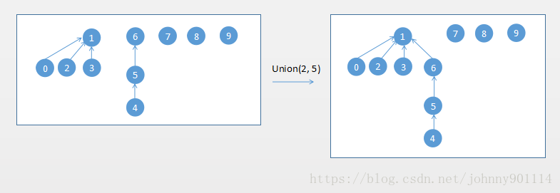

这个时候可以使用rank来优化，rank代表数的高度或深度。高度低的树向高度高的树合并。

使用rank的优化方案，执行 Union(2, 5)，如下的合并过程：

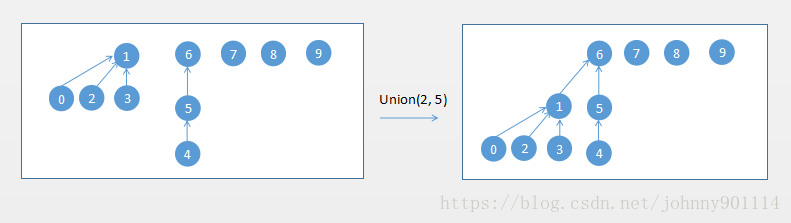

实现代码如下：

```java
public class UnionFind4 implements UF {

    private int[] parents;
    //rank[i]表示i为根的集合所表示的树的层数
    private int[] rank;

    public UnionFind4(int size) {
        parents = new int[size];
        rank = new int[size];
        for (int i = 0; i < parents.length; i++) {
            parents[i] = i;
            //每个根节点所在的树一开始都只有一个层
            rank[i] = 1;
        }
    }

    @Override
    public int size() {
        return parents.length;
    }

    @Override
    public boolean isConnected(int p, int q) {
        return find(p) == find(q);
    }

    /**
     * 查询某个节点的根节点
     * 时间复杂度为O(h)
     *
     * @param p
     * @return
     */
    private int find(int p) {
        while (p != parents[p]) {
            p = parents[p];
        }
        return p;
    }

    public void unionElements(int p, int q) {
        int pRoot = find(p);
        int qRoot = find(q);
        if (pRoot == qRoot) {
            return;
        }
        //根据根节点所在树的层级来判断合并方向
        //层级矮的树往层级高的树合并不需要维护rank
        if (rank[pRoot] < rank[qRoot]) {
            parents[pRoot] = qRoot;
        } else if (rank[pRoot] > rank[qRoot]) {
            parents[qRoot] = pRoot;
        } else {//只有rank相等的情况才需要维护rank
            parents[pRoot] = qRoot;
            rank[qRoot] += 1;
        }
    }

}
```

在我机器上的性能对比：

```java
//十万级别
int size = 100000;
int p = 100000;
UnionFind1 = 7.439281844  //quick find
UnionFind2 = 12.273788926 //quick union
UnionFind3 = 0.024156916  //基于size的优化
UnionFind4 = 0.02013447   //基于rank的优化

//千万级别
int size = 10000000;
int p = 10000000;
//数据量太大，不测试UnionFind1和UnionFind2
UnionFind3 = 5.023308892   //基于size的优化
UnionFind4 = 4.741167168   //基于rank的优化
```

### 路径压缩优化

路径压缩基于rank的基础上来做优化的。优化时机是在执行 **find操作** 的时候对其进行路径压缩。

```java
private int find(int p) {
    while (p != parents[p]) {
        parents[p] = parents[parents[p]];
        p = parents[p];
    }
    return p;
}
```

路径压缩的流程如下：

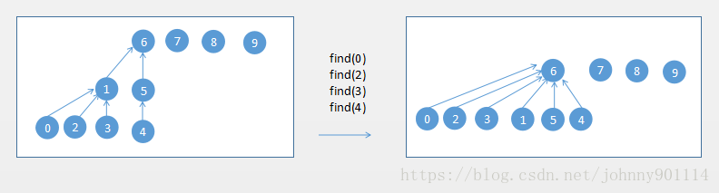

在我机器上的性能对比如下：

```java
//千万级别
int size = 10000000;
int p = 10000000;
UnionFind3 = 5.16725354   //基于size的优化
UnionFind4 = 5.148308358  //基于rank的优化
UnionFind5 = 4.526459366  //基于路径压缩的优化
```

> 至此，我们从一开始的 Quick Find 到 Quick Union优化，然后从 Quick Union 到基于 size 的优化，然后从基于size优化到基于rank优化，到最后的路径压缩优化，整个并查集的实现和优化就介绍完毕。

## 并查集的时间复杂度

在我们使用 Quick Union 版本的并查集使用树形结构来组织节点的关系。

那么性能跟树的深度有关系，简称 O(h)，以前介绍二分搜索树的时候，时间复杂度也是为 O(h)。

但是并查集并不是一个二叉树，而是一个多叉树，所以并查集的查询和合并时间复杂度并不是O(log n)

在加上rank和路径压缩优化后 ，并查集的时间复杂度为 O(log* n)
log* n的数学定义：


**log\* n** 叫做 [Iterated logarithm](https://en.wikipedia.org/wiki/Iterated_logarithm)，下面是 **n** 和 **log\* n** 之间的关系：

| n                | lg* n |
| ---------------- | ----- |
| (−∞, 1]          | 0     |
| (1, 2]           | 1     |
| (2, 4]           | 2     |
| (4, 16]          | 3     |
| (16, 65536]      | 4     |
| (65536, 2^65536] | 5     |

> O(log n) 的时间复杂度已经很快了，O(log* n) 是比O(log n) 还要快，近似等于O(1)，比O(1)慢一点。