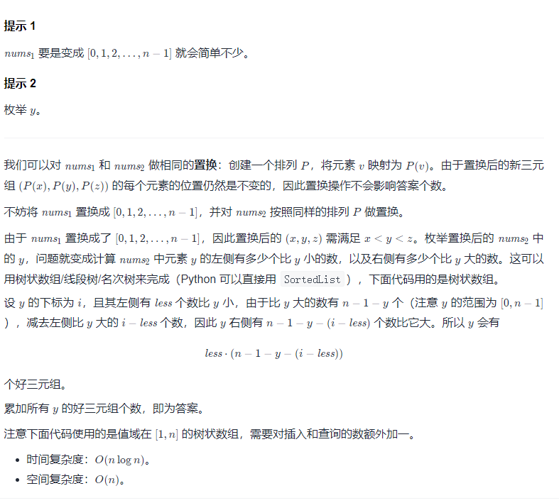

#### 5999. 统计数组中好三元组数目

给你两个下标从 **0** 开始且长度为 `n` 的整数数组 `nums1` 和 `nums2` ，两者都是 `[0, 1, ..., n - 1]` 的 **排列** 。

好三元组 指的是 3 个 互不相同 的值，且它们在数组 nums1 和 nums2 中出现顺序保持一致。换句话说，如果我们将 pos1v 记为值 v 在 nums1 中出现的位置，pos2v 为值 v 在 nums2 中的位置，那么一个好三元组定义为 0 <= x, y, z <= n - 1 ，且 pos1x < pos1y < pos1z 和 pos2x < pos2y < pos2z 都成立的 (x, y, z) 。

请你返回好三元组的 **总数目** 。

**示例 1：**

```shell
输入：nums1 = [2,0,1,3], nums2 = [0,1,2,3]
输出：1
解释：
总共有 4 个三元组 (x,y,z) 满足 pos1x < pos1y < pos1z ，分别是 (2,0,1) ，(2,0,3) ，(2,1,3) 和 (0,1,3) 。
这些三元组中，只有 (0,1,3) 满足 pos2x < pos2y < pos2z 。所以只有 1 个好三元组。
```

**示例 2：**

```shell
输入：nums1 = [4,0,1,3,2], nums2 = [4,1,0,2,3]
输出：4
解释：总共有 4 个好三元组 (4,0,3) ，(4,0,2) ，(4,1,3) 和 (4,1,2) 。
```

**提示：**

* n == nums1.length == nums2.length
* 3 <= n <= 105
* 0 <= nums1[i], nums2[i] <= n - 1
* nums1 和 nums2 是 [0, 1, ..., n - 1] 的排列。

### 题解

**树状数组**



```java
class Solution {
        public long goodTriplets(int[] nums1, int[] nums2) {
            int n = nums1.length;

            int[] p = new int[n];
            for (int i = 0; i < n; i++) {
                p[nums1[i]] = i;
            }

            int[] nums3 = new int[n];
            for (int i = 0; i < n; i++) {
                nums3[i] = p[nums2[i]];
            }

            FenwickTree fenwickTree = new FenwickTree(n);

            int[] left = new int[n];
            for (int i = 0; i < n; i++) {
                int rank = nums3[i] + 1;
                fenwickTree.update(rank, 1);
                left[i] = fenwickTree.query(rank - 1);
            }

            fenwickTree = new FenwickTree(n);
            int[] right = new int[n];
            for (int i = n - 1; i >= 0; i--) {
                int rank = nums3[i] + 1;
                fenwickTree.update(rank, 1);
                right[i] = (n - 1 - i) - fenwickTree.query(rank - 1);
            }

            long ans = 0;
            for (int i = 0; i < n; i++) {
                ans = ans + (long) left[i] * (long) right[i];
            }
            return ans;
        }


        private class FenwickTree {
            private int[] tree;
            private int len;

            public FenwickTree(int n) {
                this.len = n;
                tree = new int[n + 1];
            }

            // 单点更新：将 i 这个位置 + 1
            public void update(int i, int delta) {
                // 从下到上，最多到 size，可以等于 size
                while (i <= this.len) {
                    tree[i] += delta;
                    i += lowbit(i);
                }
            }


            // 区间查询：查询小于等于 i 的元素个数
            // 查询的语义是"前缀和"
            public int query(int i) {
                // 从右到左查询
                int sum = 0;
                while (i > 0) {
                    sum += tree[i];
                    i -= lowbit(i);
                }
                return sum;
            }

            public int lowbit(int x) {
                return x & (-x);
            }
        }
    }
```

