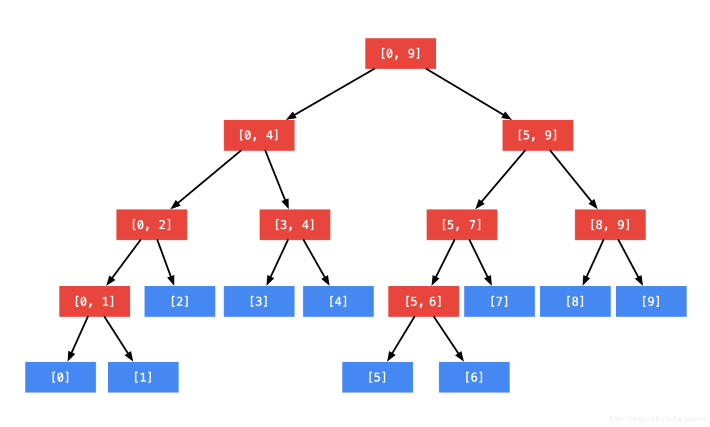
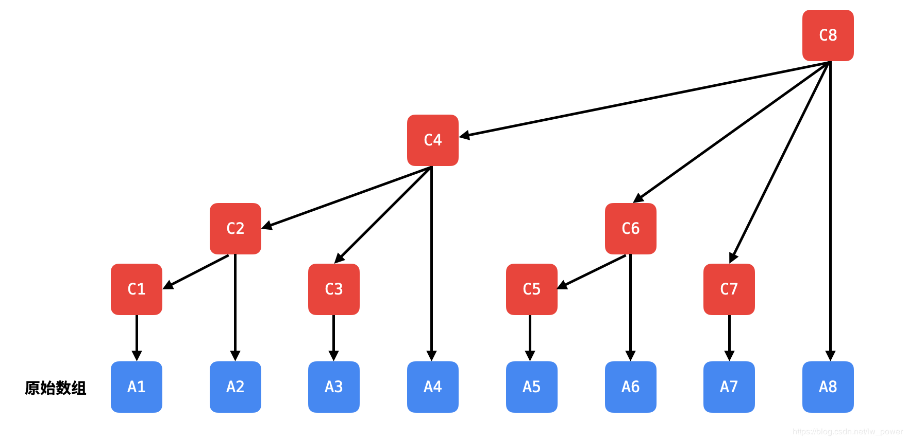
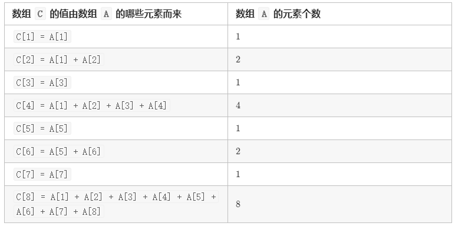
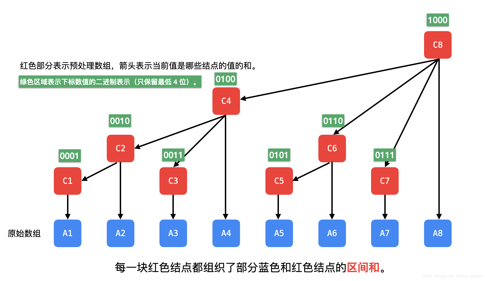
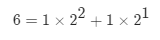
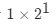
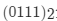
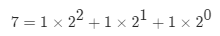
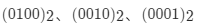

# 「树状数组」知识入门

## 预备知识：前缀和数组

- 知道前缀和就可以求区间和，这是因为不同规模的区间和有重复的部分，相减以后就得到了区间和。


如图所示：**红色部分的和 = 绿色部分的和 - 黄色部分的和**。

* 可以定义：前缀和 preSum[i] 表示 nums[0, i] 的和，则区间和 sumRange[from, to] = preSum[to] - preSum[from - 1]；
* 注意到 preSum[from - 1] 有下标越界的风险，通常的做法是：让前缀和数组多设置一位，为此修改定义：preSum[i] 表示 nums[0, i) 的和，初始化的时候 preSum[0] = 0，则： sumRange[from, to] = preSum[to + 1] - preSum[from]。
* 预先计算出「前缀和」使得计算「区间和」的时间复杂度成为O(1)。

相关的练习题有：

- 「力扣」第 303 题：区域和检索 - 数组不可变；

- 「力扣」第 307 题：区域和检索 - 数组可修改（用前缀和做会超时）。

做「力扣」第 307 题的时候会发现，如果有修改的需求，单独修改一个值，最坏情况下需要修改整个前缀和数组的值，时间复杂度是 O(N)，这里 N 是输入数组的长度。

「前缀和」数组的思路是：将原始数组进行预处理，将来需要查询数据的时候，只需要查询预处理数组的某些值即可。

要优化「修改操作」造成的线性时间复杂度，**预处理数据组织成线性结构肯定是不行的**，因此一种方案是把预处理的数据组织成「树形结构」，有两种数据结构：

- 线段树：高效处理「区间和」查询（不仅仅可以处理和、还可以处理区间最值等），单点修改；
- 树状数组：高效处理「前缀和」查询，单点修改。

说明：

* 事实上，「区间修改」也是支持的，但涉及的知识比较复杂，感兴趣的朋友可以自行查阅相关资料进行学习；
* 「线段树」能做的事情的范围大于「树状数组」能做的事情，「树状数组」做的事情更少、更专一，代码层面相对较简单。

「线段树」和「树状数组」一样，都是对原始输入数组进行了预处理，使得在真正需要查询数据的时候，我们只需要看「预处理数组」的部分信息即可，由于组织成树形结构，「修改」和「查询」的时间复杂度都是O(logN)。

思想：空间换时间。

注意：「线段树」和「树状数组」**不能处理输入数组的长度有增加或者减少**的情况。

- 线段树是一棵二叉树

红色部分表示预处理数组，蓝色部分是原始输入数组，箭头表示当前值是哪些结点的值的和。



- 树状数组是多叉树

红色部分表示预处理数组，蓝色部分是原始输入数组，箭头表示当前值是哪些结点的值的和。



## 「树状数组」如何组织原始输入数据的结构

注意：和「堆」一样，树状数组的 0 号下标不放置元素，从 1 号下标开始使用。从上图可以观察到，与数组 C 的某个结点有关的数组 A 的某些结点，它们的下标之间有如下关系。



这件事情是由下标数值的二进制决定的，把下标写成二进制的形式，最低位的 1 以及后面的 0 表示了预处理数组 C 管理了多少输入数组 A 的元素。我们看一下下面的图：



例如：6 的二进制表示为 01100110，这里只保留最低 4 位。将 6 进行二级制分解得到：



最后的这部分决定了 C[6] 管理了多少个输入数组 A 的数据，这里是 2 个，即从下标 6 开始（包括 6）向前数 2 个数，因此 C[6] = A[5] +A[6]，其它同理。

这就是开头所说的：「树状数组」里某个元素管理了原始输入数组多少数据是由下标决定的。

我们看到：

- 「树状数组」组织成的树是有层级的，**下标的二进制表示的最低位 1 后面的 0 的个数决定了，当前结点在第几层**；
- 这样组织数据，从叶子结点到父结点是可以通过一个叫做 lowbit 的函数计算出来，并且可以知道小于等于当前下标的同一层结点的所有结点，为了说清楚这一点，需要有一定的篇幅。

## lowbit 函数

这样命名的含义是截取一个正整数的二进制表示里的最低位的 1 和它后面的所有的 0。`lowbit` 的定义如下：

lowbit(x) = x & (-x);

说明：

- 这里 `x` 一定是正整数，即 `x >= 1`；

- 这里 `&` 表示按位与运算；
- -x 也可以写成 (~x + 1) ，这里 ~ 表示「按位取反」。这是负数的定义，负数用补码表示，它的值等于这个负数的绝对值按位取反以后再加 1，因此 lowbit(x) = x & (~x + 1);。

## 「单点更新」与「前缀和查询」

### 单点更新

- 「单点更新」从孩子结点到父亲结点，沿途所有的结点都需要更新；

- **从孩子结点到父亲结点，就是不断加上当前下标的 `lowbit` 值，产生进位**。

```java
/**
 * 单点更新
 *
 * @param i     原始数组索引 i
 * @param delta 变化值 = 更新以后的值 - 原始值
 */
public void update(int i, int delta) {
    // 从下到上更新，注意，预处理数组，比原始数组的 len 大 1，故 预处理索引的最大值为 len
    while (i <= len) {
        tree[i] += delta;
        i += lowbit(i);
    }
}

public static int lowbit(int x) {
    return x & (-x);
}
```

### 前缀和查询

我们使用记号 `preSum[7]` 表示查询 `A[1] + A[2] + ... + A[7]`。依然是考虑 7 的二进制分解：



这三部分可以看成  这 3 部分之和，分别表示 4 个元素 + 2 个元素 + 1 个元素，正好是 lowbit 值一直减，减到 0 为止，每减去一个 lowbit 值，消去一个 1。

```java
/**
 * 查询前缀和
 *
 * @param i 前缀的最大索引，即查询区间 [0, i] 的所有元素之和
 */
public int query(int i) {
    // 从右到左查询
    int sum = 0;
    while (i > 0) {
        sum += tree[i];
        i -= lowbit(i);
    }
    return sum;
}
```

### 树状数组的初始化

这里要说明的是，初始化前缀和数组应该交给调用者来决定。下面是一种初始化的方式。树状数组的初始化可以通过「单点更新」来实现，因为最开始的时候，数组的每个元素的值都为 0，每个都对应地加上原始数组的值，就完成了预处理数组 C 的创建。

这里要特别注意，`update` 操作的第 2 个参数是一个变化值，而不是变化以后的值。因为我们的操作是逐层向上汇报，汇报变更值会让我们的操作更加简单。

```java
public FenwickTree(int[] nums) {
    this.len = nums.length + 1;
    tree = new int[this.len + 1];
    for (int i = 1; i <= len; i++) {
        update(i, nums[i]);
    }
}
```

**「树状数组」的完整代码**：

```java
public class FenwickTree {

    /**
     * 预处理数组
     */
    private int[] tree;
    private int len;

    public FenwickTree(int n) {
        this.len = n;
        tree = new int[n + 1];
    }

    /**
     * 单点更新
     *
     * @param i     原始数组索引 i
     * @param delta 变化值 = 更新以后的值 - 原始值
     */
    public void update(int i, int delta) {
        // 从下到上更新，注意，预处理数组，比原始数组的 len 大 1，故 预处理索引的最大值为 len
        while (i <= len) {
            tree[i] += delta;
            i += lowbit(i);
        }
    }

    /**
     * 查询前缀和
     *
     * @param i 前缀的最大索引，即查询区间 [0, i] 的所有元素之和
     */
    public int query(int i) {
        // 从右到左查询
        int sum = 0;
        while (i > 0) {
            sum += tree[i];
            i -= lowbit(i);
        }
        return sum;
    }

    public  int lowbit(int x) {
        return x & (-x);
    }
}
```

