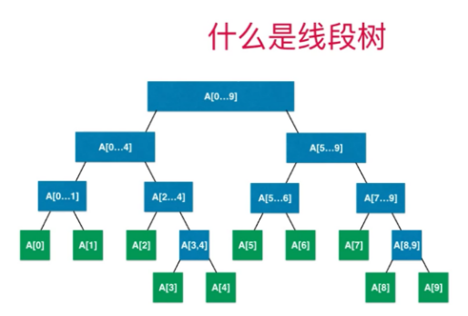
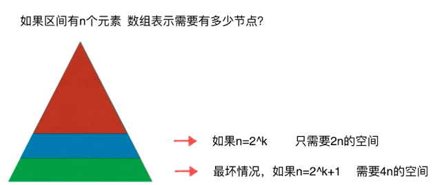

# 线段树(区间树)

### 为什么要使用线段树？

最经典的线段树问题：区间染色

​	有一面墙 ，长度为n，每次选择一段儿墙进行染色，m次操作后，我们可以看见多少种颜色？//孩子节点的索引


​		例如上图，我们第一次将[1,8]的位置染成蓝色，然后再将[5,9]的位置染成黄色，然后将[6,15]的位置染成红色，最后把[12,15]的颜色染成绿色，我们通过这几次操作可以发现，图中被重复染色的位置是会被覆盖的，比如[12,15]这个位置显示被染成红色，然后又被染成了绿色，但最后呈现的是绿色。我们也可以把“m次操作后，我们可以看见多少种颜色”这个问题，转化为“m次操作后，我们可以在[i, j]区间内看见多少种颜色”问题。对于这个问题我们可以使用数组来解决，但我们会发现，在使用数组实现的时候，不管是染色操作（更新区间），还是查询操作（查询区间），都需要对数组进行遍历，这样使用数组实现区间染色问题的时间复杂度就是O(n)。但这个时间复杂度的程序执行起来，数据量如果大了，执行效率是很低的。所以有了线段树这样的数据结构。

另一类经典问题：区间查询


查询一个区间[i, j]的最大值，最小值，或者区间数字和

实质上是一个基于区间的统计查询，例如在一个学习网站：用户想要知道2019年注册用户种消费最高的用户？消费最少的用户？学习时长最长的用户？

当我们使用线段树来处理这类问题时，时间复杂度为O(logn)，其执行效率就要比数组实现快很多。

### 什么是线段树？

​		一棵二叉树的每个节点是存储的一个区间或者说是一个线段相应的信息，这里说的相应的信息不是指把这个区间内的元素都存进去，我们以求和为例，每一个节点相应存储的是这个节点所对应区间的数字的和。


线段树一定是满二叉树吗？不一定，这里是因为8恰好是2的三次方，刚好可以构成一颗满二叉树。

根节点代表整个线段，左孩子代表根节点线段的前半段，右孩子就是根节点线段的后半段。直到到了叶子节点，叶子节点只表示一个元素。如果现在数组中有十个元素，相应的线段树就不是满二叉树了，如下：



注意：线段树不是完全二叉树，但线段树是平衡二叉树，当然堆也是平衡二叉树。

关于平衡二叉树和完全二叉树的概念，由于堆是完全二叉树，所以我在[堆和优先队列](https://www.cnblogs.com/reminis/p/12633099.html)中就详细介绍了，有兴趣的小伙伴可以看一下。

​		什么是完全二叉树呢？完全二叉树就是把元素按照树的形状一层一层的放，直到放完为止，即把元素顺序排成树的形状。堆也是一棵平衡二叉树，因为完全二叉树一定是平衡二叉树，什么是平衡二叉树？即对于整棵树来说，最大深度和最小深度的差值不能大于1，因此平衡二叉树一定不会退化成链表。满二叉树是特殊的完全二叉树。

​		线段树虽然是平衡二叉树，不是完全二叉树，但是线段树任然可以使用数组来表示，如果区间有n个元素，用数组表示需要有多少个节点呢？对于满二叉树来说，0层有一个节点，1层有两个节点，2层有四个节点，3层有8个节点，则在h层一共有2h个节点(大约是2h个)，最后一层(h-1层)，有2(h-1)个节点，即满二叉树最后一层的节点数大致等于前面所有层节点之和。



 	为什么最坏情况是如果n=2k+1，需要4n的空间呢？因为如果n=2k，就是刚好可以构成一课满二叉树，这时只需要2n的区间就好了，这是最好的情况，数组中每个空间都被使用，最坏的情况就是在满二叉树的情况下多出一个节点，由于我们数组是存储的相当于满二叉树的节点个数，所以需要数组2n+2n=4n的空间，但实际上这2n的空间中只有一个节点是有效数据，其他2n-1的空间都是浪费掉的。

​		所以为了考虑到最坏的情况，如果区间有n个元素，数组表示需要4n的空间，由于我们的线段树不考虑添加元素，即区间固定，使用4n的静态空间就可以了。

### 创建一棵线段树

代码实现如下：

```java
public class SegmentTree<E> {

    private E[] data;

    private E[] tree;

    //构造函数 -- 通过用户传递的数组构建一棵线段树
    public SegmentTree(E[] arr){
        this.data = (E[])new Object[arr.length];
        for (int i=0; i<arr.length; i++){
            data[i] = arr[i];
        }
        //创建一个空间为4n的静态数组
        tree = (E[])new Object[arr.length*4];
    }

    //获取线段树中实际元素的个数
    public int getSize(){
        return data.length;
    }

    //查找元素
    public E  get(int index){
        if (index < 0 || index >= data.length ){
            throw new IllegalArgumentException("Index is Illegal");
        }
        return data[index];
    }

}
```

​		虽然线段树不是完全二叉树，但由于线段树是平衡二叉树，所以我们在处理时，是将线段树作为满二叉树在进行处理，满二叉树又是特殊的完全二叉树，所以线段树也可以使用数组来表示，线段树使用数组表示时，其索引与节点的关系如下：

```java
    //左孩子节点的索引
    public int leftChild(int index){
        return index*2 + 1;
    }

    //右孩子节点的索引
    public int rightChild(int index){
        return index*2 + 2;
    }
```

由于我们线段树中节点存储的不是元素，而是存储的这个区间以某种方法合并后的值，比如是存储的这个区间中元素的最大值，最小值，或者是这个区间中的元素之和等。所以我们需要在创建线段树的构造函数中，添加一个合并方法，让用户在使用时去确定是以何种方式合并这个区间中的元素的，如下：
先创建一个合并方法的接口:

```java
public interface Merger<E> {    
    E merge(E a, E b);   
}
```

下面让我们来看看如何构建一颗线段树吧：


```java
   private Merger<E> merger;

    public SegmentTree(E[] arr, Merger<E> merger){
        //合并的方法
        this.merger = merger;
        this.data = (E[])new Object[arr.length];
        for (int i=0; i<arr.length; i++){
            data[i] = arr[i];
        }
        //创建一个空间为4n的静态数组
        tree = (E[])new Object[arr.length*4];
        //递归构建一颗线段树
        buildSegmentTree(0,0,arr.length-1);
    }

    // 在treeIndex的位置创建表示区间[l...r]的线段树
    private void buildSegmentTree(int treeIndex, int l, int r) {
        //递归终止条件，即到了叶子节点
        if (l == r){
            tree[treeIndex] = data[l];
            return;
        }
        //获取当前节点的左孩子索引
        int leftTreeIndex = leftChild(treeIndex);
        //获取当前节点的右孩子索引
        int rightTreeIndex = rightChild(treeIndex);

        //int mid = (l + r) / 2 该方式可能会导致整型溢出
        int mid = l + (r-l)/2;
        //递归构建左子树
        buildSegmentTree(leftTreeIndex,l,mid);
        //递归构建右子树
        buildSegmentTree(rightTreeIndex,mid+1,r);
        //合并左子树和右子树所代表的区间
        tree[treeIndex] = merger.merge(tree[leftTreeIndex],tree[rightTreeIndex]);
    }
```

​		现在就让我们来测试一下我们自己写的线段树是否正确吧，为了更直观的看输出结果，我们重写一下SegmentTree的toString()方法：

```java
  @Override
    public String toString() {
        StringBuilder res = new StringBuilder();
        res.append("[");
        for (int i=0; i<tree.length; i++){
            if (tree[i] == null){
                res.append("null");
            }else {
                res.append(tree[i]);
            }
            
            if (i != tree.length-1){
                res.append(",");
            }
        }
        res.append("]");
        return res.toString();
    }
```

这里以求和为例进行测试：在测试中为了代码的简洁性我使用的是Lambda表达式，若你不了解Lambda表达式的使用，你也可以使用匿名内部类进行测试

```java
  public static void main(String[] args) {
        Integer[] nums = {-2, 0, 3, -5, 2, -1};
        SegmentTree<Integer> segTree = new SegmentTree<>(nums,
                (a, b) -> a + b);
        System.out.println(segTree);
    }
```

测试代码结果分析：


由于我们的线段树在使用数组表示时，为其分配了用户给定数组长度的四倍，所有会多出一些空间，这些空间的值都默认为空。

#### 线段树的查询操作

​	  线段树的查询操作如下：


​		在这个过程中，我们不需要从头到尾遍历我们需要查询的区间，我么只需要从我们的线段树上，从根节点想下去找相应的子区间，最后把我们找到的这些子区间在全都组合起来就可以了。这个过程是和整棵树的高度相关的，而和需要查询区间的长度是没关的，而我们整棵树的高度是LogN级别的，所以我们查询操作也是LogN的。

代码实现如下：

```java
  // 在以treeIndex为根的线段树中[l...r]的范围里，搜索区间[queryL...queryR]的值
    private E query(int treeIndex, int l, int r, int queryL, int queryR) {
        if (l==queryL && r==queryR){
            return tree[treeIndex];
        }

        int mid = l + (r-l)/2 ;

        // treeIndex的节点分为[l...mid]和[mid+1...r]两部分
        int leftTreeIndex = leftChild(treeIndex);
        int rightTreeIndex = rightChild(treeIndex);

        if (queryL >= mid+1){
            return query(rightTreeIndex,mid+1,r,queryL,queryR);
        }else if (queryR <= mid){
            return query(leftTreeIndex,l,mid,queryL,queryR);
        }
        E leftResult = query(leftTreeIndex, l, mid, queryL, mid);
        E rightResult = query(rightTreeIndex,mid+1, r,mid+1,queryR);
        return merger.merge(leftResult,rightResult);
    }
```

​	  线段树的查询操作，我们已经写完了，现在来进行测试：这里还是以求和为例

```java
 public static void main(String[] args) {
        Integer[] nums = {-2, 0, 3, -5, 2, -1};
        SegmentTree<Integer> segTree = new SegmentTree<>(nums,
                (a, b) -> a + b);
        System.out.println(segTree);

        System.out.println(segTree.query(0, 2));
        System.out.println(segTree.query(2, 5));
        System.out.println(segTree.query(0, 5));
    }
```

运行结果如下：


#### 线段树的更新操作

​		在讲线段树的更新操作之前，我们先来看一个leetcode上的问题：就是303号问题，区域和检索 - 不可变，具体题目描述请上leetcode官网进行搜索题号进行查看:


可以看到题目描述的信息和我们的测试代码运行结果相同，我们使用自己实现的线段树，可以很简单的解决这个问题：

```java
 //使用我们的自定义线段树
    private SegmentTree<Integer> segmentTree;

    public NumArray(int[] nums) {
        if (nums.length > 0){
            Integer[] data = new Integer[nums.length];
            for (int i=0; i<nums.length; i++){
                data[i] = nums[i];
            }
            segmentTree = new SegmentTree<>(data,(a, b) -> a+b);
        }
    }

    public int sumRange(int i, int j) {
        if (segmentTree == null){
            throw new IllegalArgumentException("segmentTree is null");
        }
        return segmentTree.query(i,j);
    }
```

由于这个问题中的数组是不可变的，所以我们不需要这么麻烦，我们可以通过预处理的方式来进行处理，如下：

```java
 private int[] sum; 
    
    public NumArray(int[] nums) {

        sum = new int[nums.length + 1];
        sum[0] = 0;
        for(int i = 1 ; i < sum.length ; i ++)
            // sum[i]存储前i个元素和, sum[0] = 0
            // 即sum[i]存储nums[0...i-1]的和
            // sum(i, j) = sum[j + 1] - sum[i]
            sum[i] = sum[i - 1] + nums[i - 1];
    }

    public int sumRange(int i, int j) {
        return sum[j + 1] - sum[i];
    }
```

接下来在看一个leetcode上的题，就是307号问题，这个问题在303号问题的基础上，多了一个更新操作:


我们如果任然使用预处理的方式解决这个问题：

```java
  private int[] sum;
    private int[] data;

    public NumArray(int[] nums) {

        data = new int[nums.length];
        for(int i = 0 ; i < nums.length ; i ++)
            data[i] = nums[i];

        sum = new int[nums.length + 1];
        sum[0] = 0;
        for(int i = 1 ; i < sum.length ; i ++)
            sum[i] = sum[i - 1] + nums[i - 1];
    }

    //添加一个更新操作，每一次更新，我们都需要对sum数组中的值进行重置
    public void update(int index,int val){
        data[index] = val;
        //只需要对被修改元素值之后的和进行修改
        for(int i = index+1 ; i < sum.length ; i ++)
            sum[i] = sum[i - 1] + data[i - 1];
    }
```

由于每次更新操作之后，我们都需要对sum数组中的值进行重置，这个过程中的时间复杂度为O(n)，下面让我们使用线段树来解决这个问题，在此之前，我们先看一下线段树的更新操作：

```java
 //将index位置的值，修改为e
    public void set(int index,E val){
        if (index<0 || index >= data.length)
            throw new IllegalArgumentException("index is illegal");
        data[index] = val;
        //数组中对应的值修改后，需要维护线段树中节点的值
        set(0,0,data.length-1,index,val);
    }

    //以treeIndex为根的线段树中更新index的值为val
    private void set(int treeIndex, int l, int r, int index, E val) {
        //递归终止条件
        if (l == r){
            tree[treeIndex] = val;
            return;
        }

        int mid = l + (r - l) / 2;
        int leftTreeIndex = leftChild(treeIndex);
        int rightTreeIndex = rightChild(treeIndex);
        //被修改元素的索引大于中间点，则去右子树递归修改
        if (index >= mid+1){
            set(rightTreeIndex, mid+1, r, index, val);
        }else { //被修改元素的索引小于中间点，则去左子树递归修改
            set(leftTreeIndex, l, mid, index, val);
        }
        //合并左子树和右子树修改的值
        tree[treeIndex] = merger.merge(tree[leftTreeIndex],tree[rightTreeIndex]);
    }
```

现在再让我们来解决这个307号问题：

```java
 //使用我们自己实现的线段树
    private SegmentTree<Integer> segmentTree;

    public NumArray(int[] nums) {
        if (nums.length > 0){
            Integer[] data = new Integer[nums.length];
            for (int i=0; i<nums.length; i++){
                data[i] = nums[i];
            }
            segmentTree = new SegmentTree<>(data,(a, b) -> a+b);
        }
    }

    //调用我们线段树的更新操作
    public void update(int index,int val){
        if (segmentTree == null){
            throw new IllegalArgumentException("segmentTree is null");
        }
        segmentTree.set(index,val);
    }

    public int sumRange(int i, int j) {
        if (segmentTree == null){
            throw new IllegalArgumentException("segmentTree is null");
        }
        return segmentTree.query(i,j);
    }
```

由于我们的线段树是平衡二叉树，所以线段树的查询和更新操作的时间复杂度都是O(log n)的。本文讲的是一维线段树，当然还有二维线段树和三维线段树，本文就不做介绍了，你们有兴趣可以去网上查阅相关资料进行学习。
