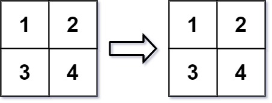

#### 566. 重塑矩阵

在 MATLAB 中，有一个非常有用的函数 `reshape` ，它可以将一个 `m x n` 矩阵重塑为另一个大小不同（`r x c`）的新矩阵，但保留其原始数据。

给你一个由二维数组 `mat` 表示的 `m x n` 矩阵，以及两个正整数 `r` 和 `c` ，分别表示想要的重构的矩阵的行数和列数。

重构后的矩阵需要将原始矩阵的所有元素以相同的 **行遍历顺序** 填充。

如果具有给定参数的 `reshape` 操作是可行且合理的，则输出新的重塑矩阵；否则，输出原始矩阵。

**示例 1：**


```shell
输入：mat = [[1,2],[3,4]], r = 1, c = 4
输出：[[1,2,3,4]]
```

**示例 2：**



```shell
输入：mat = [[1,2],[3,4]], r = 2, c = 4
输出：[[1,2],[3,4]]
```

**提示：**

* `m == mat.length`
* `n == mat[i].length`
* `1 <= m, n <= 100`
* `-1000 <= mat[i][j] <= 1000`
* `1 <= r, c <= 300`

### 题解

**模拟**

```java
class Solution {
    public int[][] matrixReshape(int[][] nums, int r, int c) {
        int m = nums.length;
        int n = nums[0].length;
        if (m * n != r * c) {
            return nums;
        }

        int[][] ans = new int[r][c];
        for (int x = 0; x < m * n; ++x) {
            ans[x / c][x % c] = nums[x / n][x % n];
        }
        return ans;
    }
}
```

